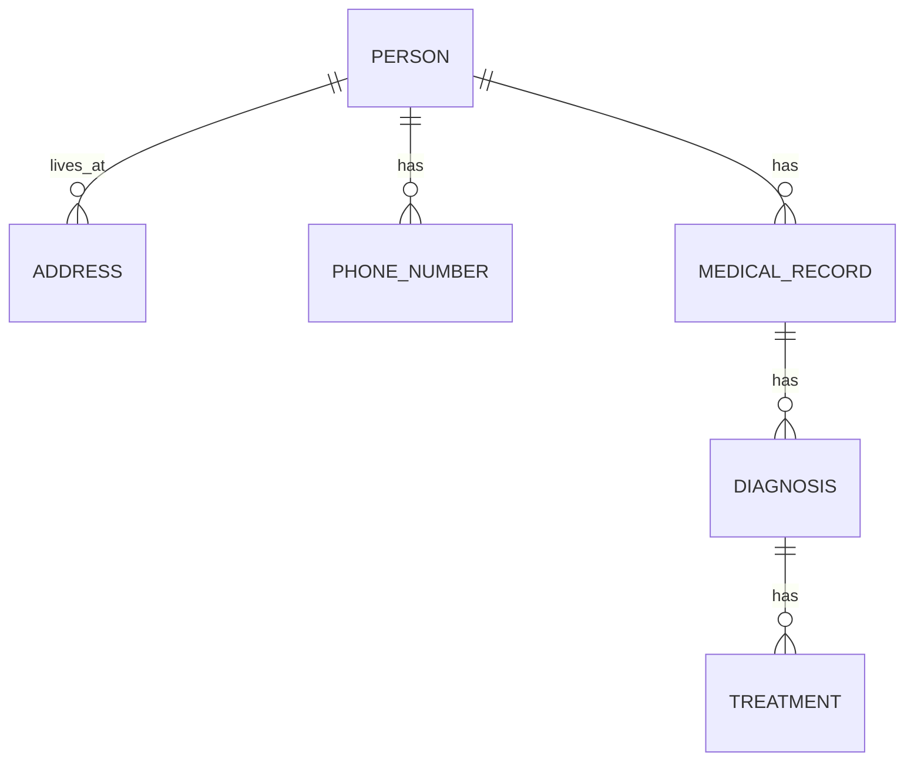

---

title: Entity_Type
type: Atomic Note
course: Database Systems
semester: Winter 2026
unit: '3'
hub: "[[3_Database_Design_Hub]]"
source: "[[Chapter_3.pdf]]"
source_pages:
- 16
mode: CS-DB
read: false
generated: true
prerequisites:
- "[[Entity-relationship_Model]]"

---

# 1. Mental Model

An entity type can be thought of as a classification of objects in a system, similar to how a taxonomy categorizes living organisms. Just as a taxonomy has categories and characteristics that define the organisms within it, an entity type has attributes and relationships that define the objects it represents. The entity type is like a class in object-oriented programming, where objects with similar properties and behaviors are grouped together.

# 2. Schema & Query Mechanics

The [[Entity_Relationship_Model]] is used to identify entity types, such as [[Entity_Type]], and their relationships, including [[Relationship_Type]] and [[Attribute]]. During [[Conceptual_Database_Design]], entity types are defined and their relationships are established. The [[Logical_Database_Design]] phase involves mapping these entity types to database tables, while [[Physical_Database_Design]] focuses on the storage and indexing of these tables. A well-designed database schema is a result of following a [[Database_Development_Methodology]] and [[Database_System_Development_Lifecycle]], which includes [[Database_Planning]], [[Requirements_Collection_And_Analysis]], and [[Dbms_Selection]]. The [[Er_Diagram]] is a useful tool for visualizing entity types and their relationships.

# 3. ACID Violations & Scaling Limits

When multiple transactions are executed concurrently, the consistency of entity type data can be compromised if not properly managed, potentially leading to ACID violations. For instance, if two transactions simultaneously update the same entity type attribute, the resulting data may be inconsistent. As the database scales, the likelihood of such conflicts increases, and the system must be designed to handle [[Information_System]] loads and ensure data consistency. Entity types with high [[Cardinality]] and [[Multiplicity]] relationships can be particularly challenging to manage in a distributed database environment.

## 4. Entity-Relationship Model



In this Mermaid entity-relationship diagram, entities are represented as boxes (e.g., `PERSON`, `ADDRESS`), and relationships between them are represented as lines with various notations. The `||--o{` notation indicates a 1:N (one-to-many) relationship, where one instance of the entity on the left side can have multiple instances of the entity on the right side.

## 5. Walkthrough

Here are the steps to understand entity types and relationships in the context of Epidemiology & Public Health Modeling:

1. **Identify Entity Types**: In epidemiology, we start by identifying entity types such as `PERSON`, `MEDICAL_RECORD`, and `DIAGNOSIS`. Each of these entity types has its own set of attributes, such as age, sex, and medical history for `PERSON`.
2. **Define Attributes**: For each entity type, we define its attributes. For example, `PERSON` might have attributes like `age`, `sex`, and `address`, while `MEDICAL_RECORD` might have attributes like `record_date`, `diagnosis`, and `treatment`.
3. **Establish Relationships**: Next, we establish relationships between entity types. For instance, a person can have multiple medical records (`PERSON ||--o{ MEDICAL_RECORD : has`), and a medical record is associated with one person.
4. **Determine Relationship Types**: We determine the type of relationship, such as 1:N (one-to-many) or M:N (many-to-many). For example, a person can have multiple addresses (`PERSON ||--o{ ADDRESS : lives_at`), but an address is associated with one person.
5. **Apply to Epidemiology**: Applying this to epidemiology, we can model how individuals ( `PERSON` ) are associated with multiple diagnoses ( `DIAGNOSIS` ) through their medical records ( `MEDICAL_RECORD` ), and how diagnoses are related to treatments ( `TREATMENT` ).
6. **Analyze and Model**: Finally, we use these entity-relationship models to analyze and model public health data, such as tracking the spread of diseases, identifying high-risk populations, and evaluating the effectiveness of interventions.

---

## 6. The Proving Grounds

```interactive-quiz

[
  {
    "id": "q1",
    "type": "true_false",
    "difficulty": "L1",
    "question": "An entity type is a classification of objects in a system.",
    "answer": true,
    "explanation": "This statement is true as it aligns with the definition of an entity type."
  },
  {
    "id": "q2",
    "type": "scenario",
    "difficulty": "L2",
    "question": "Given two entity types, 'Customer' and 'Order', where a customer can have multiple orders but an order is associated with only one customer, what happens when you try to establish a relationship between them?",
    "answer": "A one-to-many relationship is established, with 'Customer' being the parent entity and 'Order' being the child entity.",
    "explanation": "In entity-relationship modeling, this scenario naturally leads to a one-to-many relationship."
  },
  {
    "id": "q3",
    "type": "debug",
    "difficulty": "L3",
    "question": "Find the error.",
    "content": "function getEntityTypeName(entity) {\n  if (entity instanceof Customer) {\n    return 'Customer';\n  } else if (entity instanceof Order) {\n    return 'Order';\n  } else {\n    return null;\n  }\n}",
    "answer": "The bug is that it does not handle cases where entity is not an instance of Customer or Order but is still a valid entity type. The function should either throw an exception or return a default value to indicate an unknown entity type.",
    "explanation": "The current implementation silently returns null for unknown entity types, which can lead to null pointer exceptions later in the code."
  }
]

```