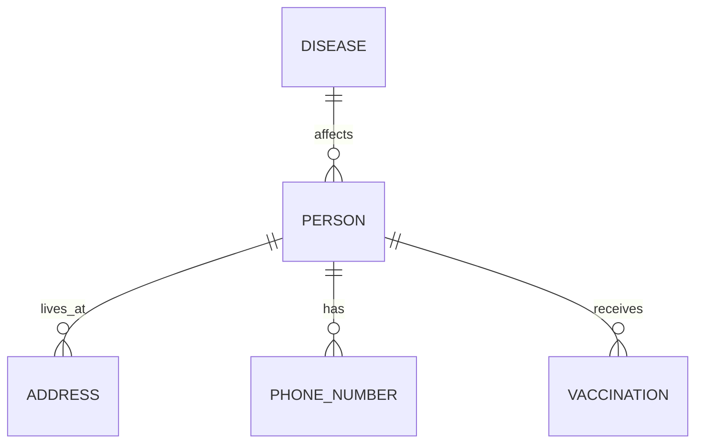

---

title: Information_System
type: Atomic Note
course: Database Systems
semester: Winter 2026
unit: '3'
hub: '[[3_Database_Design_Hub]]'
source: '[[Chapter_3.pdf]]'
source_pages:
- 3
mode: CS-DB
read: false
generated: true
prerequisites:
- '[[Database_Planning]]'
- '[[Requirements_Collection_And_Analysis]]'
- '[[Conceptual_Database_Design]]'
- '[[Entity_Relationship_Model]]'
- '[[Logical_Database_Design]]'

---


# 1. Mental Model

An Information System can be thought of as a complex ecosystem, similar to a city's infrastructure. Just as a city's infrastructure consists of interconnected components like roads, utilities, and public services, an Information System comprises interconnected components like hardware, software, data, and network infrastructure. The flow of information within the system is akin to the flow of traffic in a city, with each component playing a crucial role in ensuring the smooth operation of the entire system.

# 2. Schema & Query Mechanics

The development of an Information System involves a structured approach, starting with [[Database_Planning]] and [[Requirements_Collection_And_Analysis]], which inform the [[Conceptual_Database_Design]] and [[Entity_Relationship_Model]]. This conceptual design is then translated into a [[Logical_Database_Design]], which defines the relationships between [[Entity_Type]]s and [[Relationship_Type]]s. The logical design is subsequently mapped to a [[Physical_Database_Design]], which takes into account the specifics of the [[Dbms_Selection]] and the underlying storage infrastructure. Throughout this process, considerations of [[Attribute]]s, [[Multiplicity]], [[Cardinality]], and [[Participation]] are crucial in ensuring data consistency and integrity.

# 3. ACID Violations & Scaling Limits

As an Information System grows and scales, it may encounter limitations in its ability to maintain [[Acid]] properties, particularly in distributed environments. If the system is not designed to handle high volumes of transactions, it may experience [[Acid]] violations, leading to inconsistencies and errors. 

| Scale | Issue |
|---|---|
| Horizontal | Distributed transaction management becomes increasingly complex |
| Vertical | Increased load on individual components can lead to bottlenecks |

In such cases, the system's [[Information_System]] architecture may need to be reevaluated to ensure that it can handle the increased load and maintain data consistency.

## 4. Entity-Relationship Model



In this Mermaid entity-relationship diagram, entities are represented as boxes (e.g., `PERSON`, `DISEASE`), and relationships between them are depicted as lines with various notations. 
- The `||--o{` notation indicates a 1:N (one-to-many) relationship, where one instance of the entity on the left side can have multiple instances of the entity on the right side (e.g., one person can have multiple addresses or phone numbers).
- The `||--o{` line with no specific notation beside it also implies a 1:N relationship but focuses on the participation; for instance, a disease can affect many people, and a person can have multiple vaccinations.

## 5. Walkthrough

Here is a walkthrough situated in the domain of Epidemiology & Public Health Modeling:

1. **Initial System State**: The Information System for Epidemiology & Public Health Modeling starts with an empty database schema. No entities or relationships are defined.

2. **Defining Entities**: The developers define key entities such as `PERSON`, `DISEASE`, `ADDRESS`, `PHONE_NUMBER`, and `VACCINATION`. Each entity represents a crucial piece of information to be tracked within the system.

3. **Establishing Relationships**: They establish that a person can live at multiple addresses over time (`PERSON ||--o{ ADDRESS`), reflecting the need to track the residences of individuals for epidemiological studies.

4. **Further Relationships**: The team also defines that a person can have multiple phone numbers (`PERSON ||--o{ PHONE_NUMBER`), which is essential for contact tracing.

5. **Disease and Vaccination Tracking**: A disease can affect many people, and each person can receive multiple vaccinations (`DISEASE ||--o{ PERSON` and `PERSON ||--o{ VACCINATION`), highlighting the system's capability to monitor disease spread and vaccination efforts.

6. **Final System State**: The Information System now has a comprehensive schema that supports detailed epidemiological modeling, including tracking of individuals, their locations, contact information, disease status, and vaccination history. This schema provides a robust foundation for analyzing and responding to public health challenges.

---

## 6. The Proving Grounds

```interactive-quiz

[
  {
    "id": "q1",
    "type": "true_false",
    "difficulty": "L1",
    "question": "An Information System is comprised solely of software and data components.",
    "answer": false,
    "explanation": "An Information System is a complex ecosystem consisting of interconnected components like hardware, software, data, and network infrastructure."
  },
  {
    "id": "q2",
    "type": "scenario",
    "difficulty": "L2",
    "question": "Given that an Information System's network infrastructure experiences a sudden outage, what happens to the flow of information within the system?",
    "answer": "The flow of information within the system is disrupted, causing potential delays or losses in data transmission and processing.",
    "explanation": "Similar to a traffic jam in a city's road network, a network infrastructure outage in an Information System hinders the flow of information, impacting the system's overall performance and functionality."
  },
  {
    "id": "q3",
    "type": "debug",
    "difficulty": "L3",
    "question": "Find the error.",
    "content": "function calculateTotal(data) {\n  let total = 0;\n  for (let i = 0; i <= data.length; i++) {\n    total += data[i];\n  }\n  return total;\n}",
    "answer": "The bug is an off-by-one error. The loop should iterate until i < data.length. The fix is to change the condition to i < data.length.",
    "explanation": "The loop iterates one extra time, attempting to access an index out of bounds, which will result in NaN (Not a Number) or incorrect results. Changing the condition ensures the loop only accesses valid indices."
  }
]

```