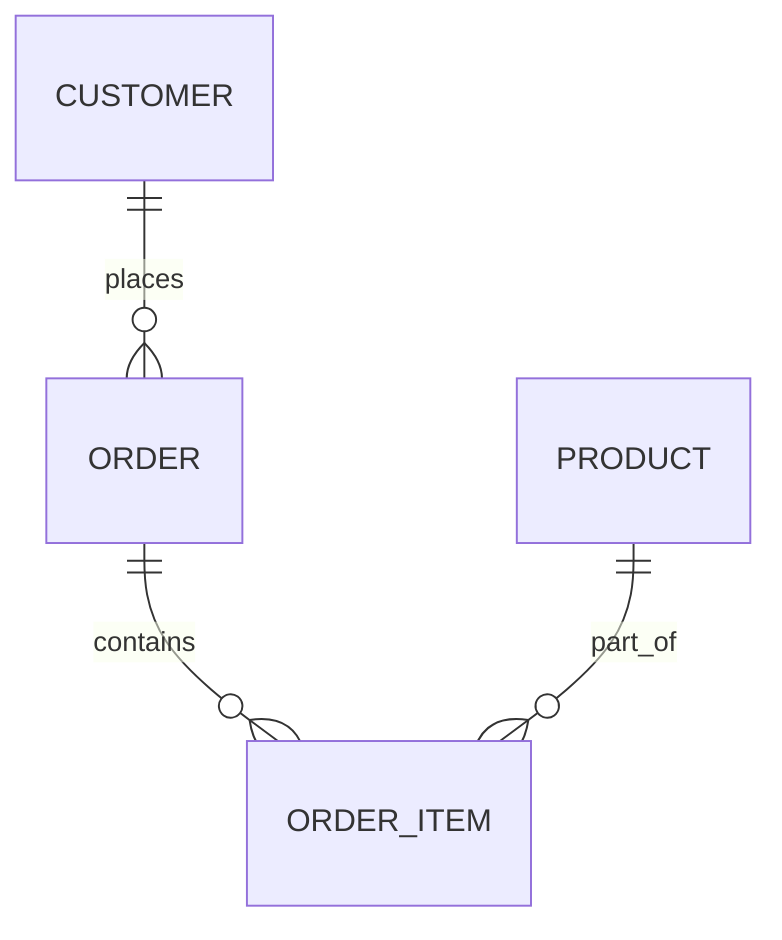

---

title: Logical_Database_Design
type: Atomic Note
course: Database Systems
semester: Winter 2026
unit: '3'
hub: "[[3_Database_Design_Hub]]"
source: "[[Chapter_3.pdf]]"
source_pages:
- 9
mode: CS-DB
read: false
generated: true
prerequisites:
- "[[Conceptual_Database_Design]]"

---

# 1. Mental Model

A logical database design can be thought of as a blueprint for a train network, where tables are like train stations and relationships between them are like the tracks connecting these stations. Just as train tracks define how stations are connected and how trains can move between them, relationships in a logical database design define how data can be linked and accessed across different tables. This analogy highlights the importance of planning and structuring the connections between data entities to ensure efficient and coherent data retrieval.

# 2. Schema & Query Mechanics

The process of [[Logical_Database_Design]] involves transforming the [[Conceptual_Database_Design]] into a more technical map of the database, using a specific data model such as the relational model, and is dependent on the choice of [[Dbms_Selection]] but independent of physical considerations. This phase involves detailed definitions of [[Entity_Type]]s, [[Relationship_Type]]s, and [[Attribute]]s, and is guided by the principles of [[Database_Development_Methodology]] and the [[Database_System_Development_Lifecycle]]. The design is often represented using an [[Er_Diagram]], which visually depicts [[Entity_Relationship_Model]] components such as [[Entity_Type]], [[Relationship_Type]], [[Multiplicity]], [[Cardinality]], and [[Participation]]. The goal is to create a robust [[Information_System]] design that meets the requirements identified during [[Requirements_Collection_And_Analysis]] and aligns with the overall [[Database_Planning]] strategy. Effective [[Logical_Database_Design]] lays the groundwork for [[Physical_Database_Design]].

# 3. ACID Violations & Scaling Limits

In a logical database design, if relationships between tables are not properly defined, it can lead to inconsistencies and potential [[Acid]] violations when the design is implemented. For instance, if a critical relationship is missed or incorrectly defined, it can result in data inconsistencies during [[Participation]] and [[Cardinality]] enforcement. As the database scales, poorly designed relationships can lead to performance bottlenecks and make it difficult to maintain data integrity. Moreover, overlooking [[Multiplicity]] constraints can cause issues with data redundancy and lead to scalability issues. 

| Error Type | Description | Impact on Design |

|------------|-------------|------------------|

| Missing Relationships | Omitting critical relationships between entities | Data inconsistency and potential ACID violations |

| Incorrect Cardinality | Incorrectly defining cardinality constraints | Data redundancy and scalability issues |

## 4. Entity-Relationship Model



In this Mermaid `erDiagram`, rectangles represent entities (e.g., `CUSTOMER`, `ORDER`, `ORDER_ITEM`, `PRODUCT`), and lines with various symbols denote relationships: 
- `||--o{` indicates a 1:N (one-to-many) relationship, where the entity on the left can have multiple instances of the entity on the right, but each instance on the right is associated with only one on the left. 
For example, a customer can place many orders, but each order is associated with only one customer.

## 5. Walkthrough

Here is a walkthrough situated in the domain of **Telecommunications & Core Network Routing**, focusing on logical database design for a network routing system:

1. **Identify Entities**: In a telecommunications network, key entities might include `NETWORK_NODE` (representing routers or switches) and `ROUTE` (representing paths through the network). 

2. **Define Relationships**: A `NETWORK_NODE` can be connected to multiple other nodes, suggesting a relationship, but for routing purposes, we focus on how routes are associated with nodes. A `ROUTE` can span multiple `NETWORK_NODE`s, indicating a many-to-many (M:N) relationship between `ROUTE` and `NETWORK_NODE`.

3. **Establish Cardinality**: For efficient routing, each `ROUTE` must be associated with at least two `NETWORK_NODE`s (a source and a destination), but can be associated with many more. Conversely, each `NETWORK_NODE` can be part of many `ROUTE`s.

4. **Logical Design Refinement**: Refine the design by considering additional entities and relationships, such as `NETWORK_LINK` (representing physical connections between nodes) and its relationship to `NETWORK_NODE`.

5. **Apply to Database Schema**: Translate the logical design into a database schema, creating tables for `NETWORK_NODE`, `ROUTE`, and `NETWORK_LINK`, with foreign keys to establish relationships.

6. **Query Mechanic Application**: With the schema in place, develop queries to efficiently retrieve routing information, such as finding all routes that pass through a specific node or determining the best path between two nodes.

---

## 6. The Proving Grounds

```interactive-quiz

[
  {
    "id": "q1",
    "type": "true_false",
    "difficulty": "L1",
    "question": "In a logical database design, relationships between tables define how data can be linked and accessed across different tables.",
    "answer": true,
    "explanation": "This statement is true as relationships in a logical database design serve to connect data across different tables, similar to how tracks connect train stations."
  },
  {
    "id": "q2",
    "type": "scenario",
    "difficulty": "L2",
    "question": "Given two tables, 'Customers' and 'Orders', where each customer can have multiple orders but each order is associated with only one customer, what happens when you delete a customer record?",
    "answer": "All associated order records should be deleted or have their customer association updated to maintain data integrity.",
    "explanation": "This scenario tests understanding of cascading actions in relationships. If a customer is deleted, their orders either need to be deleted or reassigned to another customer to avoid orphaned records."
  },
  {
    "id": "q3",
    "type": "debug",
    "difficulty": "L3",
    "question": "Find the error.",
    "content": "if (orderTotal > 0) {\n  discount = 0;\n} else {\n  discount = 10;\n}",
    "answer": "The bug is a logic inversion. The correct logic should apply a discount when the order total is 0 or less, not when it's greater than 0. The fix is to change the condition to 'if (orderTotal <= 0)'.",
    "explanation": "The given code snippet incorrectly applies a discount only when the order total is positive, which is counterintuitive. A discount should be applied when the order total is 0 or negative."
  }
]

```