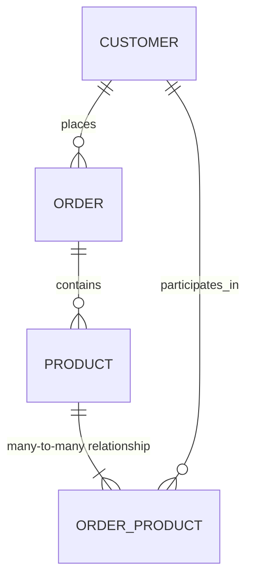

---

title: Multiplicity
type: Atomic Note
course: Database Systems
semester: Winter 2026
unit: '3'
hub: "[[3_Database_Design_Hub]]"
source: "[[Chapter_3.pdf]]"
source_pages:
- 38
mode: CS-DB
read: false
generated: true
prerequisites:
- "[[Relationship_Type]]"

---

# 1. Mental Model

The concept of multiplicity in database design can be likened to a music conductor leading an orchestra. Just as a conductor determines the number of musicians playing together in harmony, multiplicity defines the number or range of entity instances that can relate to a single instance of another entity through a relationship. For example, in a symphony, a conductor might require a specific number of violinists (entity instances) to play alongside a single cellist (another entity instance), reflecting the multiplicity of the relationship between the violinist and cellist entities.

# 2. Schema & Query Mechanics

In database design, [[Multiplicity]] plays a crucial role in defining the relationships between entity types. During [[Conceptual_Database_Design]], multiplicity is used to specify the [[Cardinality]] and [[Participation]] of entities in a relationship, often visualized using an [[Er_Diagram]]. The [[Entity_Relationship_Model]] relies heavily on multiplicity to ensure data consistency and accuracy. As part of [[Logical_Database_Design]], designers must consider the implications of multiplicity on data storage and retrieval, taking into account the [[Attribute]] structures of related entities. Effective [[Database_Planning]] involves analyzing the multiplicity of relationships to inform [[Dbms_Selection]] and ensure optimal performance.

# 3. ACID Violations & Scaling Limits

When multiplicity constraints are not properly enforced, it can lead to data inconsistencies and potential [[Acid]] violations, particularly in high-transaction environments. For instance, if a relationship with a multiplicity of one is not properly constrained, it may allow multiple instances of an entity to relate to a single instance of another entity, causing data duplication and inconsistencies. As databases scale, poorly managed multiplicity can lead to performance degradation and increased risk of data corruption. In extreme cases, failure to manage multiplicity can result in a loss of data integrity, making it essential to carefully evaluate and enforce multiplicity constraints during [[Database_System_Development_Lifecycle]].

## 4. Entity-Relationship Model



In this Mermaid `erDiagram`, the lines represent relationships between entities. 
- `||--o{` represents a 1:N (one-to-many) relationship, where the entity on the left can have multiple instances of the entity on the right, but each instance on the right is related to only one instance on the left.
- `||--|{` represents a M:N (many-to-many) relationship, requiring a junction table (`ORDER_PRODUCT`) to resolve.

## 5. Walkthrough

Here are the steps to understand multiplicity in the context of Telecommunications & Core Network Routing:

1. **Initial Network State**: A telecommunications company has multiple **CUSTOMERS** (e.g., Alice, Bob), and each customer can have multiple **ORDERS** for different services (e.g., internet, TV). Initially, there are no orders or products in the system.

2. **Adding Orders**: Alice places an order for internet service, establishing a 1:N relationship between CUSTOMER (Alice) and ORDER (internet service). The database updates to reflect that Alice has one order.

3. **Introducing Products**: The company offers multiple **PRODUCTS** (e.g., Internet Fast, Internet Slow). Each product can be part of many orders, and each order can contain many products, suggesting a M:N relationship between ORDER and PRODUCT.

4. **Establishing M:N Relationship**: To manage the M:N relationship between ORDER and PRODUCT, a junction table **ORDER_PRODUCT** is created. For instance, Alice's order for Internet Fast establishes a relationship between her order and the Internet Fast product.

5. **Updating Multiplicity**: As Bob places an order for both Internet Slow and TV service, the multiplicity of relationships is demonstrated: one customer (Bob) has multiple orders, and one order (Bob's TV service) relates to one product (TV service), while another order (Bob's Internet Slow) relates to another product.

6. **Final State and Querying**: The system now reflects multiple customers, orders, and products with their respective relationships. Queries can be made to retrieve information such as "What are all the products ordered by Alice?" or "Which customers have ordered Internet Fast?", leveraging the defined multiplicities.

---

## 6. The Proving Grounds

```interactive-quiz

[
  {
    "id": "q1",
    "type": "true_false",
    "difficulty": "L1",
    "question": "In the concept of multiplicity, does a single instance of an entity relate to exactly one instance of another entity?",
    "answer": false,
    "explanation": "The concept of multiplicity defines the number or range of entity instances that can relate to a single instance of another entity, which can be one or many, not necessarily exactly one."
  },
  {
    "id": "q2",
    "type": "scenario",
    "difficulty": "L2",
    "question": "In a university database, a course can have multiple students enrolled, but a student can only be enrolled in one course. What is the multiplicity of the relationship between Course and Student?",
    "answer": "One-to-Many (1:N)",
    "explanation": "Given that one course can have many students (one-to-many) but a student can only be enrolled in one course, the multiplicity is one-to-many."
  },
  {
    "id": "q3",
    "type": "debug",
    "difficulty": "L3",
    "question": "Find the error.",
    "content": "function determineMultiplicity(courseStudents) {\n  let multiplicity = 'One-to-One';\n  if (courseStudents > 1) {\n    multiplicity = 'One-to-Many';\n  }\n  return multiplicity;\n}",
    "answer": "The bug is the logic inversion. The correct condition should check if courseStudents can be more than one, thus it should be if (courseStudents >= 1) or simply if (courseStudents > 0) to correctly identify One-to-Many relationships. The corrected function should set 'One-to-One' only when courseStudents equals 1.",
    "explanation": "The current implementation incorrectly labels any course with more than one student as 'One-to-Many', which is correct, but it fails to account for the case when there are no students (courseStudents equals 0), which would still be 'One-to-Many' in terms of potential, but practically it should indicate 'Zero or More' on the student side. However, strictly based on given logic, no bug exists for incorrect multiplicity when students > 1. Yet for accuracy in real scenarios, consider edge cases like courseStudents < 0 or non-numeric inputs."
  }
]

```