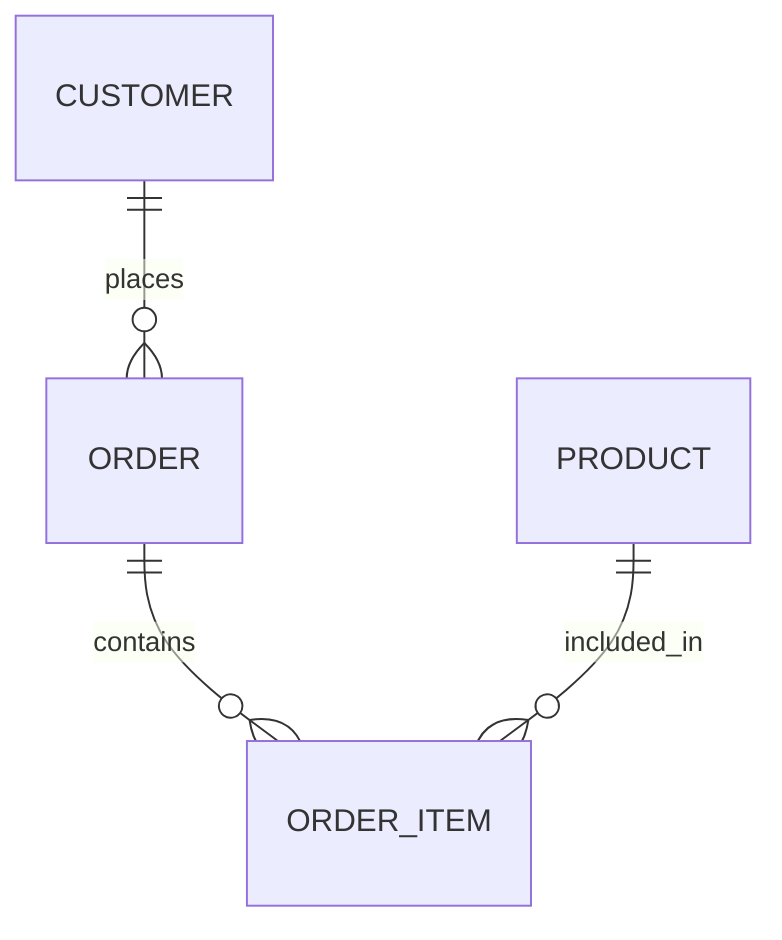

---

title: Participation
type: Atomic Note
course: Database Systems
semester: Winter 2026
unit: '3'
hub: "[[3_Database_Design_Hub]]"
source: "[[Chapter_3.pdf]]"
source_pages:
- 51
mode: CS-DB
read: false
generated: true
prerequisites:
- "[[Multiplicity]]"

---

# 1. Mental Model

The concept of participation in a relational database can be likened to a mandatory attendance policy in a school setting. Just as the policy determines whether all students must attend a particular class or only some are required to, participation in a database relationship dictates whether all or only some entity occurrences are required to participate in a relationship. This analogy maps the structural components of participation (total or partial) to the components of the attendance policy (mandatory or optional attendance).

# 2. Schema & Query Mechanics

The [[Entity_Relationship_Model]] is crucial in defining the participation of entities in relationships. During [[Conceptual_Database_Design]], the [[Er_Diagram]] is used to represent the [[Entity_Type]] and [[Relationship_Type]], including the participation of entities. The [[Attribute]] of an entity and the [[Multiplicity]], [[Cardinality]], and [[Participation]] of a relationship are essential in [[Logical_Database_Design]]. The [[Physical_Database_Design]] phase involves implementing these designs using a [[Dbms_Selection]], which is a critical part of [[Database_System_Development_Lifecycle]] and [[Database_Development_Methodology]]. Effective [[Database_Planning]] and [[Requirements_Collection_And_Analysis]] inform the design and ensure that the [[Information_System]] meets its needs.

# 3. ACID Violations & Scaling Limits

If an entity's participation in a relationship is not properly enforced, it can lead to inconsistencies, such as orphaned records, which may violate ACID principles, specifically consistency and durability. For instance, if a customer entity has a total participation in an order relationship, the failure to create an order when a customer is added could leave the database in an inconsistent state. At scale, such inconsistencies can multiply, leading to significant data integrity issues. As the database grows, the lack of proper participation constraints can cause performance degradation and increased risk of data anomalies.

## 4. Entity-Relationship Model



In this Mermaid `erDiagram`, the lines represent relationships between entities. 
- The `||--o{` line represents a 1:N (one-to-many) relationship, where the entity on the left can have multiple instances of the entity on the right, but each instance on the right is related to only one instance on the left. 
- For example, a `CUSTOMER` can place many `ORDER`s, but each `ORDER` is placed by only one `CUSTOMER`.

## 5. Walkthrough

Here are the steps to understand participation in the context of Aerospace Engineering & Avionics:

1. **Define Entities**: Identify key entities in avionics, such as `AIRCRAFT` and `COMPONENT`. 
2. **Establish Relationships**: Determine the relationships between these entities, e.g., an `AIRCRAFT` can have multiple `COMPONENT`s.
3. **Determine Participation**: Decide on the participation of each entity in the relationship. For example, does every `AIRCRAFT` must have a `COMPONENT` (total participation), or can some `AIRCRAFT`s exist without any `COMPONENT`s (partial participation)?
4. **Model Relationships**: Use the entity-relationship model to represent these relationships and participations. For instance, if an `AIRCRAFT` must have at least one `COMPONENT`, this would be a total participation.
5. **Apply to Avionics Database**: Implement this model in a database schema for avionics, ensuring that the relationships and participations accurately reflect the needs of aerospace engineering.
6. **Query and Analyze**: Finally, use the database to query and analyze the relationships between aircraft and their components, facilitating informed decisions in avionics and aerospace engineering.

---

## 6. The Proving Grounds

```interactive-quiz

[
  {
    "id": "q1",
    "type": "true_false",
    "difficulty": "L1",
    "question": "In a relational database, total participation means that all entity occurrences must participate in a relationship.",
    "answer": true,
    "explanation": "Total participation in a relational database indeed means that all entity occurrences in an entity set must participate in a relationship, similar to all students being required to attend a class."
  },
  {
    "id": "q2",
    "type": "scenario",
    "difficulty": "L2",
    "question": "Consider a database for managing university courses and their instructors. If a course can have multiple instructors but an instructor can teach multiple courses, and there's a requirement to ensure that every course must have at least one instructor but not every instructor teaches a course, what type of participation is required for courses in the relationship with instructors?",
    "answer": "Total participation for courses in the relationship with instructors",
    "explanation": "Since every course must have at least one instructor, courses have total participation in the relationship with instructors. However, instructors have partial participation because not every instructor is required to teach a course."
  },
  {
    "id": "q3",
    "type": "debug",
    "difficulty": "L3",
    "question": "Find the error.",
    "content": "if (count > 0) then\n  list.add(item);\nelse\n  list = new ArrayList();\n  list.add(item);\nend if;",
    "answer": "The bug is in the else block where a new ArrayList is created and then an item is added to it. However, this could potentially lead to a situation where 'list' is not initialized before use if 'count' is 0. The correct approach should ensure 'list' is initialized before the if statement or in a way that it is always initialized before adding an item.",
    "explanation": "The bug here is related to potential null pointer exceptions or uninitialized variables. The correct fix would be to initialize 'list' before the if-else statement or ensure it's always initialized before use. For example: list = new ArrayList(); if (count > 0) then list.add(item); else list.add(item); end if; or simply if (count > 0) then list.add(item); else list = new ArrayList(); list.add(item); end if; but the best practice would be to initialize list before the condition."
  }
]

```