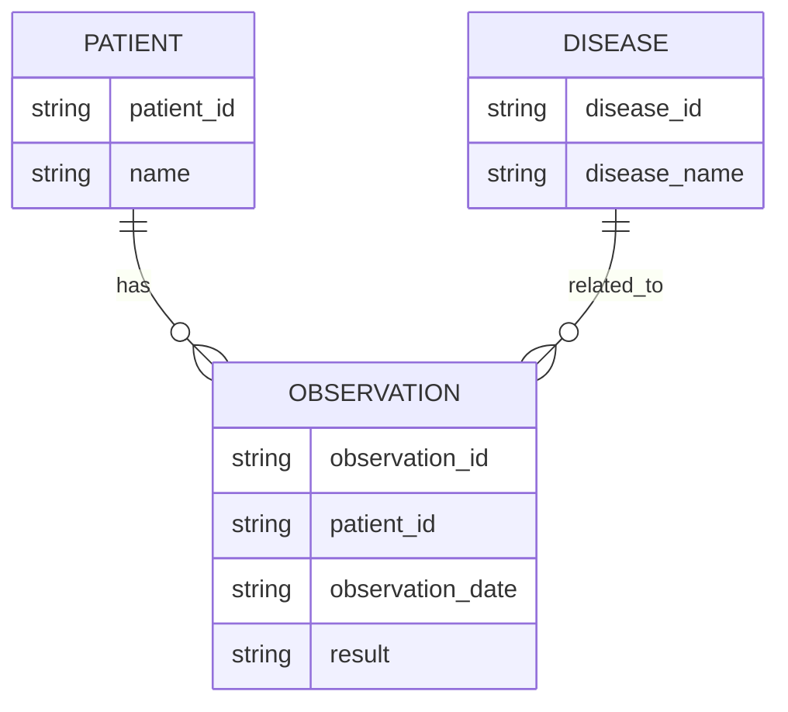

---

title: Physical_Database_Design
type: Atomic Note
course: Database Systems
semester: Winter 2026
unit: '3'
hub: "[[3_Database_Design_Hub]]"
source: "[[Chapter_3.pdf]]"
source_pages:
- 10
mode: CS-DB
read: false
generated: true
prerequisites:
- "[[Logical_Database_Design]]"

---

# 1. Mental Model

A physical database design can be thought of as a high-performance sports car, where the base relations are like the engine components, and the file organizations and indexes are like the optimized gear system and suspension. Just as a well-tuned suspension system enables the car to handle sharp turns and rough roads efficiently, a well-designed file organization and indexing system enable the database to quickly locate and retrieve data. The integrity constraints and security measures are like the car's safety features, such as airbags and anti-lock braking, which prevent damage to the vehicle and its occupants.

# 2. Schema & Query Mechanics

The [[Physical_Database_Design]] process involves implementing the [[Logical_Database_Design]] into a specific [[Database_Management_System]] (DBMS). This requires selecting the most suitable [[File_Organizations]] and [[Indexes]] to achieve efficient data access. The [[Entity_Relationship_Model]] and [[Er_Diagram]] developed during [[Conceptual_Database_Design]] and [[Logical_Database_Design]] are used to inform the [[Physical_Database_Design]] process. A thorough [[Requirements_Collection_And_Analysis]] and [[Database_Planning]] are essential to ensure that the physical design meets the [[Information_System]] requirements. The [[Dbms_Selection]] also plays a critical role in determining the physical design.

# 3. ACID Violations & Scaling Limits

If the physical database design is not optimized for concurrency, it may lead to [[Acid]] violations, such as inconsistent data or failed transactions. As the database scales, poorly designed file organizations and indexing systems can cause performance bottlenecks, leading to slower query execution times. In extreme cases, this can result in the database becoming unresponsive or even crashing. 

| Scaling Issue | Description |
|---|---|
| Concurrency Control | Failure to manage concurrent access to data |
| Data Fragmentation | Poor data distribution leading to slower query performance |
| Index Overhead | Excessive indexing causing increased storage requirements | 
| Query Optimization | Inefficient query execution plans resulting in slower performance |

## 4. Entity-Relationship Model



In this Mermaid entity-relationship diagram, `PATIENT`, `OBSERVATION`, and `DISEASE` are entities represented as rectangles. The lines with crow's feet (`||--o{`) denote 1:N (one-to-many) relationships: one patient can have many observations, and one disease can be related to many observations. The labels on the lines (`has` and `related_to`) describe the nature of these relationships.

## 5. Walkthrough

Here are the steps to design a physical database for Epidemiology & Public Health Modeling:

1. **Identify Entities**: Identify key entities in the epidemiology domain, such as `PATIENT`, `OBSERVATION`, and `DISEASE`, which will be represented as tables in the database.
2. **Define Relationships**: Determine the relationships between these entities, such as a patient having many observations (1:N) and a disease being related to many observations (1:N).
3. **Choose File Organizations**: Select appropriate file organizations for each table, such as heap files for `PATIENT` and `DISEASE`, and a clustered index on `patient_id` for `OBSERVATION` to facilitate efficient querying.
4. **Design Indexing System**: Design an indexing system to enable quick data retrieval, including creating indexes on `observation_date` and `result` in `OBSERVATION`, and a unique index on `disease_name` in `DISEASE`.
5. **Establish Integrity Constraints**: Establish integrity constraints to ensure data consistency, such as primary keys on `patient_id`, `observation_id`, and `disease_id`, and foreign keys to maintain relationships between tables.
6. **Implement Security Measures**: Implement security measures to protect sensitive patient data, such as access control lists and encryption, to prevent unauthorized access or data breaches.

---

## 6. The Proving Grounds

```interactive-quiz

[
  {
    "id": "q1",
    "type": "true_false",
    "difficulty": "L1",
    "question": "Is physical database design concerned with the logical structure of the database?",
    "answer": false,
    "explanation": "Physical database design is concerned with the physical storage and retrieval of data, not the logical structure."
  },
  {
    "id": "q2",
    "type": "scenario",
    "difficulty": "L2",
    "question": "Given a database with a large table of customer information, and a query that frequently retrieves customer data by last name, what would be an effective indexing strategy?",
    "answer": "Create a B-tree index on the last name column.",
    "explanation": "A B-tree index would allow for efficient retrieval of data by last name, reducing the time complexity of the query."
  },
  {
    "id": "q3",
    "type": "debug",
    "difficulty": "L3",
    "question": "Find the error.",
    "content": "UPDATE customers SET balance = balance + amount; COMMIT; IF (amount > 1000) THEN UPDATE customers SET balance = balance - fee;",
    "answer": "The bug is a logical error due to a missing lock and incorrect order of operations. The correct fix is to reorder the operations and add locking: UPDATE customers SET balance = balance + amount; IF (amount > 1000) THEN UPDATE customers SET balance = balance - fee; COMMIT;",
    "explanation": "The original code snippet has a bug where the update and conditional update operations are not properly synchronized, potentially leading to inconsistent results. The fix involves reordering the operations and adding locking to ensure consistency."
  }
]

```