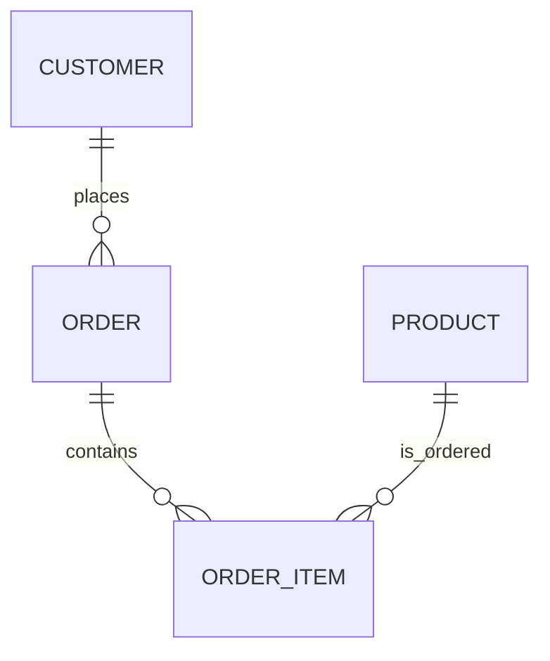

---

title: Requirements_Collection_And_Analysis
type: Atomic Note
course: Database Systems
semester: Winter 2026
unit: '3'
hub: "[[3_Database_Design_Hub]]"
source: "[[Chapter_3.pdf]]"
source_pages:
- 4
mode: CS-DB
read: false
generated: true
prerequisites:
- "[[Database_Planning]]"

---

# 1. Mental Model

The process of Requirements Collection And Analysis can be likened to a detective's investigation, where the detective (analyst) gathers clues (requirements) from various sources (stakeholders) to piece together a clear picture of the crime (system needs). Just as a detective must sift through witness statements and evidence to identify key details, an analyst must categorize and prioritize requirements to understand the essential features of the system. The sources of requirements, like multiple witnesses, can provide conflicting or incomplete information, which the analyst must reconcile to form a coherent understanding.

# 2. Schema & Query Mechanics

Requirements Collection And Analysis is a critical phase in [[Database_Development_Methodology]] and [[Database_System_Development_Lifecycle]], directly influencing the success of [[Conceptual_Database_Design]], [[Logical_Database_Design]], and [[Physical_Database_Design]]. This phase begins with [[Requirements_Collection_And_Analysis]], where analysts gather and document the needs of stakeholders. These needs are then translated into a formal representation, often using an [[Entity_Relationship_Model]] to identify [[Entity_Type]]s, [[Relationship_Type]]s, [[Attribute]]s, [[Multiplicity]], [[Cardinality]], and [[Participation]]. The output of this process can be visualized using an [[Er_Diagram]], which helps in validating the requirements against the proposed structure of the [[Information_System]]. Effective [[Database_Planning]] relies on thorough requirements analysis to ensure that the selected [[Dbms_Selection]] can meet the system's needs.

# 3. ACID Violations & Scaling Limits

Requirements Collection And Analysis can lead to ACID violations and scaling limits if not properly managed, particularly when dealing with distributed systems or high-transaction databases. For instance, if the requirements do not adequately address concurrency control, the system may experience inconsistencies, violating the atomicity and consistency principles of ACID. Similarly, poor analysis might lead to underestimating the database's future growth, resulting in scalability issues when the system needs to handle increased loads or larger datasets. 

| Failure Mode | Description | Impact on ACID | Scaling Impact |

|--------------|-------------|----------------|---------------|

| Inadequate Concurrency Control | Insufficient mechanisms for managing simultaneous transactions | Atomicity, Consistency | Vertical scaling limits |

| Underestimated Data Growth | Failure to anticipate future data volume increases | Availability, Performance | Horizontal scaling challenges |

## 4. Entity-Relationship Model



In this Mermaid entity-relationship diagram, `ORDER`, `CUSTOMER`, and `PRODUCT` represent entities, while `ORDER_ITEM` represents a junction table for the many-to-many relationship between `ORDER` and `PRODUCT`. The `||--o{` and `||--o}` symbols denote one-to-many (`1:N`) relationships, indicating that one customer can place many orders, and one order can contain many order items.

## 5. Walkthrough

Here are the steps for Requirements Collection And Analysis in the context of Quantitative Finance & High-Frequency Trading:

1. **Identify Stakeholders**: In a high-frequency trading system, stakeholders include traders, risk managers, and compliance officers. Each stakeholder provides input on the system's requirements, such as low-latency trade execution, real-time risk monitoring, and regulatory reporting.

2. **Gather Requirements**: The analyst collects requirements from stakeholders through interviews, surveys, and documentation review. For example, traders require the system to execute trades within 10 milliseconds, while risk managers need real-time updates on exposure limits.

3. **Categorize Requirements**: The analyst categorizes requirements into functional (e.g., trade execution, risk monitoring), non-functional (e.g., performance, security), and regulatory requirements (e.g., reporting, compliance).

4. **Prioritize Requirements**: The analyst prioritizes requirements based on business value, risk, and complexity. For instance, low-latency trade execution is prioritized over a reporting feature.

5. **Analyze Requirements**: The analyst analyzes requirements to identify potential conflicts, ambiguities, or omissions. For example, the requirement for low-latency trade execution may conflict with the need for robust risk monitoring.

6. **Validate Requirements**: The analyst validates requirements with stakeholders to ensure accuracy, completeness, and feasibility. This step ensures that the requirements accurately reflect the needs of the high-frequency trading system.

---

## 6. The Proving Grounds

```interactive-quiz

[
  {
    "id": "q1",
    "type": "true_false",
    "difficulty": "L1",
    "question": "Is Requirements Collection And Analysis similar to a detective's investigation?",
    "answer": true,
    "explanation": "The process of Requirements Collection And Analysis is likened to a detective's investigation where clues (requirements) are gathered from various sources (stakeholders) to understand the system needs."
  },
  {
    "id": "q2",
    "type": "scenario",
    "difficulty": "L2",
    "question": "Given that a stakeholder provides a requirement that conflicts with another stakeholder's requirement, what should the analyst do?",
    "answer": "The analyst should categorize and prioritize the requirements to resolve the conflict and ensure the essential features of the system are met.",
    "explanation": "The analyst must sift through the requirements to identify key details, categorize, and prioritize them to understand the essential features of the system and resolve conflicts."
  },
  {
    "id": "q3",
    "type": "debug",
    "difficulty": "L3",
    "question": "Find the error.",
    "content": "if (requirement importance > 5) then {\n  requirement.priority = 'high';\n} else {\n  requirement.priority = 'low';\n}",
    "answer": "The bug is the incorrect comparison operator. The correct operator should be '>=' instead of '>'. The fix is to change the line to 'if (requirement_importance >= 5) then'.",
    "explanation": "The bug is a logic inversion. The current code will not prioritize requirements with an importance of exactly 5 as 'high'. The fix corrects this to ensure requirements with an importance of 5 or more are prioritized as 'high'."
  }
]

```