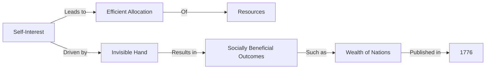

---

title: Adam_Smith
course: Economics
unit: '1'
semester: Winter 2026
mode: ECON-MICRO
type: atomic_note
hub: '[[1_Basics_Of_Economics_Hub]]'
source: '[[5-Pdf Store/note generated/Winter 2026/Economics/Chapter_1.pdf]]'
date: '2026-05-08'
prerequisites:
- '[[Economic_Analysis]]'
- '[[Economic_Resources]]'
- '[[Human_Wants]]'
- '[[Positive_Economics]]'
- '[[Normative_Economics]]'
source_pages:
- 7
generated: true

---


## 1. Mental Model

In the competitive landscape of the airline industry, Adam Smith's concepts can be vividly illustrated through the lens of Game Theory Application. Consider a scenario where two major airlines, American Airlines and Delta Air Lines, operate on a duopoly route between New York and Los Angeles. **Explicit Component 1: Division of Labor** - Just as Adam Smith advocated for specialization, American Airlines might focus on providing premium in-flight services, while Delta Air Lines concentrates on offering competitive pricing and efficient check-in processes. **Explicit Component 2: Invisible Hand** - As both airlines respond to market forces and passenger demand, they independently adjust their pricing and services, leading to an equilibrium that benefits consumers, illustrating how individual self-interest can lead to socially beneficial outcomes, a concept Smith described as the "invisible hand" guiding market economies.

## 2. Micro Theory

The concept of Adam Smith is deeply rooted in the field of economics, particularly in the study of [[Economic_Analysis]], which encompasses the examination of how individuals, firms, and governments allocate [[Economic_Resources]] to satisfy [[Human_Wants]]. Adam Smith, often regarded as the father of economics, laid the foundation for modern economics with his seminal work, "An Inquiry into the Nature and Causes of Wealth of Nations," published in 1776. This treatise not only established Smith as a pivotal figure in the development of economic thought but also introduced several critical concepts that remain integral to [[Positive_Economics]] and [[Normative_Economics]].

At the core of Adam Smith's contributions is the idea of the "invisible hand," a metaphorical mechanism that describes how individuals acting in their own self-interest can lead to socially beneficial outcomes, such as the efficient allocation of Economic Resources. This concept challenges the traditional view that economic efficiency requires a centralized authority to direct Resource Allocation. Instead, Smith posits that through the interactions of numerous individuals and firms operating in a free market, resources can be allocated efficiently, leading to economic prosperity. This process is closely related to the principles of Efficient Allocation, where resources are allocated in a manner that maximizes the satisfaction of Human Wants given the constraints of Scarcity.

The works of Adam Smith are also instrumental in understanding Economic Systems, particularly the capitalist system, which emphasizes private ownership of the means of production, creation of goods and services for profit, and free-market exchange. Smith's analysis in "The Wealth of Nations" provided a comprehensive critique of mercantilism and laid the groundwork for the study of Macroeconomics, which examines the economy as a whole, focusing on issues such as economic growth, inflation, and unemployment.

Smith's methodology in approaching economic phenomena can be characterized by Inductive Reasoning, where general conclusions are drawn from specific observations. His detailed examination of the division of labor, the concept of markets, and the role of self-interest in economic activities exemplifies this approach. Furthermore, his use of Deductive Reasoning to derive broader principles from these observations helped to establish economics The study of Adam Smith's contributions falls under the Branches Of Economics, particularly Microeconomics, which focuses on the behavior and decision-making of individual economic units. His insights into how economies function and how Basic Economic Questions are addressed through market mechanisms continue to influence contemporary Economic Analysis.

In conclusion, Adam Smith's work represents a foundational element in the study of economics, influencing both Positive Economics, which deals with "what is," and Normative Economics, which concerns "what ought to be." His theories on the invisible hand, the division of labor, and the efficiency of markets remain crucial in understanding the complexities of Resource Allocation and the pursuit of an Efficient Allocation of resources in the face of Scarcity. As such, Adam Smith's contributions continue to be a vital part of the discourse in economics, embodying the intersection of historical context, theoretical innovation, and practical application.

## 3. Limitations & Edge Cases

Adam Smith's groundbreaking work, "The Wealth of Nations", has several limitations and edge cases. One major limitation is its assumption of a laissez-faire economy, which neglects the possibility of market failures and externalities, such as environmental degradation and income inequality. Additionally, Smith's concept of the "invisible hand" implies that individuals acting in their own self-interest will lead to socially optimal outcomes, but this ignores issues of unequal bargaining power and imperfect information. Furthermore, Smith's model of economic growth is based on a simplistic view of technological progress and capital accumulation, which does not account for complexities such as institutional and social factors that influence economic development. Moreover, the book's focus on industrialized economies overlooks the unique challenges and characteristics of pre-industrial and non-Western societies, limiting its generalizability and applicability to diverse economic contexts.

## 4. Market Graph



This flowchart illustrates the core concept of Adam Smith's "invisible hand," which describes how individuals acting in their own self-interest can lead to socially beneficial outcomes, such as the efficient allocation of resources. The diagram shows how self-interest, driven by the invisible hand, results in the wealth of nations, a concept introduced in Adam Smith's seminal book published in 1776.

## 5. Walkthrough

## Step 1: Identify the Key Figure and Publication

The key figure is Adam Smith, and his publication is "An Inquiry into the Nature and Causes of Wealth of Nations," released in 1776.

## Step 2: Understand the Context of the Publication

The publication is a seminal work that laid the foundation for modern economics, earning Adam Smith the title of the father of economics.

## Step 3: Recognize the Contribution to Economics

Adam Smith's work introduced critical concepts that remain integral to both Positive Economics and Normative Economics, particularly the idea of the "invisible hand."

## Step 4: Apply the Concept of the Invisible Hand

The concept of the "invisible hand" describes how individuals acting in self-interest can lead to socially beneficial outcomes, such as the efficient allocation of Economic Resources.

## Step 5: Analyze the Impact on Economic Thought

Adam Smith's contributions, especially through "An Inquiry into the Nature and Causes of Wealth of Nations" published in 1776, significantly influenced the development of economic thought, establishing him as a pivotal figure in economics.

---

## Review & Practice

```interactive-quiz

[
  {
    "type": "mcq",
    "difficulty": "L1",
    "question": "What concept, introduced by Adam Smith, describes how individuals acting in their own self-interest can lead to socially beneficial outcomes, such as the efficient allocation of Economic Resources?",
    "options": {
      "A": "Invisible Hand of Supply",
      "B": "Invisible Hand",
      "C": "Law of Diminishing Returns",
      "D": "Efficient Market Hypothesis"
    },
    "answer": "B",
    "explanation": "The concept of the 'invisible hand' by Adam Smith illustrates how self-interested individuals can lead to socially beneficial outcomes, such as efficient resource allocation, without the need for centralized direction."
  },
  {
    "type": "fill_in",
    "difficulty": "L2",
    "question": "Fill in the blank.",
    "textWithBlanks": "The Blank is a metaphorical mechanism that describes how individuals acting in their own self-interest can lead to socially beneficial outcomes, such as the efficient allocation of Economic Resources.",
    "answer": [
      "invisible hand"
    ],
    "explanation": "The concept of the 'invisible hand' by Adam Smith describes how individuals acting in their own self-interest can lead to socially beneficial outcomes, such as the efficient allocation of Economic Resources.",
    "required_keywords": [
      "invisible hand",
      "self-interest",
      "efficient allocation",
      "Economic Resources"
    ]
  },
  {
    "type": "true_false",
    "difficulty": "L1",
    "question": "The concept of the 'invisible hand' by Adam Smith suggests that individuals acting solely out of self-interest can lead to inefficient allocation of economic resources.",
    "answer": false,
    "explanation": "The concept of the 'invisible hand' by Adam Smith actually suggests that individuals acting in their own self-interest can lead to socially beneficial outcomes, such as the efficient allocation of economic resources. This concept is central to understanding how free markets can lead to economic efficiency and prosperity."
  }
]

```