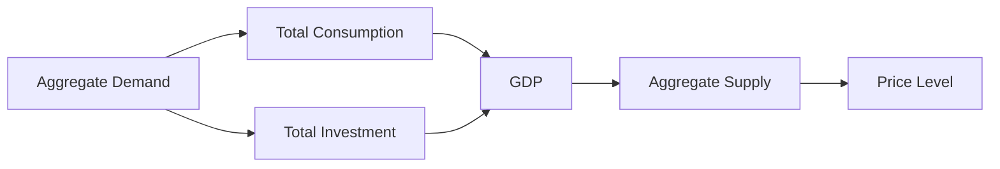

---

title: Aggregate_Behavior
type: Atomic Note
course: Economics
semester: Winter 2026
unit: '1'
hub: "[[1_Basics_Of_Economics_Hub]]"
source: "[[Chapter_1.pdf]]"
source_pages:
- 17
mode: ECON-MACRO
read: false
generated: true
prerequisites:
- "[[Macroeconomics]]"

---

# 1. Mental Model

Imagine you're in a school cafeteria with hundreds of students, and everyone is choosing what to eat for lunch. Instead of looking at each person's choice individually, aggregate behavior looks at the overall pattern of what all the students choose to eat, like how many pizzas or sandwiches are ordered. This helps us understand the bigger picture of how all these individual choices affect the cafeteria and the school.

# 2. Economic Theory

Aggregate behavior refers to the overall behavior of all [[Decision_Making_Units]] in an economy, such as consumers and firms, and how their collective actions impact economic outcomes. This concept is crucial in [[Macroeconomics]], as it helps economists understand and analyze the economy as a whole. By studying aggregate behavior, economists can identify patterns and trends that inform [[Positive_Economics]] and [[Normative_Economics]] analysis.

## 3. Economic Model



## 4. Walkthrough

* The model starts with Aggregate Demand (A), which is the total amount of spending in the economy by consumers, businesses, government, and foreigners.
* This demand is broken down into Total Consumption (B) and Total Investment (C), which are the two main components of aggregate demand.
* The sum of Total Consumption and Total Investment affects the Gross Domestic Product (GDP) (D), which is a measure of the economy's overall production.
* The GDP, in turn, influences Aggregate Supply (E), which is the total amount of production in the economy.
* Finally, Aggregate Supply and Aggregate Demand interact to determine the Price Level (F) in the economy.

## 5. Market Failures

This concept can fail when there are external shocks, such as natural disasters or global economic downturns, that affect aggregate demand and supply. Common pitfalls include ignoring the role of government policies and international trade in influencing aggregate behavior. Edge cases to watch out for include situations where the economy experiences a significant shift in consumer or investor behavior.

---

## 6. The Proving Grounds

```interactive-quiz

[
  {
    "id": "q1",
    "type": "true_false",
    "difficulty": "L1",
    "question": "Aggregate behavior focuses on individual decision-making units within an economy.",
    "answer": false,
    "explanation": "Aggregate behavior actually refers to the overall behavior of all decision-making units in an economy, such as consumers and firms, and how their collective actions affect the economy. It does not focus on individual decision-making units, but rather on the patterns and trends that emerge from the actions of all these units taken together. This concept is crucial in understanding macroeconomic phenomena, as it allows economists to analyze the economy as a whole, rather than getting bogged down in individual cases."
  },
  {
    "id": "q2",
    "type": "synthesis",
    "difficulty": "L2",
    "question": "A school cafeteria is experiencing a surge in student population and needs to adjust its lunch offerings. The cafeteria currently offers pizzas, sandwiches, and salads. Using the concept of aggregate behavior, analyze how the cafeteria can optimize its food supply to meet the demands of the growing student population.",
    "answer": "A grading rubric that assesses the cafeteria's optimization strategy based on aggregate behavior could include the following criteria: \n- Identification of overall patterns in student food choices\n- Analysis of how individual choices affect the cafeteria's supply chain\n- Evaluation of the impact of aggregate behavior on the cafeteria's operational efficiency\n- Assessment of the strategy's effectiveness in meeting the demands of the growing student population",
    "explanation": "The concept of aggregate behavior is crucial in understanding the overall pattern of student food choices in the cafeteria. By analyzing the aggregate behavior of students, the cafeteria can identify trends and patterns in food preferences, such as the popularity of pizzas over sandwiches. This information can be used to optimize the food supply, ensuring that the cafeteria has sufficient quantities of popular items while minimizing waste. The grading rubric assesses the student's ability to apply the concept of aggregate behavior to a real-world scenario, evaluating their analysis of overall patterns, supply chain management, operational efficiency, and strategy effectiveness."
  },
  {
    "id": "q3",
    "type": "writing",
    "difficulty": "L3",
    "question": "Explain how aggregate behavior helps in understanding the overall impact of individual choices in an economic context.",
    "answer": "Aggregate behavior helps in understanding the overall impact by analyzing the collective actions of decision-making units, such as consumers and firms, and how these actions influence the economy as a whole.",
    "explanation": "This concept works by aggregating the individual choices and actions of numerous economic agents, allowing economists to identify patterns and trends that might not be visible at the individual level. For instance, if a large number of consumers decide to save more and spend less, this aggregate behavior can lead to a decrease in overall demand for goods and services, influencing the economy's growth rate. Similarly, if firms collectively decide to invest more in production, the aggregate behavior can result in an increase in the supply of goods and services. By studying these aggregate behaviors, economists can better understand and predict economic outcomes, such as inflation rates, employment levels, and GDP growth."
  }
]

```