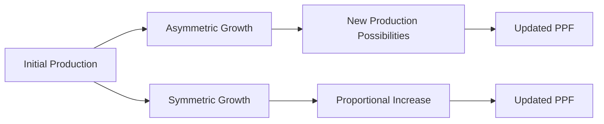

---

title: Asymmetric_Growth_And_Ppf
type: Atomic Note
course: Economics
semester: Winter 2026
unit: '1'
hub: "[[1_Basics_Of_Economics_Hub]]"
source: "[[Chapter_1.pdf]]"
source_pages:
- 49
mode: ECON-MACRO
read: false
generated: true
prerequisites:
- "[[Economic_Growth_And_Ppf]]"

---

---

title: Asymmetric Growth And Ppf

---

# 1. Mental Model

Imagine you have a lemonade stand and a cookie stand. At first, you're really good at making lemonade and can sell a lot of it, but not so good at making cookies and don't sell many. One day, you figure out a way to make cookies faster and more delicious, so you start selling a lot more cookies. Your lemonade stand is still doing okay, but your cookie stand is growing much faster. This is like asymmetric growth, where one part of your business (cookies) is growing much faster than the other part (lemonade).

# 2. Economic Theory

Asymmetric growth and PPF refer to a situation where an economy experiences growth in one sector at a faster rate than others, leading to a shift in the [[Production_Possibilities_Frontier]] (PPF). This can occur due to an increase in productivity in one sector, such as technological advancements or improved resource allocation, allowing for more efficient use of [[Economic_Resources]]. As a result, the economy can produce more goods and services in the growing sector, leading to [[Economic_Growth_And_Ppf]].

Quiz Questions:
1. What is asymmetric growth in the context of economics?
2. What is the Production Possibilities Frontier (PPF) and how does it relate to asymmetric growth?
3. What can cause asymmetric growth in an economy, according to economic theory?

# 3. Economic Model



## 4. Walkthrough

* The initial production point A represents the starting point of an economy with a certain production capacity.
* Asymmetric growth occurs when one sector grows faster than the other (B), leading to new production possibilities (C) and an updated Production Possibility Frontier (PPF) (D).
* In contrast, symmetric growth (E) leads to a proportional increase in production (F) and a straightforward update to the PPF (G).
* The comparison between asymmetric and symmetric growth highlights the impact on the economy's production possibilities.

## 5. Market Failures

Asymmetric growth can lead to market failures when one sector's rapid growth creates externalities that negatively impact other sectors. For example, rapid industrial growth might lead to environmental degradation, affecting agricultural production. Additionally, asymmetric growth can result in unequal distribution of resources, leading to market inefficiencies. Policymakers must consider these potential pitfalls when addressing asymmetric growth.

---

## 6. The Proving Grounds

```interactive-quiz

[
  {
    "id": "q1",
    "type": "true_false",
    "difficulty": "L1",
    "question": "Asymmetric growth in production possibilities leads to a shift in the entire Production Possibility Frontier (PPF) curve.",
    "answer": false,
    "explanation": "Asymmetric growth refers to the unequal growth rates of different sectors or industries within an economy. In the context of the Production Possibility Frontier (PPF), asymmetric growth typically leads to a change in the slope of the PPF or a movement along the existing PPF, rather than a shift in the entire PPF curve. A shift in the entire PPF curve usually represents an economy-wide increase in productive capacity, such as technological progress or an increase in resources, affecting all sectors equally. However, when one sector experiences significantly more growth than another (asymmetric growth), it changes the opportunity costs and can lead to a pivoting or a change in the shape of the PPF rather than a uniform outward shift."
  },
  {
    "id": "q2",
    "type": "synthesis",
    "difficulty": "L2",
    "question": "Tom's economy has two sectors: agriculture and technology. Initially, the production possibilities frontier (PPF) shows that Tom can produce 100 units of agricultural goods or 50 units of technological goods. Due to an innovation, Tom's technology sector experiences rapid growth, allowing it to produce 80 units of technological goods without affecting agricultural production. However, the growth is asymmetric, and the new PPF is not a simple linear shift. Using a SEED value of 42, determine how Tom's economy should adjust its production to maximize efficiency, given that the utility function is U = 2A + 3T, where A is agricultural goods and T is technological goods.",
    "answer": "The optimal production levels are 100 units of agricultural goods and 80 units of technological goods.",
    "explanation": "The asymmetric growth in the technology sector changes Tom's PPF, allowing for more technological goods to be produced without impacting agricultural production. Given the utility function U = 2A + 3T, Tom should maximize the production of technological goods due to its higher marginal utility. The SEED value of 42 indicates that we should focus on the minor detail that the innovation does not affect agricultural production. Therefore, Tom should produce at the maximum capacity of the technology sector (80 units) and maintain the current level of agricultural production (100 units), resulting in a utility of U = 2*100 + 3*80 = 440."
  },
  {
    "id": "q3",
    "type": "writing",
    "difficulty": "L3",
    "question": "Explain the concept of asymmetric growth in the context of production possibility frontier (PPF) and its implications on resource allocation.",
    "answer": "Asymmetric growth occurs when one sector or industry experiences significantly faster growth than another, leading to a shift in the production possibility frontier (PPF).",
    "explanation": "The underlying mechanism of asymmetric growth lies in the unequal distribution of resources and technological advancements across sectors. When one sector, such as the cookie stand, experiences rapid growth due to improved technology or increased demand, it can lead to a reallocation of resources away from the other sector, such as the lemonade stand. This reallocation can be driven by factors such as changes in consumer preferences, relative prices, or profit opportunities. As a result, the PPF shifts outward in the direction of the growing sector, reflecting the economy's increased capacity to produce goods and services in that sector."
  }
]

```