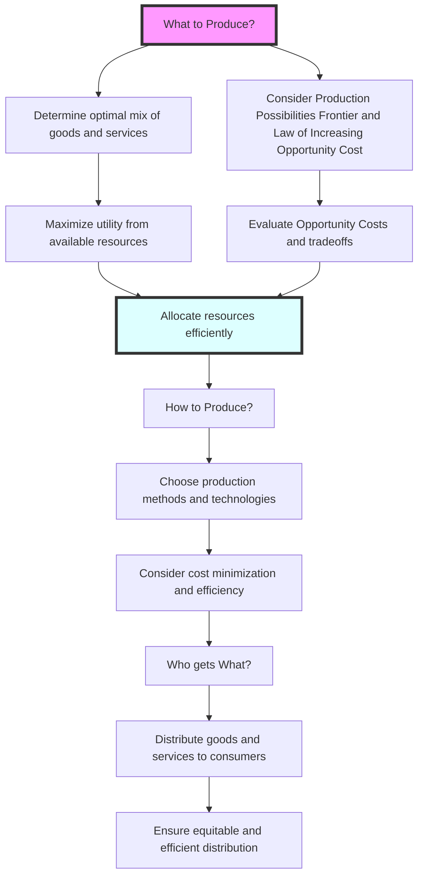

---

title: Basic_Economic_Questions
course: Economics
unit: '1'
semester: Winter 2026
mode: ECON-MICRO
type: atomic_note
hub: '[[1_Basics_Of_Economics_Hub]]'
source: '[[5-Pdf Store/note generated/Winter 2026/Economics/Chapter_1.pdf]]'
date: '2026-05-08'
prerequisites:
- '[[Production_Possibilities_Frontier]]'
source_pages:
- 50
generated: true

---


## 1. Mental Model

Imagine you have a super cool lemonade stand, and you only have enough cups, sugar, and lemons to make a limited amount of lemonade. Now, you need to answer three big questions: **What** kind of lemonade should you make (maybe strawberry or regular?), **How** should you make it (with a fancy machine or by squeezing lemons by hand?), and **For Whom** should you make it (your friends, your family, or the kids in the neighborhood?). These questions are like the basic economic questions that countries and people have to answer too: **What** goods and services to produce, **How** to produce them, and **For Whom** to produce them, given that resources are limited and can't satisfy everyone's wants and needs.

## 2. Micro Theory

The **Basic Economic Questions** constitute a fundamental framework in economic inquiry, stemming from the pervasive issue of **Scarcity_And_Choice**. These questions are intrinsic to the **Definition_Of_Economics**, which revolves around the allocation of **Economic_Resources** to satisfy unlimited **Human_Wants**. Given the constraints of **Scarcity**, societies must address three pivotal questions to achieve an **Efficient_Allocation** of resources.

The first question, **What_To_Produce**, pertains to the types and quantities of goods and services to be produced within an economy. This involves determining the optimal mix of products that maximizes the utility derived from the available resources, taking into account the **Production_Possibilities_Frontier** and the **Law_Of_Increasing_Opportunity_Cost**. The **Opportunity_Cost** of choosing to produce one good over another is a critical consideration, as it reflects the tradeoffs inherent in **Scarcity**.

The second question, **How_To_Produce**, concerns the methods and techniques employed in the production process. This involves decisions about the combination of inputs, such as labor and capital, to be used in producing goods and services. The choice of production technique is influenced by the **Economic_Resources** available, technological advancements, and the pursuit of **Efficiency**.

The third question, **For_Whom_To_Produce**, addresses the distribution of goods and services among the population. This involves determining who will receive the produced goods and services, and in what quantities. The distribution of income and the resulting **Economic_Growth** are critical factors in answering this question.

The **Basic_Economic_Questions** are central to **Economic_Theory** and are addressed through various **Branches_Of_Economics**, including **Microeconomics** and **Macroeconomics**. **Positive_Economics** provides a factual analysis of economic phenomena, while **Normative_Economics** offers value judgments about what ought to be. The process of answering these questions often involves **Inductive_Reasoning** and **Deductive_Reasoning**, as economists seek to understand the complex interactions within economies.

Different **Economic_Systems**, such as a **Capitalist_Economy**, attempt to resolve these questions through market mechanisms or government intervention. However, **Market_Failure** can occur, leading to inefficiencies and justifying the **Role_Of_Government** in correcting these failures. The works of **Adam_Smith** and other economists have shaped our understanding of how economies allocate resources and address the **Basic_Economic_Questions**.

Ultimately, the answers to these questions involve **Decision_Making_Units**, such as households and firms, making choices that reflect **Tradeoffs** and **Choice**. The study of **Basic_Economic_Questions** provides insights into the workings of economies and the mechanisms that guide **Resource_Allocation**.

## 3. Limitations & Edge Cases

The basic economic questions of what, how, and for whom to produce are limited in that they assume a simplistic, static framework that neglects complexities of real-world economies, such as dynamic changes in consumer preferences, technological advancements, and institutional factors; furthermore, these questions often implicitly assume a given distribution of income and resources, overlooking issues of inequality and unemployment, and edge cases like market failures, externalities, and public goods provision, which require more nuanced and multifaceted analysis beyond the basic framework, ultimately rendering the questions somewhat oversimplified and inadequate for addressing the intricacies of modern economic systems.

## 4. Market Graph

### Basic Economic Questions Flowchart



### Explanation

The provided Mermaid flowchart illustrates the basic economic questions that arise due to scarcity and the necessity of making choices in the allocation of resources. It outlines the decision-making process involved in determining what to produce, how to produce it, and who gets what, ultimately aiming for an efficient allocation of resources.

## 5. Walkthrough

## Step 1: Define the Basic Economic Questions

The basic economic questions are derived from the issue of **Scarcity_And_Choice** and are fundamental to the **Definition_Of_Economics**. These questions are: **What_To_Produce**, **How_To_Produce**, and **For_Whom_To_Produce**.

## Step 2: Identify the First Basic Economic Question - What To Produce

The first question, **What_To_Produce**, involves deciding the types and quantities of goods and services to be produced. This decision is based on the **Production_Possibilities_Frontier** and considers the **Opportunity_Cost** and the **Law_Of_Increasing_Opportunity_Cost**.

## 3: Identify the Second and Third Basic Economic Questions

Although not detailed in the provided text, the three basic economic questions are: 
1. **What_To_Produce**
2. **How_To_Produce** 
3. **For_Whom_To_Produce**.

## 4: Understand the Role of Scarcity

The **Scarcity** of resources necessitates answering these questions to achieve an **Efficient_Allocation** of resources to satisfy unlimited **Human_Wants**.

## 5: Apply the Questions to Resource Allocation

Given **Scarcity**, societies must make choices. For example, if a society decides to produce more **Wheat**, it must consider the **Opportunity_Cost** in terms of reduced production of another good, like **WTI Crude Oil**. Similarly, how goods are produced (**How_To_Produce**) and for whom they are produced (**For_Whom_To_Produce**) are critical for efficient resource allocation.

---

## Review & Practice

```interactive-quiz

[
  {
    "type": "mcq",
    "difficulty": "L1",
    "question": "What are the three basic economic questions that societies must address to achieve an efficient allocation of resources?",
    "options": {
      "A": "What to consume, how to produce, and for whom to produce",
      "B": "What to produce, how to produce, and for whom to produce",
      "C": "What to produce, how to consume, and for whom to consume",
      "D": "What to distribute, how to allocate, and for whom to allocate"
    },
    "answer": "B",
    "explanation": "The three basic economic questions are: (1) What to produce, which involves determining the types and quantities of goods and services to be produced; (2) How to produce, which concerns the methods and techniques employed in the production process; and (3) For whom to produce, which addresses the distribution of goods and services among the population."
  },
  {
    "type": "fill_in",
    "difficulty": "L2",
    "question": "Fill in the blank.",
    "textWithBlanks": "The Blank is a fundamental framework in economic inquiry, stemming from the pervasive issue of Scarcity_And_Choice.",
    "answer": [
      "Basic Economic Questions"
    ],
    "explanation": "The term 'Basic Economic Questions' is a critical concept in economics that stems from the issue of scarcity and choice. It constitutes a framework that includes questions such as What_To_Produce, How_To_Produce, and For_Whom_To_Produce."
  },
  {
    "type": "debug",
    "difficulty": "L1",
    "question": "Identify and correct the technical error in the following scenario: An economy is faced with the Basic Economic Questions. In determining 'What To Produce', it considers the [[Production_Possibilities_Frontier]] but mistakenly ignores the impact of Blank1 on the optimal mix of products.",
    "content": "The economy in question has to make decisions based on its resources and wants. For 'What To Produce', it looks at the Production Possibilities Frontier. However, it fails to account for Blank1 properly.",
    "answer": "The economy fails to account for the Law_Of_Increasing_Opportunity_Cost.",
    "required_keywords": [
      "Law_Of_Increasing_Opportunity_Cost",
      "Production_Possibilities_Frontier",
      "Opportunity_Cost"
    ],
    "explanation": "The correct consideration for 'What To Produce' involves both the Production Possibilities Frontier and the Law_Of_Increasing_Opportunity_Cost. The error lies in ignoring the Law_Of_Increasing_Opportunity_Cost, which is crucial for understanding the tradeoffs in production choices."
  }
]

```