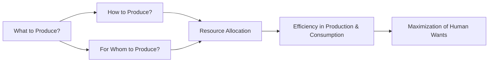

---

title: Basic_Economic_Questions
course: Economics
unit: '1'
semester: Winter 2026
mode: ECON-MICRO
type: atomic_note
hub: '[[1_Basics_Of_Economics_Hub]]'
source: '[[5-Pdf Store/note generated/Winter 2026/Economics/Chapter_1.pdf]]'
date: '2026-05-08'
prerequisites:
- '[[Scarcity]]'
- '[[Economic_Resources]]'
- '[[Human_Wants]]'
- '[[Resource_Allocation]]'
- '[[Efficient_Allocation]]'
source_pages:
- 50
generated: true

---


## 1. Mental Model

In the high-stakes world of professional sports, specifically the English Premier League, clubs face critical decisions that mirror the basic economic questions. For instance, when Arsenal FC must decide how to allocate its £200 million annual transfer budget, it must answer: (1) What to produce? - Should they invest in a new striker to boost goal-scoring, or a defensive midfielder to strengthen their backline? This relates to the question of what goods and services to produce, in this case, a strong attacking or defensive lineup. (2) How to produce? - Should they rely on their in-house scouting network or hire an external consultancy to identify top talent, illustrating the method of production and resource utilization. By mapping these two components, we see that Arsenal's management must weigh the opportunity costs of their choices, making strategic decisions that reflect the fundamental economic questions of what, how, and for whom to produce.

## 2. Micro Theory

The [[Basic_Economic_Questions]] constitute a fundamental framework in economic inquiry, stemming from the pervasive issue of [[Scarcity]], which necessitates the allocation of limited [[Economic_Resources]] to satisfy unlimited [[Human_Wants]]. The crux of economic analysis revolves around addressing these questions, which essentially seek to determine how societies organize the production, distribution, and consumption of goods and services. 

The [[Basic_Economic_Questions]] are fundamentally three: what goods and services to produce, how to produce them, and for whom to produce them. These questions are intrinsically linked to the process of [[Resource_Allocation]], which is a critical concept in economics as it deals with the distribution of resources among alternative uses to achieve an [[Efficient_Allocation]] that maximizes the satisfaction of human wants given the constraints of scarce resources.

The first question, concerning what goods and services to produce, involves deciding which [[Human_Wants]] to satisfy and to what extent. This decision is influenced by the availability of [[Economic_Resources]] and the technology at hand. The second question, how to produce, pertains to the methods and techniques of production, which are also constrained by available resources and technology. The third question, for whom to produce, addresses the distribution of goods and services among the population, reflecting issues of equity and access.

The analysis of these questions falls under the purview of [[Economic_Analysis]], which can be divided into [[Positive_Economics]] and [[Normative_Economics]]. [[Positive_Economics]] focuses on the objective analysis of economic phenomena, describing "what is," whereas [[Normative_Economics]] involves subjective judgments about "what ought to be," often influencing policy decisions related to [[Resource_Allocation]].

The resolution of the [[Basic_Economic_Questions]] varies across different [[Economic_Systems]], which are shaped by a country's history, culture, and technology. [[Adam_Smith]], often regarded as the father of modern economics, provided foundational insights into how economies function and how [[Efficient_Allocation]] can be achieved through the mechanism of the market, notably through his concept of the "invisible hand."

The study of [[Basic_Economic_Questions]] also intersects with [[Macroeconomics]], which examines the economy as a whole, focusing on aggregate variables such as inflation, unemployment, and economic growth. The approach to understanding these questions can involve both [[Inductive_Reasoning]], which generalizes from specific observations, and [[Deductive_Reasoning]], which derives specific conclusions from general principles.

In conclusion, the [[Basic_Economic_Questions]] form the bedrock of economic inquiry, reflecting the ongoing challenge of [[Scarcity]] and the need for [[Resource_Allocation]]. Their analysis is central to various branches of economics, including **Microeconomics**, [[Macroeconomics]], and [[Branches_Of_Economics]] more broadly, and is informed by the works of seminal thinkers like [[Adam_Smith]]. The study of these questions enables a deeper understanding of [[Economic_Systems]] and the mechanisms that lead to an [[Efficient_Allocation]] of resources to meet [[Human_Wants]].

## 3. Limitations & Edge Cases

The basic economic questions of what, how, and for whom to produce are limited in that they assume a simplistic, static framework that neglects complexities of real-world economies, such as dynamic changes in consumer preferences, technological advancements, and institutional factors; furthermore, these questions often implicitly assume a given distribution of income and resources, overlooking issues of inequality and unemployment, and edge cases like market failures, externalities, and public goods provision, which require more nuanced and multifaceted analysis beyond the basic framework, ultimately rendering the questions somewhat oversimplified and inadequate for addressing the intricacies of modern economic systems.

## 4. Market Graph



The provided Mermaid flowchart illustrates the interconnection between the Basic Economic Questions and the concept of Resource Allocation, ultimately leading to the goal of achieving efficiency in production and consumption to maximize human wants. The flowchart shows how the decisions on what goods and services to produce, how to produce them, and for whom to produce them are all linked through the process of resource allocation.

## 5. Walkthrough

## Step 1: Define the Basic Economic Questions

The Basic Economic Questions are three: 

## Step 2: What goods and services to produce?

## Step 3: How to produce them?

## Step 4: For whom to produce them?

## Step 5: Identify the Underlying Issue

The underlying issue is [[Scarcity]], which necessitates the allocation of limited [[Economic_Resources]] to satisfy unlimited [[Human_Wants]].

## Step 6: Understand Resource Allocation

[[Resource_Allocation]] deals with the distribution of resources among alternative uses to achieve an [[Efficient_Allocation]] that maximizes the satisfaction of human wants given the constraints of scarce resources.

## Step 7: Analyze the First Basic Economic Question

The first question, "what goods and services to produce," involves decisions on the types and quantities of goods and services to produce given the limited resources.

## Step 8: Recognize the Importance of Efficient Allocation

The goal of addressing the Basic Economic Questions is to achieve an [[Efficient_Allocation]] of resources, which maximizes the satisfaction of human wants under the constraint of scarcity.

---

## Review & Practice

```interactive-quiz

[
  {
    "type": "mcq",
    "difficulty": "L1",
    "question": "The decision on what goods and services to produce is primarily influenced by:",
    "options": {
      "A": "The level of consumer spending in the economy",
      "B": "The availability of Economic Resources and the technology at hand",
      "C": "The level of prices in the economy",
      "D": "The government's fiscal policy"
    },
    "answer": "B",
    "explanation": "The decision on what goods and services to produce is fundamentally influenced by the availability of Economic Resources and the technology at hand. This is because resources are scarce and their allocation determines the extent to which human wants can be satisfied. Technology plays a crucial role in transforming resources into goods and services efficiently."
  },
  {
    "type": "fill_in",
    "difficulty": "L2",
    "question": "Fill in the blank.",
    "textWithBlanks": "The decision on what goods and services to produce is influenced by the availability of Blank1 and the technology at hand.",
    "answer": [
      "Economic Resources"
    ],
    "explanation": "The decision on what goods and services to produce is influenced by the availability of Economic Resources and the technology at hand. This is a fundamental concept in economics, specifically related to the Basic Economic Questions.",
    "required_keywords": [
      "Economic Resources",
      "Basic Economic Questions",
      "Scarcity",
      "Resource Allocation"
    ]
  },
  {
    "type": "true_false",
    "difficulty": "L1",
    "question": "The decision on what goods and services to produce is influenced solely by consumer preferences and not by the availability of Economic Resources and the technology at hand.",
    "answer": false,
    "explanation": "The decision on what goods and services to produce is indeed influenced by the availability of Economic Resources and the technology at hand. This is a fundamental concept within the Basic Economic Questions framework, which acknowledges that the production of goods and services is constrained by the resources and technology available to a society."
  }
]

```