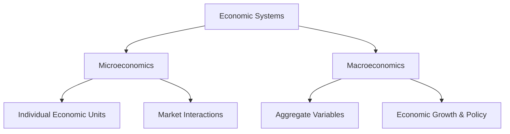

---

title: Branches_Of_Economics
course: Economics
unit: '1'
semester: Winter 2026
mode: ECON-MICRO
type: atomic_note
hub: '[[1_Basics_Of_Economics_Hub]]'
source: '[[5-Pdf Store/note generated/Winter 2026/Economics/Chapter_1.pdf]]'
date: '2026-05-08'
prerequisites:
- '[[Opportunity_Cost]]'
- '[[Macroeconomics]]'
- '[[Efficient_Allocation]]'
- '[[Economic_Resources]]'
- '[[Human_Wants]]'
source_pages:
- 15
generated: true

---


## 1. Mental Model

As an environmental economist, consider a real-world scenario where a coastal city, such as Miami, faces the challenges of sea-level rise and devastating hurricanes. In this setting, **Microeconomics** comes into play when analyzing the decision-making process of a single firm, such as a beachfront hotel, that must weigh the costs of investing in flood-protection measures, like seawalls or elevated foundations, against the potential benefits of reduced damage and uninterrupted business operations. Specifically, the hotel's management must consider the [[Opportunity_Cost]] of choosing to invest in flood protection, which could be the forgone revenue from not allocating resources to other business-enhancing projects. Meanwhile, [[Macroeconomics]] is relevant when assessing the broader economic implications of sea-level rise on the entire city's economy, such as the projected losses in tourism revenue, the impact on property values, and the overall effect on the city's GDP, thereby informing policy decisions that require a comprehensive understanding of the aggregate economic consequences of climate change.

## 2. Micro Theory

The study of economics is bifurcated into two primary branches, which serve as the foundation for understanding the complexities of economic systems. The core of modern economics is formed by its two major branches: microeconomics and macroeconomics. Microeconomics, a branch of economics that focuses on the behavior and decision-making of individual economic units, such as households and firms, examines how these units interact in specific markets to determine the prices and quantities of goods and services. This branch of economics is concerned with the [[Efficient_Allocation]] of [[Economic_Resources]], which are inherently scarce, to satisfy [[Human_Wants]].

In contrast, macroeconomics, the other major branch of economics, investigates the economy as a whole, analyzing aggregate variables such as inflation, unemployment, and economic growth. Macroeconomics seeks to understand the factors that influence the overall performance of an economy, including the role of government policies, international trade, and technological advancements. The dichotomy between microeconomics and macroeconomics reflects the different methodologies and perspectives employed to address the [[Basic_Economic_Questions]] that every economy must answer, namely, what goods and services to produce, how to produce them, and for whom to produce them.

The study of economics also encompasses [[Positive_Economics]], which focuses on the objective analysis of economic phenomena, describing "what is," and Normative Economics, which involves subjective judgments about "what ought to be." Positive economics employs Inductive Reasoning and Deductive Reasoning to develop and test economic theories, whereas normative economics relies on value judgments to evaluate economic policies and outcomes. The intersection of positive and normative economics is critical in informing Economic Analysis, which provides a framework for evaluating the Resource Allocation and identifying the most efficient solutions.

The works of Adam Smith, often regarded as the father of modern economics, laid the groundwork for the development of both microeconomics and macroeconomics. Smith's concept of the "invisible hand" illustrates how individual self-interest can lead to socially beneficial outcomes, such as the efficient allocation of resources, in a market economy. The study of Economic Systems, which include market economies, command economies, and mixed economies, provides insight into how different societies organize and allocate their Economic Resources.

Ultimately, the branches of economics, microeconomics and macroeconomics, are interconnected and interdependent, providing a comprehensive understanding of the economy and the complex interactions within it. A thorough analysis of these branches, grounded in the principles of Scarcity and Economic Resources, enables policymakers and economists to develop effective solutions to address the challenges facing modern economies, ensuring the optimal Resource Allocation and satisfaction of Human Wants. Branches Of Economics serve as the overarching framework for the study of economics, encompassing various subfields and methodologies that collectively contribute to a deeper understanding of economic phenomena.

## 3. Limitations & Edge Cases

The branches of economics, specifically microeconomics and macroeconomics, have limitations and edge cases. Microeconomics, which focuses on individual economic units, assumes that agents have perfect information and make rational decisions, but in reality, agents may have limited information and make irrational choices. Additionally, microeconomics often neglects externalities and public goods, which can have significant impacts on the economy. On the other hand, macroeconomics, which looks at the economy

## 4. Market Graph



This flowchart illustrates the two primary branches of economics, microeconomics and macroeconomics, which serve as the foundation for understanding economic systems. The branches diverge to focus on either individual economic units and market interactions (microeconomics) or the economy as a whole, analyzing aggregate variables and economic growth (macroeconomics).

## 5. Walkthrough

### 5-Step Technical Walkthrough of Branches Of Economics

#### Step 1: Identification of Primary Branches
The study of economics is divided into two primary branches: **microeconomics** and [[Macroeconomics]].

#### Step 2: Definition of Microeconomics
Microeconomics focuses on the behavior and decision-making of individual economic units, such as **households** and **firms**. It examines how these units interact in specific markets to determine the **prices** and **quantities** of goods and services.

#### Step 3: Objectives of Microeconomics
The main objective of microeconomics is the [[Efficient_Allocation]] of [[Economic_Resources]], which are inherently **scarce**, to satisfy [[Human_Wants]].

#### Step 4: Definition of Macroeconomics
Macroeconomics investigates the economy as a whole, analyzing **aggregate variables** such as:
- **Inflation**
- **Unemployment**
- [[Economic_Growth]]

#### Step 5: Objectives of Macroeconomics
Macroeconomics seeks to understand the factors that influence the overall performance of an economy, including the role of **government policies**.

---

## Review & Practice

```interactive-quiz

[
  {
    "type": "mcq",
    "difficulty": "L1",
    "question": "Which branch of economics focuses on the behavior and decision-making of individual economic units, such as households and firms, to determine the prices and quantities of goods and services?",
    "options": {
      "A": "Macroeconomics",
      "B": "Microeconomics",
      "C": "Positive Economics",
      "D": "Normative Economics"
    },
    "answer": "B",
    "explanation": "Microeconomics is the branch of economics that examines how individual economic units, such as households and firms, interact in specific markets to determine the prices and quantities of goods and services. It is concerned with the efficient allocation of economic resources, which are inherently scarce, to satisfy human wants."
  },
  {
    "type": "fill_in",
    "difficulty": "L2",
    "question": "Fill in the blank.",
    "textWithBlanks": "Microeconomics examines how individual economic units, such as households and firms, interact in specific markets to determine the prices and quantities of goods and services, which is concerned with the Blank of [[Economic_Resources]].",
    "answer": [
      "Efficient Allocation"
    ],
    "explanation": "The blank refers to the concept of efficient allocation of economic resources, which is a fundamental aspect of microeconomics. Microeconomics focuses on the behavior and decision-making of individual economic units, such as households and firms, and examines how these units interact in specific markets to determine the prices and quantities of goods and services. This branch of economics is concerned with the efficient allocation of economic resources, which are inherently scarce, to satisfy human wants.",
    "required_keywords": [
      "Microeconomics",
      "Efficient Allocation",
      "Economic Resources"
    ]
  },
  {
    "type": "true_false",
    "difficulty": "L1",
    "question": "In Labor Market Economics, an increase in income leads to an increase in the demand for an inferior good.",
    "answer": false,
    "explanation": "In Labor Market Economics, an increase in income leads to a decrease in the demand for an inferior good. Inferior goods are those for which demand decreases as income increases. This is in contrast to normal goods, for which demand increases as income increases."
  }
]

```