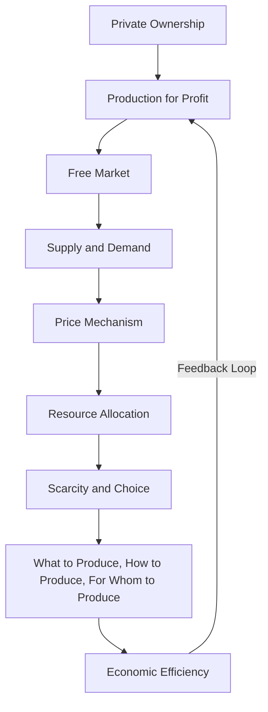

---

title: Capitalist_Economy
course: "Economics"
unit: '1'
semester: "Winter 2026"
mode: ECON-MICRO
type: atomic_note
hub: "[[1_Basics_Of_Economics_Hub]]"
source: "[[5-Pdf Store/note generated/Winter 2026/Economics/Chapter_1.pdf]]"
date: '2026-05-08'
prerequisites:
- "[[Economic_Systems]]"
source_pages:
- 57
generated: true

---

## 1. Mental Model

Imagine you have a lemonade stand. You make lemonade and sell it to people walking by. You own the lemons, sugar, and cups (that's like owning the means of production). You decide how much lemonade to make and how much to charge for it (that's like being your own entrepreneur). You want to make as much money as possible, so you try to sell as much lemonade as you can and make it taste really good (that's like working for private profit). If you make a lot of money, you can use it to buy more lemons and sugar, and maybe even hire your friends to help you make even more lemonade! That's kind of like a capitalist economy, where people own their own businesses and try to make money by selling things to others.

## 2. Micro Theory

A capitalist economy is a type of economic system where the means of production are predominantly privately owned by individuals or businesses, and the primary motive for production is to generate private profits. This system operates on the principles of [[Scarcity_And_Choice]], where [[Human_Wants]] are unlimited, but [[Economic_Resources]] are limited, necessitating choices on how to allocate these resources efficiently.

The capitalist economy is characterized by private ownership of the factors of production, including capital goods, and the creation of goods and services for profit in a free market. The [[Definition_Of_Economics]] implies that resources are scarce, and their allocation must be efficient. In a capitalist economy, this efficiency is achieved through the mechanism of the market, where prices of goods and services are determined by supply and demand.

The fundamental [[Basic_Economic_Questions]] - [[What_To_Produce]], [[How_To_Produce]], and [[For_Whom_To_Produce]] - are answered through the interactions of numerous private decision-making units, such as households and businesses, operating in a market environment. The answers to these questions are guided by the pursuit of profit and the desire to maximize utility or satisfaction.

The production possibilities of an economy are illustrated by the [[Production_Possibilities_Frontier]] (PPF), which shows the various combinations of two goods or services that can be produced given the available resources and technology. The [[Law_Of_Increasing_Opportunity_Cost]] applies here, indicating that as more of one good is produced, the opportunity cost of producing additional units of that good increases.

In a capitalist economy, [[Opportunity_Cost]] plays a crucial role in decision-making. Resources are allocated based on their alternative uses, and the choices made reflect the trade-offs inherent in [[Scarcity]]. The efficient allocation of resources is a key objective, aiming to achieve an optimal distribution of resources that maximizes the satisfaction of [[Human_Wants]].

The study of economics, including the functioning of a capitalist economy, falls under [[Branches_Of_Economics]], which include [[Macroeconomics]] and [[Positive_Economics]], as well as [[Normative_Economics]]. [[Positive_Economics]] deals with what is, while [[Normative_Economics]] concerns what ought to be. The analysis of a capitalist economy often involves [[Inductive_Reasoning]] and [[Deductive_Reasoning]], as economists seek to understand and predict economic phenomena.

The concept of a capitalist economy was significantly influenced by [[Adam_Smith]], who is considered the father of modern economics. His work laid the foundation for [[Economic_Theory]], including the "invisible hand" mechanism that guides resources to their most valuable uses in a free market.

However, a capitalist economy is not without its challenges. Issues such as [[Market_Failure]], where the market fails to allocate resources efficiently, can arise. This may necessitate the [[Role_Of_Government]] in correcting these failures through regulation or public goods provision.

In conclusion, a capitalist economy operates on the principles of private ownership, profit motive, and free market exchange. It relies on the efficient allocation of [[Economic_Resources]] to meet [[Human_Wants]] under conditions of [[Scarcity]], with decision-making distributed among numerous private [[Decision_Making_Units]]. The system's efficiency and growth potential are influenced by factors such as [[Economic_Growth]], [[Efficiency]], and the inevitable [[Tradeoffs]] and [[Choice]]s that economic agents must make.

## 3. Limitations & Edge Cases

The capitalist economy is limited by its tendency to concentrate wealth and power in the hands of a few individuals, leading to income inequality and potential exploitation of workers. Additionally, the pursuit of private profit can lead to market failures, such as negative externalities and information asymmetry, which can result in socially suboptimal outcomes. Furthermore, the system's reliance on continuous growth and profit maximization can lead to environmental degradation and neglect of social welfare. The capitalist economy also struggles with issues of imperfect competition, where large corporations may wield significant market power, stifling innovation and competition. Moreover, the system's inability to provide public goods and address collective action problems can lead to underinvestment in essential services like healthcare, education, and infrastructure. Overall, these limitations highlight the need for regulatory frameworks and institutional interventions to mitigate the negative consequences of capitalist economies.

## 4. Market Graph



This flowchart illustrates the core components of a capitalist economy, including private ownership, production for profit, and the free market, which interact to determine resource allocation and economic efficiency. The feedback loop from economic efficiency back to production for profit highlights the self-regulating nature of the capitalist economy, where the pursuit of profit drives innovation and efficiency.

## 5. Walkthrough

## Step 1: Private Ownership of Means of Production

In a capitalist economy, the means of production are privately owned by individuals or businesses. This implies that resources such as capital goods, labor, and raw materials are owned and controlled by private entities rather than the state.

## Step 2: Production for Private Profit

Production in a capitalist economy takes place at the initiative of individual private entrepreneurs who work mainly for private profit. This means that the primary motive for production is not to satisfy social needs directly but to generate profits for the owners of the means of production.

## Step 3: Operation through Market Mechanism

The capitalist economy operates through the market mechanism, where prices of goods and services are determined by supply and demand. This mechanism ensures that resources are allocated efficiently, given that they are scarce.

## Step 4: Addressing Basic Economic Questions

The capitalist economy addresses the basic economic questions:
- **What to Produce**: The decision on what goods and services to produce is determined by the profit motive. Entrepreneurs produce goods and services that they believe will yield a profit.
- **How to Produce**: The method of production is chosen based on cost minimization and efficiency to maximize profits.
- **For Whom to Produce**: The distribution of goods and services is determined by market forces, specifically the interaction of supply and demand, which influences prices and, consequently, who can afford to buy the goods and services produced.

## 5: Efficiency through Supply and Demand

Efficiency in the allocation of resources is achieved through the supply and demand mechanism. When demand for a good or service is high, and supply is low, prices tend to rise. This signals to entrepreneurs that they can make a profit by producing more of that good or service. Conversely, if demand is low and supply is high, prices fall, signaling that less of that good or service should be produced. This process ensures that resources are allocated in a way that reflects consumer preferences and the scarcity of resources.

---

## Review & Practice

```interactive-quiz

[
  {
    "type": "mcq",
    "difficulty": "L1",
    "question": "In a capitalist economy, the mechanism that guides resources to their most valuable uses in a free market is referred to as the:",
    "options": {
      "A": "Invisible Hand",
      "B": "Invisible Hand",
      "C": "Market Failure",
      "D": "Scarcity Principle"
    },
    "answer": "B",
    "explanation": "The concept of the 'invisible hand' was introduced by Adam Smith to describe how individuals acting in their own self-interest can lead to socially beneficial outcomes, such as the efficient allocation of resources in a free market."
  },
  {
    "type": "fill_in",
    "difficulty": "L2",
    "question": "Fill in the blank.",
    "textWithBlanks": "A capitalist economy is a type of economic system where the means of production are predominantly privately owned by individuals or businesses, and the primary motive for production is to generate private profits. This system operates on the principles of [[Scarcity_And_Choice]], where [[Human_Wants]] are unlimited, but [[Economic_Resources]] are limited, necessitating choices on how to allocate these resources efficiently.",
    "answer": [
      "Scarcity_And_Choice"
    ],
    "explanation": "The most important technical term for 'Capitalist Economy' in the given context is 'Scarcity_And_Choice'."
  },
  {
    "type": "debug",
    "difficulty": "L1",
    "question": "Find the bug in the following scenario of a capitalist economy: In a capitalist economy, the production possibilities of an economy are illustrated by the [[Production_Possibilities_Frontier]] (PPF), which shows the various combinations of two goods or services that can be produced given the available resources and Technological Progress. However, the scenario incorrectly states that the PPF is influenced by Government Intervention.",
    "content": "The production possibilities of an economy are illustrated by the [[Production_Possibilities_Frontier]] (PPF), which shows the various combinations of two goods or services that can be produced given the available resources and Technological Progress. However, the PPF is also significantly influenced by Government Intervention.",
    "answer": "The bug is the inclusion of Government Intervention as a direct influencer of the PPF in a capitalist economy. While government intervention can indirectly affect the PPF through policies that impact technology, resources, or trade, the PPF is primarily determined by the available resources and technology. The correct influencers to consider are [[Scarcity]], Technological Progress, and [[Resource_Allocation]].",
    "required_keywords": [
      "Production_Possibilities_Frontier",
      "Technological_Progress",
      "Scarcity"
    ],
    "explanation": "The PPF is a graphical representation showing the various combinations of two goods that can be produced given the available resources and technology. It is primarily influenced by changes in resources, technology, and efficiency. Government intervention can affect these factors but is not a direct influencer of the PPF itself in the context of a capitalist economy's basic model."
  }
]

```