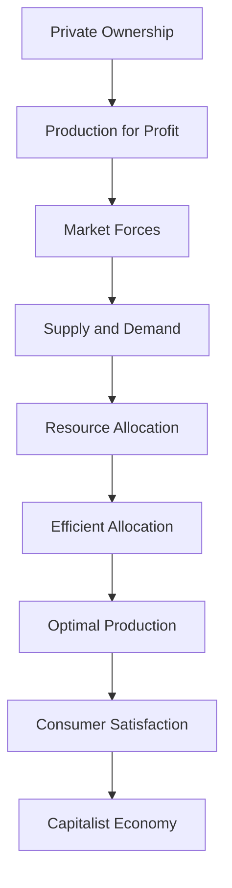

---

title: Capitalist_Economy
course: "Economics"
unit: '1'
semester: "Winter 2026"
mode: ECON-MICRO
type: atomic_note
hub: "[[1_Basics_Of_Economics_Hub]]"
source: "[[5-Pdf Store/note generated/Winter 2026/Economics/Chapter_1.pdf]]"
date: '2026-05-08'
prerequisites:
- "[[Economic_Systems]]"
source_pages:
- 57
generated: true

---

## 1. Mental Model

In the competitive world of commercial airlines, a capitalist economy is exemplified by the operations of low-cost carriers such as Ryanair. Here, privately owned companies like Ryanair own their means of production, including aircraft, and production, or flight schedules and routes, are determined by individual entrepreneurs aiming to maximize private profits. Two specific components of a capitalist economy are evident: (1) **Private Ownership**, as Ryanair's fleet and infrastructure are owned by private shareholders, and (2) **Profit Motive**, as the airline's primary goal is to generate profits for its owners by offering affordable fares and efficient services, while minimizing costs through efficient operations, illustrating how capitalist principles drive business decisions in a real-world setting.

## 2. Micro Theory

A capitalist economy is a type of [[Economic_Systems]] characterized by the private ownership of the means of production, where individuals and businesses operate with the primary goal of generating profits. In this economic system, all means of production are privately owned, and production takes place at the initiative of individual private entrepreneurs who work mainly for private profit. The capitalist economy is driven by the principles of [[Scarcity]], where [[Human_Wants]] are unlimited, but the resources available to satisfy those wants are limited.

The mechanism of a capitalist economy relies on the efficient allocation of [[Economic_Resources]], which are allocated based on market forces, such as supply and demand. The [[Basic_Economic_Questions]] of what, how, and for whom to produce are answered through the interactions of individuals and businesses in the market, rather than through central planning. This leads to an Efficient Allocation of resources, as resources are allocated to their most valuable uses.

The study of capitalist economies falls under the purview of Microeconomics, a branch of Branches Of Economics, which focuses on the analysis of individual economic units, such as households and firms. Economic Analysis of capitalist economies involves the use of both Positive Economics, which focuses on the description and analysis of economic phenomena, and Normative Economics, which involves making value judgments about economic outcomes.

The concept of a capitalist economy was first articulated by Adam Smith, who argued that economic growth and prosperity are driven by the pursuit of self-interest and the division of labor. Inductive Reasoning and Deductive Reasoning are used in the study of capitalist economies to develop and test hypotheses about economic behavior and outcomes.

In a capitalist economy, Resource Allocation is determined by the market, rather than by a central authority. This leads to a more efficient allocation of resources, as resources are allocated based on their market value, rather than on arbitrary criteria. The study of macroeconomic phenomena, such as inflation and unemployment, is also relevant to the study of capitalist economies, and falls under the purview of Macroeconomics.

Overall, a capitalist economy is a complex system that relies on the interactions of individual economic agents to allocate resources and determine economic outcomes. Understanding the mechanisms and principles of a capitalist economy is essential for analyzing and evaluating economic policies and outcomes.

## 3. Limitations & Edge Cases

The capitalist economy is limited by its tendency to concentrate wealth and power in the hands of a few individuals, leading to income inequality and potential exploitation of workers. Additionally, the pursuit of private profit can lead to market failures, such as negative externalities and information asymmetry, which can result in socially suboptimal outcomes. Furthermore, the system's reliance on continuous growth and profit maximization can lead to environmental degradation and neglect of social welfare. The capitalist economy also struggles with issues of imperfect competition, where large corporations may wield significant market power, stifling innovation and competition. Moreover, the system's inability to provide public goods and address collective action problems can lead to underinvestment in essential services like healthcare, education, and infrastructure. Overall, these limitations highlight the need for regulatory frameworks and institutional interventions to mitigate the negative consequences of capitalist economies.

## 4. Market Graph



This flowchart illustrates the mechanism of a capitalist economy, where private ownership and production for profit drive the allocation of resources through market forces, ultimately leading to efficient allocation and consumer satisfaction. The capitalist economy is characterized by the interactions of individuals and businesses in the market, which determine the optimal production and allocation of resources.

## 5. Walkthrough

### 5-Step Technical Walkthrough of a Capitalist Economy

#### Step 1: Private Ownership of Means of Production
In a capitalist economy, all means of production are privately owned. This implies that individuals and businesses have ownership of resources such as factories, land, and capital. For example, companies like Ford own factories and machinery for car production.

#### Step 2: Production for Private Profit
Production in a capitalist economy takes place at the initiative of individual private entrepreneurs who work mainly for private profit. This means that the primary goal of businesses is to maximize profits. For instance, Apple produces iPhones with the goal of earning profits from their sale.

#### Step 3: Allocation of Economic Resources
The mechanism of a capitalist economy relies on the efficient allocation of economic resources based on market forces such as supply and demand. This process en#### Step 4: Market Determination of Production
The basic economic questions of what, how, and for whom to produce are answered through the interactions of individuals and businesses in the market. This is in contrast to central planning, where the government makes these decisions. In a capitalist economy, market forces guide the production of goods and services. For example, if consumers demand more electric vehicles, car manufacturers like Ford will adjust their production to meet this demand.

#### Step 5: Efficient Allocation of Resources
The interaction of supply and demand in the market leads to an efficient allocation of resources. Resources are allocated to the production of goods and services that are in high demand and for which consumers are willing to pay. This efficient allocation ensures that resources are not wasted on producing goods and services that are not needed or wanted. For instance, if the demand for WTI Crude Oil increases, oil producers will allocate more resources to its extraction, assuming it is profitable.

---

## Review & Practice

```interactive-quiz

[
  {
    "type": "mcq",
    "difficulty": "L1",
    "question": "In a capitalist economy, the basic economic questions of what, how, and for whom to produce are answered through:",
    "options": {
      "A": "Central planning by the government",
      "B": "The interactions of individuals and businesses in the market",
      "C": "A combination of government intervention and market forces",
      "D": "The initiative of individual consumers"
    },
    "answer": "B",
    "explanation": "In a capitalist economy, the basic economic questions of what, how, and for whom to produce are answered through the interactions of individuals and businesses in the market, rather than through central planning. This leads to an efficient allocation of resources, as resources are allocated to their most valuable uses based on market forces such as supply and demand."
  },
  {
    "type": "fill_in",
    "difficulty": "L2",
    "question": "Fill in the blank.",
    "textWithBlanks": "The Blank economy is a type of economic system characterized by the private ownership of the means of production, where individuals and businesses operate with the primary goal of generating profits.",
    "answer": [
      "capitalist"
    ],
    "explanation": "The term 'capitalist' is the critical technical term that defines this type of economic system."
  },
  {
    "type": "true_false",
    "difficulty": "L1",
    "question": "In a capitalist economy, the basic economic questions of what, how, and for whom to produce are answered through central planning rather than through the interactions of individuals and businesses in the market.",
    "answer": false,
    "explanation": "In a capitalist economy, the basic economic questions of what, how, and for whom to produce are answered through the interactions of individuals and businesses in the market, rather than through central planning. This allows for a more efficient allocation of resources, as resources are allocated based on their market value, rather than on arbitrary criteria."
  }
]

```