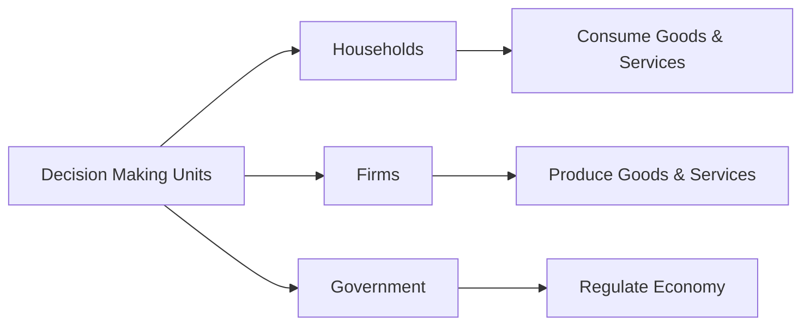

---

title: Decision_Making_Units
type: Atomic Note
course: Economics
semester: Winter 2026
unit: '1'
hub: "[[1_Basics_Of_Economics_Hub]]"
source: "[[Chapter_1.pdf]]"
source_pages:
- 17
mode: ECON-MACRO
read: false
generated: true
prerequisites:
- "[[Definition_Of_Economics]]"

---

# 1. Mental Model

Imagine you're planning a school event and you need to decide how to organize it. You have to think about who will help, what food to serve, and how to make it fun. In economics, the people or groups making these kinds of choices are called decision-making units. They can be individuals, families, companies, or even governments.

# 2. Economic Theory

Decision Making Units refer to the individual entities that make economic choices, such as [[Households]], [[Firms]], and [[Markets]], which are the basic building blocks of economic analysis in [[Microeconomics]]. These units make decisions about how to allocate [[Economic_Resources]] and face [[Scarcity]] and [[Opportunity_Cost]] in their decision-making processes. They play a crucial role in shaping [[Aggregate_Behavior]] and the overall performance of an economy.

# 3. Economic Model



## 4. Walkthrough

* Decision Making Units (DMUs) are entities that make economic choices, such as households, firms, and government.
* Households (B) consume goods and services (E) based on their preferences and budget constraints.
* Firms (C) produce goods and services (F) to maximize profits, and
* Government (D) regulates the economy (G) through policies and laws.

## 5. Market Failures

This concept may fail when decision-making units have imperfect information, leading to suboptimal choices. Additionally, externalities, such as pollution, can occur when firms prioritize profits over social welfare. Furthermore, government interventions can sometimes lead to inefficiencies or misallocations of resources.

---

## 6. The Proving Grounds

```interactive-quiz

[
  {
    "id": "q1",
    "type": "true_false",
    "difficulty": "L1",
    "question": "Decision Making Units in economics can only be individuals or families.",
    "answer": false,
    "explanation": "Decision Making Units in economics refer to the individual entities that make economic choices. These units are not limited to just individuals or families. According to economic theory, Decision Making Units can also include firms, companies, and even governments, as they all play a role in making economic decisions. This broader definition encompasses various sectors of the economy, making the statement that Decision Making Units can only be individuals or families incorrect."
  },
  {
    "id": "q2",
    "type": "synthesis",
    "difficulty": "L2",
    "question": "The local government is planning a community festival and needs to decide on the logistics. They have to choose between organizing it themselves or outsourcing it to a private events company. The festival will feature food stalls, entertainment, and a fireworks display. The government has a budget of $10,000 and expects around 5,000 attendees. Using the concept of Decision Making Units, analyze the situation and propose a decision-making approach.",
    "answer": "A grading rubric for this scenario could be:\n- Criteria 1: Cost-effectiveness (30 points)\n- Criteria 2: Quality of entertainment and services (25 points)\n- Criteria 3: Community engagement and participation (20 points)\n- Criteria 4: Logistical feasibility and risk management (25 points)\n\nThe government should evaluate both options against these criteria, considering the potential costs, benefits, and risks associated with each approach.",
    "explanation": "In this scenario, the local government acts as a Decision Making Unit, tasked with making economic choices that optimize the use of resources. By establishing clear criteria such as cost-effectiveness, quality of services, community engagement, and logistical feasibility, the government can systematically evaluate the two options. This approach allows for a structured comparison of the potential outcomes, enabling the government to make an informed decision that aligns with the community's needs and preferences. The use of a grading rubric facilitates transparency and accountability in the decision-making process, which is essential for Decision Making Units in the public sector."
  },
  {
    "id": "q3",
    "type": "writing",
    "difficulty": "L3",
    "question": "Explain Decision Making Units in the context of economic theory and their role in microeconomics.",
    "answer": "Decision Making Units are individual entities that make economic choices, including households, firms, and markets, which are the basic building blocks of economic analysis in microeconomics.",
    "explanation": "In microeconomics, Decision Making Units play a crucial role as they are the fundamental actors that drive economic activity by making choices about how to allocate resources. These units can be households, which decide how to spend their income, firms, which decide how much to produce and at what price, or markets, which facilitate the interaction between buyers and sellers. The interactions and decisions of these units determine the prices and quantities of goods and services in an economy. The concept of Decision Making Units helps economists analyze and understand the behavior of economic agents and the outcomes of their choices."
  }
]

```