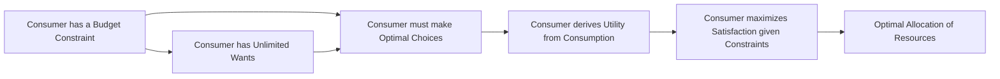

---

title: Deductive_Reasoning
course: Economics
unit: '1'
semester: Winter 2026
mode: ECON-MICRO
type: atomic_note
hub: '[[1_Basics_Of_Economics_Hub]]'
source: '[[5-Pdf Store/note generated/Winter 2026/Economics/Chapter_1.pdf]]'
date: '2026-05-08'
prerequisites:
- '[[Scarcity_And_Choice]]'
- '[[Economic_Resources]]'
- '[[Human_Wants]]'
- '[[Definition_Of_Economics]]'
- '[[Decision_Making_Units]]'
source_pages: []
generated: true

---


## 1. Mental Model

Imagine you have a super cool toy box filled with different colored blocks. Deductive reasoning is like using a special set of instructions to figure out what color block you'll pick out next. Let's say you know that all the blocks in the box are either red or blue, and you also know that you're only allowed to pick blocks from the top shelf, where all the blocks are blue. If someone tells you that you're going to pick a block from the top shelf, you can use deductive reasoning to conclude that the block you'll pick will definitely be blue - it's like following a secret code that guarantees the answer!

## 2. Micro Theory

Deductive reasoning is a cognitive process that involves drawing a specific conclusion from one or more general premises using logical rules. In the context of microeconomics, deductive reasoning is essential for making informed decisions about resource allocation, given the fundamental problem of [[Scarcity_And_Choice]], which necessitates the optimization of [[Economic_Resources]] to satisfy [[Human_Wants]].

The deductive reasoning mechanism can be understood as a sequence of steps, commencing with a well-defined set of axioms or premises, which are assumed to be true. These premises often relate to the [[Definition_Of_Economics]], which studies how [[Decision_Making_Units]], such as consumers and firms, allocate scarce resources to meet their unlimited wants. By applying logical rules, such as modus ponens or syllogism, to these premises, economists can derive conclusions that are guaranteed to be true if the initial assumptions are correct.

For instance, if we assume that consumers are rational and aim to maximize their utility, and that firms seek to maximize profits, we can use deductive reasoning to derive the optimal [[Efficient_Allocation]] of resources in a [[Capitalist_Economy]]. This process involves analyzing the [[Production_Possibilities_Frontier]] and the associated [[Opportunity_Cost]] of producing different goods and services, which ultimately informs the [[Basic_Economic_Questions]] of what to produce, how to produce, and for whom to produce.

Furthermore, deductive reasoning is crucial in [[Positive_Economics]], which focuses on the objective analysis of economic phenomena, and [[Normative_Economics]], which involves making value judgments about economic policies. By employing deductive reasoning, economists can evaluate the implications of different policy interventions, such as the impact of [[Market_Failure]] on [[Economic_Growth]], and the role of Government in correcting such failures.

In contrast to [[Inductive_Reasoning]], which involves making generalizations based on specific observations, deductive reasoning relies on the application of logical rules to arrive at a certain conclusion. The conclusions derived from deductive reasoning can be used to inform [[Resource_Allocation]] decisions, evaluate the efficiency of different [[Economic_Systems]], and understand the [[Tradeoffs]] involved in making economic choices.

The works of [[Adam_Smith]], often regarded as the father of modern economics, laid the foundation for the use of deductive reasoning in economics. His ideas on the Invisible Hand and the concept of [[Efficient_Allocation]] have been built upon and refined using deductive reasoning, ultimately contributing to the development of [[Economic_Theory]].

In conclusion, deductive reasoning is a powerful tool in microeconomics, allowing economists to derive logical conclusions from a set of premises, often related to [[Scarcity]], [[Opportunity_Cost]], and [[Efficient_Allocation]]. By applying deductive reasoning, economists can analyze complex economic phenomena, evaluate policy interventions, and inform decision-making, ultimately contributing to a deeper understanding of [[Branches_Of_Economics]] and the economy as a whole.

## 3. Limitations & Edge Cases

Deductive reasoning, while a powerful tool for deriving conclusions from premises, has limitations, particularly when context is absent. Without contextual information, deductive reasoning can lead to flawed conclusions if the premises are incomplete, inaccurate, or irrelevant. For instance, a syllogism may be logically sound but rely on outdated or culture-specific assumptions, rendering the conclusion invalid in a different context. Moreover, deductive reasoning struggles with ambiguity and vagueness, which are inherent in many real-world problems, leading to difficulties in defining the premises and, subsequently, the conclusion. Furthermore, in situations where there is a lack of clear definitions or unclear relationships between concepts, deductive reasoning can result in incorrect or incomplete conclusions, underscoring the need for contextual understanding to ensure the validity and relevance of the reasoning process.

## 4. Market Graph



This flowchart illustrates the deductive reasoning process in consumer behavior analysis, starting with the premises of a budget constraint and unlimited wants, and logically deriving the conclusion of optimal resource allocation. By applying logical rules to these initial assumptions, economists can deduce that consumers will strive to maximize satisfaction, ultimately leading to an optimal allocation of resources.

## 5. Walkthrough

## Step 1: Define the Premises

Identify the given premises. In this case, we have:
- The fundamental problem of [[Scarcity_And_Choice]].
- The need to optimize [[Economic_Resources]] to satisfy [[Human_Wants]].
- The [[Definition_Of_Economics]] which involves how [[Decision_Making_Units]] (consumers and firms) allocate scarce resources.

## Step 2: Establish the Axioms or General Statements

Assume axioms or general statements based on the premises:
- Axiom 1: Resources are scarce.
- Axiom 2: Human wants are unlimited.
- Axiom 3: The goal of [[Decision_Making_Units]] is to optimize resource allocation.

## 3: Apply Logical Rules

Apply logical rules such as modus ponens or syllogism to derive conclusions:
- Modus Ponens: If A then B; A; therefore B.
- Syllogism: All A are B; All B are C; therefore All A are C.

## 4: Derive Specific Conclusions

Using the axioms and logical rules, derive specific conclusions:
- If resources are scarce (Axiom 1) and human wants are unlimited (Axiom 2), then [[Decision_Making_Units]] must make choices about resource allocation (by modus ponens).

## 5: Validate the Conclusions

Validate the conclusions based on the initial premises and logical rules:
- The conclusion that [[Decision_Making_Units]] must make choices about resource allocation is valid given the premises of scarcity and unlimited wants. This process ensures that conclusions logically follow from the assumed premises, which is the essence of deductive reasoning in microeconomics.

---

## Review & Practice

```interactive-quiz

[
  {
    "type": "mcq",
    "difficulty": "L1",
    "question": "In the context of Consumer Behavior Analysis, what is the primary role of deductive reasoning in decision-making?",
    "options": {
      "A": "To make generalizations based on specific observations about consumer preferences",
      "B": "To derive a specific conclusion from one or more general premises using logical rules about utility maximization",
      "C": "To analyze the impact of market trends on consumer behavior",
      "D": "To evaluate the efficiency of different economic systems in resource allocation"
    },
    "answer": "B",
    "explanation": "Deductive reasoning in Consumer Behavior Analysis involves drawing specific conclusions from general premises using logical rules. It is essential for making informed decisions about resource allocation, given the fundamental problem of scarcity and choice. By applying logical rules to premises related to consumer behavior, such as the goal of utility maximization, economists can derive conclusions that are guaranteed to be true if the initial assumptions are correct."
  },
  {
    "type": "fill_in",
    "difficulty": "L2",
    "question": "Fill in the blank.",
    "textWithBlanks": "In contrast to [[Inductive_Reasoning]], which involves making generalizations based on specific observations, deductive reasoning relies on the application of logical rules to arrive at a certain conclusion.",
    "answer": [
      "Inductive_Reasoning"
    ],
    "explanation": "The sentence contains the single most important technical term for 'Deductive Reasoning' which is its contrasting concept 'Inductive_Reasoning'."
  },
  {
    "type": "debug",
    "difficulty": "L1",
    "question": "Identify the technical error in the following deductive reasoning scenario: If a firm maximizes profits in a [[Capitalist_Economy]] by producing at the point where Marginal Revenue equals Marginal Cost, and assuming that the firm's goal is to achieve an [[Efficient_Allocation]] of resources, then the firm will necessarily achieve Economic Efficiency in the short run by adjusting its Production Level.",
    "content": "The scenario provided uses deductive reasoning to conclude that a firm achieves Economic Efficiency in the short run by producing at the point where Marginal Revenue equals Marginal Cost. However, this conclusion overlooks the importance of Market Structure in determining the firm's ability to achieve Economic Efficiency.",
    "answer": "The technical error lies in assuming that achieving [[Efficient_Allocation]] through Marginal Revenue = Marginal Cost necessarily leads to Economic Efficiency in the short run without considering the impact of Market Structure on the firm's production and pricing decisions.",
    "required_keywords": [
      "Market_Structure",
      "Efficient_Allocation",
      "Economic_Efficiency",
      "Marginal_Revenue",
      "Marginal_Cost"
    ],
    "explanation": "The scenario incorrectly assumes that profit maximization through Marginal Revenue = Marginal Cost automatically results in Economic Efficiency without accounting for how different Market Structures (e.g., perfect competition, monopoly, oligopoly) can affect the firm's output, price, and ultimately, its efficiency. This oversight neglects the complex interactions between firms and consumers in various market environments."
  }
]

```