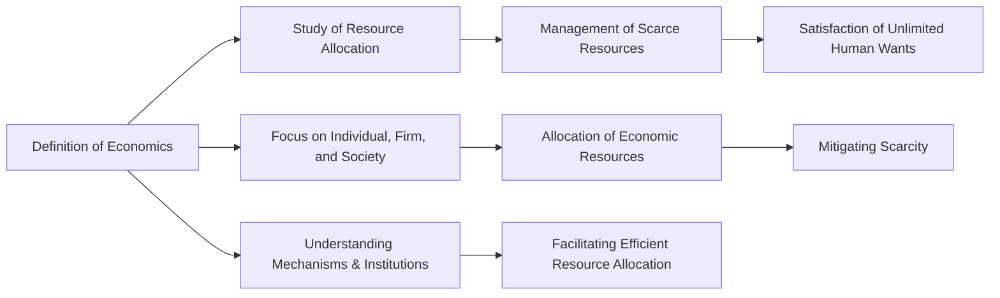

---

title: Definition_Of_Economics
course: Economics
unit: '1'
semester: Winter 2026
mode: ECON-MICRO
type: atomic_note
hub: '[[1_Basics_Of_Economics_Hub]]'
source: '[[5-Pdf Store/note generated/Winter 2026/Economics/Chapter_1.pdf]]'
date: '2026-05-08'
prerequisites:
- '[[Scarcity]]'
- '[[Opportunity_Cost]]'
- '[[Human_Wants]]'
- '[[Economic_Resources]]'
- '[[Resource_Allocation]]'
source_pages:
- 7
generated: true

---


## 1. Mental Model

As an environmental economist, I'd like to illustrate the definition of economics using a real-world scenario. Imagine a coastal city, such as Miami, struggling with sea-level rise and frequent hurricanes. The city's mayor, tasked with managing the municipal budget, must allocate resources to mitigate the effects of climate change, such as building sea walls, restoring wetlands, and upgrading stormwater drainage systems. Here, the mayor is essentially "managing a household" - in this case, the city's economy - making decisions about how to allocate scarce resources to meet the competing demands of residents, businesses, and the environment. Two specific components of economics are explicitly mapped here: [[Scarcity]] (the city's limited budget and resources) and [[Opportunity_Cost]] (the trade-off between investing in sea walls versus other public goods, such as education or healthcare). By making informed decisions, the mayor is, in effect, balancing the city's economic, social, and environmental priorities, much like a household manager allocates resources to meet the needs of their family.

## 2. Micro Theory

The discipline of economics is rooted in the Greek phrase "one who manages a household," implying a focus on the management of scarce resources to satisfy unlimited [[Human_Wants]]. This etymological origin underscores the fundamental concept of economics as the study of how individuals, firms, and societies allocate [[Economic_Resources]] to meet their needs and wants, given the constraints of [[Scarcity]]. At its core, economics seeks to understand the mechanisms and institutions that facilitate the [[Resource_Allocation]] process, ensuring an [[Efficient_Allocation]] of resources.

The study of economics encompasses various branches, including Macroeconomics, which examines aggregate economic phenomena, and Positive Economics, which focuses on the descriptive analysis of economic phenomena, untainted by normative judgments. In contrast, Normative Economics involves value judgments and prescriptive statements about what ought to be. The methodological approaches of Inductive Reasoning and Deductive Reasoning are employed in Economic Analysis to develop and test economic theories.

The foundational questions of economics, encapsulated in the Basic Economic Questions, revolve around what goods and services to produce, how to produce them, and for whom they are produced. These questions are addressed within the context of different Economic Systems, which provide the institutional framework for resource allocation. The works of Adam Smith, often regarded as the father of modern economics, laid the groundwork for understanding the efficiency of market mechanisms in allocating resources.

The excitement in economics The field's comprehensive frameworks and models facilitate a deeper understanding of economic phenomena, contributing to the ongoing discourse on how best to organize and manage economies, reflecting the essence of economics as the study of household management on a societal scale.

## 3. Limitations & Edge Cases

The definition of economics as the management of a household has several limitations. For instance, it narrowly focuses on the household aspect, overlooking the broader scope of economic activities that occur outside the household, such as production and exchange in markets. Additionally, this definition fails to account for the complexities of modern economies, including the role of governments, international trade, and non-market activities. Furthermore, it implies that economic activities are solely driven by the desire to manage resources efficiently within a household, neglecting the presence of scarcity and unlimited wants that drive economic decisions. Moreover, this definition does not accommodate the study of economies with non-traditional household structures or non-monetary transactions, rendering it somewhat outdated and restrictive.

## 4. Market Graph



The provided Mermaid flowchart illustrates the definition of economics, highlighting its core concepts, including the management of scarce resources, satisfaction of unlimited human wants, and the allocation of economic resources. The flowchart also emphasizes the importance of understanding mechanisms and institutions that facilitate efficient resource allocation in economics.

## 5. Walkthrough

## Step 1: Define the Etymological Origin of Economics

The word "economy" originates from the Greek phrase "one who manages a household," indicating the management of scarce resources.

## Step 2: Identify the Core Concept of Economics

The core concept of economics revolves around the study of how individuals, firms, and societies allocate resources to meet their needs and wants, given the constraints of scarcity.

## Step 3: Understand the Fundamental Problem Addressed by Economics

The fundamental problem addressed by economics is the management of scarce resources to satisfy unlimited human wants.

## Step 4: Recognize the Branches of Economics

Economics encompasses various branches, including Macroeconomics, Positive Economics, and Normative Economics. Macroeconomics examines aggregate economic phenomena. Positive Economics focuses on descriptive analysis without normative judgments, while Normative Economics involves value judgments and prescriptive statements.

## Step 5: Apply the Definition to Resource Allocation

Economics seeks to understand the mechanisms and institutions that facilitate the resource allocation process, ensuring an efficient allocation of resources.

---

## Review & Practice

```interactive-quiz

[
  {
    "type": "mcq",
    "difficulty": "L1",
    "question": "What is the primary focus of the study of economics in terms of resource allocation?",
    "options": {
      "A": "Maximizing profits for firms",
      "B": "Ensuring an Efficient Allocation of resources",
      "C": "Satisfying all human wants",
      "D": "Managing household budgets"
    },
    "answer": "B",
    "explanation": "The study of economics seeks to understand the mechanisms and institutions that facilitate the Resource Allocation process, ensuring an Efficient Allocation of resources. This concept is fundamental to the discipline, as it addresses how individuals, firms, and societies allocate Economic Resources to meet their needs and wants, given the constraints of Scarcity."
  },
  {
    "type": "fill_in",
    "difficulty": "L2",
    "question": "Fill in the blank.",
    "textWithBlanks": "At its core, economics seeks to understand the mechanisms and institutions that facilitate the Blank process, ensuring an [[Efficient_Allocation]] of resources.",
    "answer": [
      "Resource_Allocation"
    ],
    "explanation": "The study of economics seeks to understand the mechanisms and institutions that facilitate the Resource Allocation process, ensuring an Efficient Allocation of resources."
  },
  {
    "type": "true_false",
    "difficulty": "L1",
    "question": "The study of economics seeks to understand the mechanisms and institutions that facilitate the Resource Allocation process, ensuring an Efficient Allocation of resources to achieve a more equitable distribution of goods and services.",
    "answer": true,
    "explanation": "The study of economics indeed focuses on understanding the mechanisms and institutions that facilitate the Resource Allocation process. This understanding aims to ensure an Efficient Allocation of resources, which is a core concept in economics. The efficient allocation of resources is crucial for meeting the needs and wants of individuals and societies given the constraints of scarcity."
  }
]

```