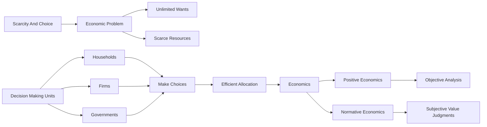

## 1. Mental Model
Imagine you have a lemonade stand, and you have to make some big decisions. You have a limited amount of money to buy lemons, sugar, and cups. You want to make the best lemonade possible to sell to your friends and family, but you can't afford to buy everything you want. Economics is like being the manager of your lemonade stand. You have to decide how to use your resources (like money, lemons, and sugar) in the best way possible to make something that people want (like yummy lemonade). You have to make choices, like "should I spend my money on more lemons or more sugar?" or "should I make a lot of lemonade or just a little?" Economics is all about making smart choices with the resources you have, so you can make the most of them - just like managing your lemonade stand!

## 2. Micro Theory
The definition of economics can be rigorously examined through the lens of microeconomic theory, which stems from the fundamental concept of [[Scarcity_And_Choice]]. Economics, derived from the Greek phrase “one who manages a household”, essentially revolves around the efficient allocation of [[Scarce_Resources]] to satisfy [[Unlimited_Wants]]. This notion underscores the crux of economic inquiry, which is to analyze how [[Decision_Making_Units]], such as households, firms, and governments, make choices in the face of scarcity.

The discipline of economics can be broadly categorized into [[Branches_Of_Economics]], including [[Macroeconomics]] and [[Microeconomics]], with the former focusing on aggregate economic phenomena and the latter on individual economic units. [[Positive_Economics]] and [[Normative_Economics]] are two distinct approaches used in economic analysis. Positive economics involves objective, fact-based analysis, whereas normative economics incorporates subjective value judgments.

The [[Theory_Of_Economics]] provides a framework for understanding how economies function, with a particular emphasis on [[Efficient_Allocation]] of resources. A fundamental concept in economics is the [[Production_Possibilities_Frontier]], which illustrates the trade-offs involved in allocating resources between different goods and services. The [[Law_Of_Increasing_Opportunity_Cost]] further elucidates these trade-offs, highlighting that as the production of one good increases, the opportunity cost of producing an additional unit of that good also increases.

Economic analysis relies heavily on [[Inductive_Reasoning]] and [[Deductive_Reasoning]] to develop and test economic theories. [[Economic_Growth]], which refers to an increase in the production of goods and services in an economy over time, is a critical aspect of economic inquiry. The [[Basic_Economic_Questions]] – [[What_To_Produce]], [[How_To_Produce]], and [[For_Whom_To_Produce]] – are fundamental to understanding how economies allocate resources.

Different [[Economic_Systems]], such as a [[Capitalist_Economy]], have distinct mechanisms for addressing these questions. In a capitalist economy, the [[Role_Of_Government_In_Market_Economy]] is crucial in ensuring that markets function efficiently and that [[Market_Failure]] is mitigated. The concept of [[Opportunity_Cost]] plays a pivotal role in decision-making, as it represents the value of the next best alternative that is given up when a choice is made.

Ultimately, the definition of economics can be distilled to the study of how societies use [[Scarce_Resources]] to produce valuable goods and services and distribute them among different people. This involves understanding the complex interplay between [[Resource_Allocation]], [[Production_Possibilities_Frontier]], and the mechanisms that guide [[Decision_Making_Units]] in their choices, all within the constraints of [[Scarcity_And_Choice]]. [[Definition_Of_Economics]] therefore encapsulates the essence of economic inquiry into the management of resources to meet unlimited wants and needs.

## 3. Limitations & Edge Cases
The definition of economics, derived from the Greek phrase "one who manages a household," oversimplifies the complexity of modern economic systems and neglects the nuances of non-market activities, such as household work and volunteering, which have significant economic implications. Furthermore, this definition focuses on the allocation of scarce resources within a household, rather than the broader economy, and does not account for macroeconomic phenomena, such as inflation, unemployment, and international trade. Additionally, it implies a narrow, microeconomic perspective, neglecting the role of institutions, power dynamics, and social norms in shaping economic outcomes, and assuming that economic agents make rational, self-interested decisions, which is not always the case.

## 4. Market Graph


The flowchart illustrates the core concept of economics, which revolves around the efficient allocation of scarce resources to satisfy unlimited wants, and highlights the role of decision-making units in making choices in the face of scarcity. The two distinct approaches in economic analysis, positive economics and normative economics, are also depicted, showcasing their differences in objective and subjective analysis.

## 5. Walkthrough
Here is the 5-step technical walkthrough of how 'Definition Of Economics' operates:

**Step 1: Identify Scarcity and Unlimited Wants**
The definition of economics starts with the concept of [[Scarcity_And_Choice]], implying that resources are limited. This limitation leads to [[Unlimited_Wants]], which cannot be fully satisfied.

**Step 2: Recognize Decision-Making Units**
Economic inquiry focuses on [[Decision_Making_Units]], which include households, firms, and governments. These units face scarcity and must make choices.

**Step 3: Understand the Goal of Economics**
The primary goal of economics is to analyze how to efficiently allocate [[Scarce_Resources]] to satisfy [[Unlimited_Wants]]. This efficient allocation is crucial in managing resources.

**Step 4: Examine the Origin of the Term "Economics"**
The term "economy" originates from the Greek phrase “one who manages a household”. This etymology highlights the fundamental idea of managing resources effectively.

**Step 5: Distinguish Between Branches and Approaches of Economics**
The discipline of economics has branches, including [[Macroeconomics]] and [[Microeconomics]]. Additionally, there are two approaches: [[Positive_Economics]] (objective, fact-based analysis) and [[Normative_Economics]] (subjective value judgments). However, these specifics do not alter the core definition.

---

## Review & Practice
```interactive-quiz
[
  {
    "type": "mcq",
    "difficulty": "L1",
    "question": "What is the primary implication of the law of demand in environmental economics, particularly in relation to elasticity calculations for a good with a high environmental impact, such as carbon-intensive energy?",
    "options": {
      "A": "As the price of carbon-intensive energy increases, the quantity demanded decreases, but the demand is highly inelastic, indicating that consumers are not very responsive to price changes.",
      "B": "As the price of carbon-intensive energy increases, the quantity demanded decreases, and the demand is elastic, indicating that consumers are very responsive to price changes.",
      "C": "As the price of carbon-intensive energy decreases, the quantity demanded increases, but the demand is highly inelastic, indicating that consumers are not very responsive to price changes.",
      "D": "As the price of carbon-intensive energy decreases, the quantity demanded remains constant, indicating a perfectly inelastic demand curve."
    },
    "answer": "B",
    "explanation": "The law of demand states that, ceteris paribus, as the price of a good increases, the quantity demanded decreases. In the context of environmental economics, this is particularly relevant for goods with high environmental impacts, such as carbon-intensive energy. Elasticity calculations help determine how responsive consumers are to changes in price. If the demand for carbon-intensive energy is elastic, it means that consumers are very responsive to price changes, and small price increases lead to significant reductions in the quantity demanded. This can be represented by the elasticity of demand formula: $E_d = \\frac{\\% \\Delta Q_d}{\\% \\Delta P}$. If $E_d > 1$, demand is elastic. Therefore, option B accurately describes the primary implication of the law of demand in environmental economics for a good with a high environmental impact."
  },
  {
    "type": "fill_in",
    "difficulty": "L2",
    "question": "Fill in the blank.",
    "textWithBlanks": "The study of how societies use [[blank]] to produce valuable goods and services and distribute them among different people.",
    "answer": [
      "Scarce Resources"
    ],
    "explanation": "The concept of economics fundamentally revolves around the efficient allocation of scarce resources to satisfy unlimited wants. This involves understanding the complex interplay between resource allocation, production possibilities frontier, and the mechanisms that guide decision-making units in their choices, all within the constraints of scarcity and choice. In mathematical terms, this can be represented as maximizing utility subject to a budget constraint, often expressed as: $\\max U(x_1, x_2) \\quad \\text{s.t.} \\quad p_1x_1 + p_2x_2 \\leq I$, where $U(x_1, x_2)$ is the utility function, $p_1$ and $p_2$ are the prices of goods 1 and 2, and $I$ is the income."
  },
  {
    "type": "debug",
    "difficulty": "L2",
    "question": "Find the bug in the formula for calculating the opportunity cost of producing an additional unit of a good: $OC = \\frac{\\Delta Q}{\\Delta P}$",
    "content": "The formula for opportunity cost is essential in understanding the trade-offs involved in allocating resources between different goods and services. However, the given formula seems incorrect.",
    "answer": "The correct formula should be $OC = \\frac{\\Delta Q_{other}}{\\Delta Q_{good}}$ or more accurately in the context of opportunity cost, it should reflect the change in the quantity of another good given up per unit change in the good in question, often expressed as $OC = \\frac{-\\Delta Q_{y}}{\\Delta Q_{x}}$ where $\\Delta Q_{y}$ is the change in quantity of good y and $\\Delta Q_{x}$ is the change in quantity of good x.",
    "required_keywords": [
      "fix_syntax"
    ],
    "explanation": "The given formula $OC = \\frac{\\Delta Q}{\\Delta P}$ seems to confuse opportunity cost with a price elasticity of demand or supply formula. Opportunity cost is about the value of the next best alternative foregone as a result of making a decision. It is typically represented by the slope of the production possibilities frontier (PPF), which shows the trade-off between producing one good over another. The correct representation should account for the quantities of goods traded off, not changes in quantity over changes in price. Therefore, the correct formula reflecting a trade-off might look like $OC = \\frac{\\Delta Q_{y}}{\\Delta Q_{x}}$, indicating how much of good y must be given up to produce one more unit of good x. In mathematical terms and using LaTeX, if $Q_x$ and $Q_y$ are quantities of goods x and y respectively, the opportunity cost of producing more of $Q_x$ is given by $OC = -\\frac{dQ_y}{dQ_x}$. This reflects the marginal rate of transformation between the two goods."
  },
  {
    "type": "trace",
    "difficulty": "L2",
    "question": "What is the exact output on the supply curve when a cost increase, such as higher wages, impacts the equilibrium price and total revenue in Environmental Economics?",
    "content": "To analyze the impact of a cost increase, such as higher wages, on the supply curve, equilibrium price, and total revenue in Environmental Economics, we start with the basic supply and demand model. The supply curve is typically upward sloping, indicating that as the price of a good increases, producers are willing to supply more of it. This is because higher prices make production more profitable, encouraging firms to produce more.\n\nWhen a cost increase occurs, such as an increase in wages, the marginal cost of production for firms increases. This means that for any given price, firms are now less willing to supply the good because their costs have risen, making production less profitable. Graphically, this can be represented as a leftward shift of the supply curve. The new supply curve reflects the higher costs of production.\n\nMathematically, let's consider the supply and demand equations:\n\nDemand: $Q_d = a - bP$\n\nSupply: $Q_s = c + dP$\n\nWhere $Q_d$ and $Q_s$ are the quantity demanded and supplied, $P$ is the price, and $a$, $b$, $c$, and $d$ are constants.\n\nIf a cost increase causes the supply curve to shift left, the new supply equation becomes:\n\n$Q_s' = c' + dP$, where $c' < c$\n\nThe equilibrium price and quantity are found where $Q_d = Q_s'$:\n\n$a - bP = c' + dP$\n\nSolving for $P$ gives:\n\n$P' = \\frac{a - c'}{b + d}$\n\nThe change in equilibrium price depends on the relative shifts and slopes of the supply and demand curves. If demand is relatively inelastic compared to supply, the price increase will be more significant.\n\nThe total revenue $TR$ is given by:\n\n$TR = P' \\times Q'$\n\nWhere $Q'$ is the new equilibrium quantity.\n\n## Step 1: Define the initial supply and demand curves\nLet's assume the initial demand curve is $Q_d = 100 - 2P$ and the initial supply curve is $Q_s = -20 + 3P$.\n\n## Step 2: Introduce the cost increase\nA cost increase shifts the supply curve left. Assume the new supply curve becomes $Q_s' = -40 + 3P$.\n\n## Step 3: Find the new equilibrium price and quantity\nSet $Q_d = Q_s'$:\n\n$100 - 2P = -40 + 3P$\n\n$5P = 140$\n\n$P' = 28$\n\nSubstitute $P'$ back into either $Q_d$ or $Q_s'$ to find $Q'$:\n\n$Q' = 100 - 2(28) = 44$\n\n## Step 4: Calculate the total revenue\n\n$TR = P' \\times Q' = 28 \\times 44$\n\n$TR = 1232$\n\nThe exact output, in this case, is the total revenue after the cost increase impacts the supply curve and changes the equilibrium price and quantity.",
    "answer": "1232",
    "explanation": "The total revenue after the cost increase is $1232."
  }
]
```