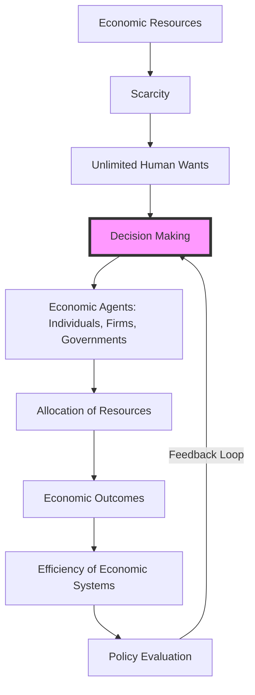

---

title: Economic_Analysis
course: Economics
unit: '1'
semester: Winter 2026
mode: ECON-MICRO
type: atomic_note
hub: '[[1_Basics_Of_Economics_Hub]]'
source: '[[5-Pdf Store/note generated/Winter 2026/Economics/Chapter_1.pdf]]'
date: '2026-05-08'
prerequisites:
- '[[Economic_Resources]]'
- '[[Human_Wants]]'
- '[[Scarcity]]'
- '[[Inductive_Reasoning]]'
- '[[Deductive_Reasoning]]'
source_pages:
- 21
generated: true

---


## 1. Mental Model

In the context of consumer behavior analysis, consider a real-world scenario where a coffee shop, Starbucks, aims to understand how changes in income and prices of substitute beverages affect the demand for its coffee. Using economic analysis, specifically the components of (1) **Income Effect**, which refers to the change in consumption patterns resulting from a change in income, and (2) **Substitution Effect**, which refers to the change in consumption patterns resulting from a change in relative prices of substitute goods, Starbucks can make informed decisions. For instance, if t

## 2. Micro Theory

Economic analysis is a systematic approach to examining the allocation of scarce [[Economic_Resources]] to satisfy unlimited [[Human_Wants]]. It is a methodology that employs logical reasoning, rooted in economic theory, to investigate the decision-making processes of economic agents and the resulting outcomes. At its core, economic analysis seeks to provide a framework for understanding how individuals, firms, and governments make choices about how to allocate resources in a world characterized by [[Scarcity]], where the demands for goods and services exceed their supply.

The foundation of economic analysis lies in the application of [[Inductive_Reasoning]] and [[Deductive_Reasoning]] to derive and test hypotheses about economic phenomena. Through the use of abstract models and empirical data, economists aim to identify causal relationships between variables, predict the consequences of policy interventions, and evaluate the efficiency of different Economic Systems in achieving their objectives. This process involves addressing the Basic Economic Questions of what, how, and for whom to produce, which are fundamental to understanding the workings of an economy.

Economic analysis can be broadly categorized into Positive Economics, which focuses on descriptive statements about economic phenomena, and Normative Economics, which involves prescriptive statements about how the economy should function. The former seeks to explain and predict economic outcomes, while the latter aims to evaluate and guide policy decisions. Macroeconomics, a branch of economics that studies aggregate economic phenomena, often employs econometric models to analyze the behavior of the economy as a whole, while Microeconomics, another key branch, examines the interactions among individual economic agents.

The process of economic analysis typically begins with the specification of a theoretical framework, which provides a structure for organizing data and testing hypotheses. This framework may draw on various Branches Of Economics, including Resource Allocation, to understand how resources are distributed among competing uses. A key concept in this context is the notion of Efficient Allocation, which refers to the optimal distribution of resources to maximize social welfare.

The works of Adam Smith, often regarded as the father of modern economics, laid the groundwork for much of contemporary economic analysis. Smith's ideUltimately, the goal of economic analysis is to provide insights that inform decision-making and policy development, with the aim of promoting a more efficient and equitable allocation of resources. By applying logical reasoning and theoretical frameworks to the study of economic phenomena, economists seek to contribute to a deeper understanding of the world around us and to help address some of the most pressing economic challenges facing society today.

## 3. Limitations & Edge Cases

Economic analysis, grounded in economic theory and logical reasoning, faces limitations, particularly in handling complex, real-world scenarios. For instance, it often relies on assumptions of rationality and perfect information, which may not hold in reality, leading to inaccurate predictions. Additionally, economic analysis can struggle with issues like uncertainty, asymmetric information, and externalities, which can significantly impact outcomes. Furthermore, the ceteris paribus assumption, which holds other factors constant, can oversimplify the interconnected nature of economic variables. Moreover, economic analysis may also be limited by its inability to fully capture non-economic factors, such as social and environmental considerations, and by the challenges of quantifying and modeling human behavior, ultimately affecting the accuracy and applicability of its conclusions.

## 4. Market Graph



This flowchart illustrates the core components of economic analysis, from the scarcity of resources to the evaluation of economic systems and policy interventions. The decision-making process of economic agents is central to the analysis, influencing and being influenced by the allocation of resources and the resulting economic outcomes.

## 5. Walkthrough

## Step 1: Define the Problem and Identify Key Concepts

The problem to be analyzed is the allocation of scarce economic resources to satisfy unlimited human wants. Key concepts include scarcity, economic resources, human wants, and logical reasoning based on economic theory.

## Step 2: Apply Economic Theory

Economic theory provides the foundation for understanding how individuals, firms, and governments make choices about allocating resources. This involves understanding principles such as opportunity cost, supply and demand, and the efficient allocation of resources.

## Step 3: Use Logical Reasoning

Logical reasoning, including inductive and deductive reasoning, is employed to derive and test hypotheses about economic phenomena. This step involves constructing abstract models that can be used to predict the consequences of different economic decisions.

## Step 4: Analyze Decision-Making Processes

Economic analysis investigates the decision-making processes of economic agents (individuals, firms, governments) to understand how they allocate resources in a world characterized by scarcity. This involves evaluating how these agents respond to changes in market conditions, policy interventions, and other external factors.

## Step 5: Evaluate Outcomes and Efficiency

The final step involves evaluating the outcomes of different economic decisions and the efficiency of various economic systems in achieving their goals. This includes assessing how well different systems allocate resources to meet human wants and comparing the efficiency of different approaches to resource allocation.

---

## Review & Practice

```interactive-quiz

[
  {
    "type": "mcq",
    "difficulty": "L1",
    "question": "What is the fundamental characteristic of the economic environment that economic analysis seeks to understand and address?",
    "options": {
      "A": "The abundance of goods and services",
      "B": "The scarcity of resources relative to unlimited wants",
      "C": "The equal distribution of wealth",
      "D": "The absence of economic decision-making"
    },
    "answer": "B",
    "explanation": "Economic analysis is concerned with understanding how individuals, firms, and governments make choices about how to allocate resources in a world characterized by scarcity, where the demands for goods and services exceed their supply."
  },
  {
    "type": "fill_in",
    "difficulty": "L2",
    "question": "Fill in the blank.",
    "textWithBlanks": "Economic analysis is a systematic approach to examining the allocation of scarce [[Economic_Resources]] to satisfy unlimited [[Human_Wants]]. It is a methodology that employs logical reasoning, rooted in economic theory, to investigate the decision-making processes of economic agents and the resulting outcomes. At its core, economic analysis seeks to provide a framework for understanding how individuals, firms, and governments make choices about how to allocate resources in a world characterized by [[Scarcity]], where the demands for goods and services exceed their supply.",
    "answer": [
      "Scarcity"
    ],
    "explanation": "The most important technical term for 'Economic Analysis' in the given context is 'Scarcity'. Scarcity refers to the fundamental problem of economics that the demands for goods and services exceed their supply."
  },
  {
    "type": "true_false",
    "difficulty": "L1",
    "question": "The demand for a normal good is upward-sloping.",
    "answer": false,
    "explanation": "The demand curve for a normal good is always downward-sloping, meaning that as the price of the good increases, the quantity demanded decreases. This is due to the substitution and income effects."
  }
]

```