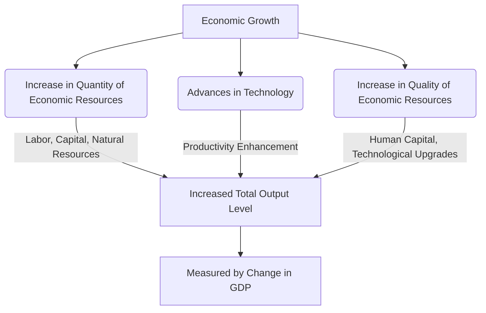

---

title: Economic_Growth
course: "Economics"
unit: '1'
semester: "Winter 2026"
mode: ECON-MICRO
type: atomic_note
hub: "[[1_Basics_Of_Economics_Hub]]"
source: "[[5-Pdf Store/note generated/Winter 2026/Economics/Chapter_1.pdf]]"
date: '2026-05-08'
prerequisites:
- "[[Production_Possibilities_Frontier]]"
source_pages:
- 48
generated: true

---

## 1. Mental Model

In the semiconductor industry, economic growth can be observed through the lens of Intel's manufacturing expansion. For instance, when Intel decides to build a new fabrication plant, it not only increases the quantity of its economic resources, such as labor and capital, but also enhances the quality of its production capabilities. Specifically, two key components driving economic growth are: (1) **Increase in the quantity of economic resources**, as Intel hires more skilled engineers and technicians to operate the new plant, thereby expanding its workforce; and (2) **Advances in technology**, as Intel adopts cutting-edge equipment and software to improve the efficiency and yield of its manufacturing process, allowing for the production of more advanced and higher-value microchips. This strategic investment enables Intel to increase its total output level, contributing to economic growth in the industry.

## 2. Micro Theory

Economic growth is a multifaceted concept that can be rigorously defined and analyzed through the lens of microeconomics. At its core, economic growth refers to an increase in the total output level of an economy, which can be achieved through two primary conditions: an increase in the quantity or quality of [[Economic_Resources]], or advances in technology. This growth is often measured by the change in the Gross Domestic Product (GDP) of a country over time.

The quantity and quality of Economic Resources, including labor, capital, and natural resources, play a crucial role in determining the productive capacity of an economy. An increase in the quantity of these resources, such as an expansion of the workforce or an accumulation of capital goods, can lead to an increase in the total output level. Similarly, an improvement in the quality of these resources, such as through investments in human capital or technological upgrades, can also enhance productivity and drive economic growth.

Advances in technology, on the other hand, can be viewed as a catalyst for economic growth, as it enables the more efficient use of existing resources. Technological progress can lead to the development of new products, services, and production processes, which can increase the overall productivity of an economy. This, in turn, can lead to an outward shift of the [[Production_Possibilities_Frontier]], representing an increase in the economy's productive capacity.

The study of economic growth falls under the purview of [[Macroeconomics]], which focuses on the aggregate behavior of economic variables, such as GDP, inflation, and employment. However, Microeconomics also plays a crucial role in understanding the underlying mechanisms driving economic growth, particularly in the context of Resource Allocation and the Basic Economic Questions of what, how, and for whom to produce.

In analyzing economic growth, economists employ both Positive Economics and Normative Economics. Positive Economics focuses on the objective analysis of economic phenomena, whereas Normative Economics involves subjective value judgments about what ought to be. The study of economic growth also relies heavily on Deductive Reasoning and Inductive Reasoning, as economists use theoretical models and empirical evidence to understand the complex relationships between economic variables.

The concept of economic growth is closely tied to the ideas of Adam Smith, who argued that economic growth is driven by the pursuit of self-interest and the division of labor. Furthermore, Scarcity and Efficient Allocation are fundamental principles that underlie the study of economic growth, as economists seek to understand how to allocate resources in a way that maximizes output and satisfies Human Wants.

In conclusion, economic growth can be defined

## 3. Limitations & Edge Cases

The concept of economic growth is limited by several edge cases, including the possibility that growth may not necessarily translate to improved well-being if income inequality worsens, as the benefits of growth may accrue disproportionately to a small elite. Additionally, economic growth may be accompanied by environmental degradation and depletion of natural resources, rendering it unsustainable in the long term. Furthermore, growth may be skewed towards sectors that do not contribute to human development, such as defense or finance, rather than healthcare or education. Moreover, the quality of growth can be compromised by corruption, poor governance, or institutional weaknesses, which can undermine the effectiveness of growth in improving living standards. Lastly, economic growth may be accompanied by diminishing returns to scale, where the marginal benefits of growth decline as the economy approaches full capacity, highlighting the need for nuanced consideration of the composition and sustainability of growth.

## 4. Market Graph



Economic growth can be achieved through increases in the quantity or quality of economic resources, or through advances in technology, all of which contribute to an increase in the total output level of an economy. The growth is ultimately measured by the change in Gross Domestic Product (GDP) over time, serving as a key indicator of a country's economic performance.

## 5. Walkthrough

## Step 1: Define Economic Growth

Economic growth is defined as an increase in the total output level of an economy. This growth can be measured by the change in the Gross Domestic Product (GDP) of a country over time.

## Step 2: Identify Conditions for Economic Growth

There are two primary conditions for economic growth:

## Step 3: An increase in the quantity or quality of economic resources.

## Step 4: Advances in technology.

## Step 5: Analyze the Role of Economic Resources

Economic resources include labor, capital, and natural resources. An increase in the quantity of these resources, such as:
- Expansion of the workforce (labor)
- Accumulation of capital goods (capital)

## Step 6: Examine the Impact of Quality Improvements

Improvements in the quality of economic resources can also drive economic growth. Examples include:
- Investments in human capital (education and training)
- Technological upgrades

## Step 7: Relate Conditions to GDP Growth

When one or both conditions for economic growth are met, the total output level of an economy increases, which is reflected in an increase in the country's GDP over time. For instance, if a country's GDP grows from $1 trillion to $1.1 trillion in a year, it indicates economic growth.

---

## Review & Practice

```interactive-quiz

[
  {
    "type": "mcq",
    "difficulty": "L1",
    "question": "What can lead to an increase in the total output level of an economy?",
    "options": {
      "A": "A decrease in the quantity of economic resources",
      "B": "An increase in the quantity of economic resources",
      "C": "A reduction in technological advancements",
      "D": "A decline in the quality of economic resources"
    },
    "answer": "B",
    "explanation": "An increase in the quantity of economic resources, such as an expansion of the workforce or an accumulation of capital goods, can lead to an increase in the total output level."
  },
  {
    "type": "fill_in",
    "difficulty": "L2",
    "question": "Fill in the blank.",
    "textWithBlanks": "An increase in the quantity of economic resources, such as an expansion of the workforce or an accumulation of capital goods, can lead to an increase in the total output level through the increase in Blank1.",
    "answer": [
      "Economic Resources"
    ],
    "explanation": "The concept of economic growth is closely related to the increase in the quantity or quality of economic resources. This includes labor, capital, and natural resources, which determine the productive capacity of an economy. An increase in these resources can lead to an increase in the total output level.",
    "required_keywords": [
      "Economic Resources",
      "Productive Capacity",
      "Economic Growth"
    ]
  },
  {
    "type": "true_false",
    "difficulty": "L1",
    "question": "An increase in the quantity of economic resources, such as an expansion of the workforce or an accumulation of capital goods, can lead to a decrease in the total output level.",
    "answer": false,
    "explanation": "An increase in the quantity of economic resources, such as an expansion of the workforce or an accumulation of capital goods, can lead to an increase in the total output level. This is a fundamental concept in labor market economics and economic growth, as more resources can contribute to higher production levels."
  }
]

```