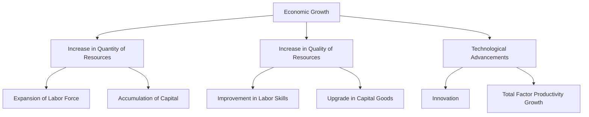

---

title: Economic_Growth
course: "Economics"
unit: '1'
semester: "Winter 2026"
mode: ECON-MICRO
type: atomic_note
hub: "[[1_Basics_Of_Economics_Hub]]"
source: "[[5-Pdf Store/note generated/Winter 2026/Economics/Chapter_1.pdf]]"
date: '2026-05-08'
prerequisites:
- "[[Production_Possibilities_Frontier]]"
source_pages:
- 48
generated: true

---

## 1. Mental Model

Imagine you have a lemonade stand. At first, you make lemonade with a small pitcher, a few lemons, and a little sugar. But one day, your parents help you get a bigger pitcher, more lemons, and a special machine that makes it easier to squeeze the lemons. You also figure out a new recipe that makes your lemonade taste even better! With all these changes, you can now make more lemonade than before, and people love it even more. This is like economic growth! You're making more lemonade (growing) because you have better tools (technology) and more ingredients (resources) to make it. Just like your lemonade stand, a country's economy grows when it gets better at making things, gets more resources, or finds new ways to make things better and faster.

## 2. Micro Theory

Economic growth, a fundamental concept in [[Macroeconomics]], refers to an increase in the total output level of an economy, typically measured by the growth rate of Gross Domestic Product (GDP). This phenomenon occurs when an economy experiences an expansion in its productive capacity, allowing it to produce more goods and services. The technical definition of economic growth is rooted in the intersection of [[Economic_Resources]] and technological advancements.

The [[Definition_Of_Economics]] highlights the study of how societies allocate Scarcity And Choice|scarce Resources to satisfy [[Human_Wants]], which are unlimited. Economic growth is achieved when an economy's [[Resource_Allocation]] becomes more efficient, enabling the production of more goods and services. This can be accomplished through an increase in the quantity or quality of [[Economic_Resources]], such as labor, capital, and natural resources. For instance, an increase in the labor force or an improvement in the quality of labor through education and training can contribute to economic growth.

The [[Production_Possibilities_Frontier]] (PPF) illustrates the various combinations of goods and services that can be produced given the available resources and technology. Economic growth is represented by an outward shift of the PPF, indicating that the economy can now produce more goods and services than it could previously. This shift can occur due to an increase in the quantity or quality of resources, such as an increase in the capital stock or an improvement in technology.

Technological advancements play a crucial role in economic growth, as they enable the more efficient use of resources, leading to an increase in productivity. [[Adam_Smith]], a pioneer in [[Economic_Theory]], noted that economic growth is driven by the division of labor and the increase in productivity that results from it. Technological progress can also lead to the development of new products, services, and industries, further contributing to economic growth.

The [[Law_Of_Increasing_Opportunity_Cost]] states that as the production of one good or service increases, the opportunity cost of producing an additional unit of that good or service also increases. However, with technological advancements, the opportunity cost of production can decrease, leading to an increase in the overall output level. This is because technology can improve the efficiency of [[Decision_Making_Units]], such as firms and households, allowing them to make more informed choices about how to allocate their resources.

In a [[Capitalist_Economy]], economic growth is driven by the interactions of [[Decision_Making_Units]], such as households, firms, and governments. The [[Role_Of_Government]] is crucial in promoting economic growth by creating an environment conducive to investment, innovation, and entrepreneurship. However, [[Market_Failure]] can occur, leading to inefficiencies in resource allocation and hindering economic growth.

The study of economic growth falls under [[Positive_Economics]], which focuses on the analysis of economic phenomena without making value judgments. In contrast, [[Normative_Economics]] deals with the evaluation of economic policies and their impact on society. [[Inductive_Reasoning]] and [[Deductive_Reasoning]] are essential tools used in the analysis of economic growth, as they enable economists to develop and test hypotheses about the determinants of economic growth.

In conclusion, economic growth is a multifaceted concept that arises from the intersection of increases in the quantity or quality of [[Economic_Resources]] and advances in technology. Understanding the mechanisms that drive economic growth is essential for policymakers to design and implement effective policies that promote [[Efficient_Allocation]] of resources, [[Choice]], and [[Tradeoffs]] that ultimately lead to an improvement in the standard of living. By addressing the [[Basic_Economic_Questions]] of [[What_To_Produce]], [[How_To_Produce]], and [[For_Whom_To_Produce]], economies can achieve sustainable economic growth and development.

## 3. Limitations & Edge Cases

The concept of economic growth has several limitations and edge cases, including the possibility that growth may not necessarily translate to improved well-being if income inequality worsens, environmental degradation accelerates, or if growth is driven by unsustainable exploitation of natural resources. Additionally, economic growth may be accompanied by diminishing marginal returns, where the social and environmental costs of growth outweigh the benefits, and may also be subject to the limitations of institutional and infrastructural capacity, where inadequate institutions, infrastructure, or governance can hinder the efficient allocation of resources and the realization of growth potential.

## 4. Market Graph

### Economic Growth Diagram



### Explanation

This Mermaid flowchart illustrates the conditions under which economic growth occurs, specifically through an increase in the quantity or quality of economic resources and advances in technology. The diagram breaks down these broad categories into more specific factors such as expansion of the labor force, accumulation of capital, improvement in labor skills, upgrade in capital goods, innovation, and total factor productivity growth.

## 5. Walkthrough

## Step 1: Define Economic Growth

Economic growth is defined as an increase in the total output level of an economy, measured by the growth rate of Gross Domestic Product (GDP). It occurs when an economy experiences an expansion in its productive capacity.

## Step 2: Identify Conditions for Economic Growth

There are two conditions under which economic growth occurs:
1. An increase in the quantity or quality of economic resources.
2. Advances in technology.

## 3: Explain Increase in Quantity or Quality of Economic Resources

An increase in the quantity of economic resources, such as labor, capital, and natural resources, can lead to economic growth. For example, if the labor force increases, or if there is an improvement in the quality of labor (e.g., through education and training), the economy can produce more goods and services.

## 4: Explain Advances in Technology

Advances in technology enable an economy to produce more goods and services with the same amount of resources. This is because technology improves the efficiency of resource allocation and utilization. For instance, technological advancements in the manufacturing sector can lead to increased productivity.

## 5: Relate to Resource Allocation and Efficiency

Economic growth is achieved when an economy's resource allocation becomes more efficient. This means that resources are allocated in a way that maximizes the production of goods and services, given the available resources and technology. An improvement in resource allocation can be due to an increase in the quantity or quality of economic resources or advances in technology.

---

## Review & Practice

```interactive-quiz

[
  {
    "type": "mcq",
    "difficulty": "L1",
    "question": "What is the primary indicator used to measure the growth rate of an economy's total output level in the context of economic growth?",
    "options": {
      "A": "Gross National Income (GNI)",
      "B": "Gross Domestic Product (GDP)",
      "C": "Net Domestic Product (NDP)",
      "D": "National Income (NI)"
    },
    "answer": "B",
    "explanation": "The primary indicator used to measure the growth rate of an economy's total output level is the Gross Domestic Product (GDP). GDP measures the total value of goods and services produced within a country's borders over a specific period, making it a comprehensive indicator of economic activity and growth."
  },
  {
    "type": "fill_in",
    "difficulty": "L2",
    "question": "Fill in the blank.",
    "textWithBlanks": "The Blank is a fundamental concept in Macroeconomics, referring to an increase in the total output level of an economy, typically measured by the growth rate of Gross Domestic Product (GDP).",
    "answer": [
      "Economic Growth"
    ],
    "explanation": "The term 'Economic Growth' is the critical technical term for this concept."
  },
  {
    "type": "debug",
    "difficulty": "L1",
    "question": "Find the bug in the formula for calculating the growth rate of GDP: GDP Growth Rate = Blank1 / (GDP Current Year - GDP Previous Year) * 100.",
    "content": "The formula for calculating the growth rate of GDP is typically expressed as: GDP Growth Rate = (GDP Current Year - GDP Previous Year) / GDP Previous Year * 100. Identify the error in the given formula.",
    "answer": "The error in the given formula is that it incorrectly divides by (GDP Current Year - GDP Previous Year) instead of GDP Previous Year.",
    "required_keywords": [
      "GDP Growth Rate",
      "GDP Previous Year",
      "GDP Current Year"
    ],
    "explanation": "The correct formula for calculating the growth rate of GDP is: GDP Growth Rate = (GDP Current Year - GDP Previous Year) / GDP Previous Year * 100. The given formula incorrectly uses (GDP Current Year - GDP Previous Year) as the denominator, which would result in a meaningless calculation. The correct denominator should be GDP Previous Year to accurately reflect the percentage change in GDP from the previous year to the current year."
  }
]

```