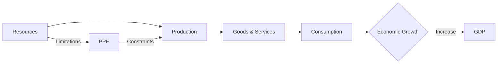

---

title: Economic_Growth_And_Ppf
type: Atomic Note
course: Economics
semester: Winter 2026
unit: '1'
hub: "[[1_Basics_Of_Economics_Hub]]"
source: "[[Chapter_1.pdf]]"
source_pages:
- 48
- 49
mode: ECON-MACRO
read: false
generated: true
prerequisites:
- "[[Production_Possibilities_Frontier]]"

---

# 1. Mental Model

Imagine you have a lemonade stand and you want to make more lemonade to sell to your friends. To do this, you might need to buy more lemons, sugar, and cups. If you can make more lemonade, that's like economic growth! It's when the whole country can make more things and provide more services, so everyone has more options.

# 2. Economic Theory

[[Economic_Growth_And_Ppf]] refers to an increase in the total output level of an economy, often measured by the growth in [[Gross_Domestic_Product_(gdp)]]. This occurs when there is an increase in the [[Economic_Resources]] available or an improvement in the technology used to produce goods and services, allowing the economy to move outward along its [[Production_Possibilities_Frontier_(ppf)]]. As a result, the economy can produce more goods and services, leading to [[Economic_Growth_And_Ppf]].

# 3. Economic Model



## 4. Walkthrough

* The economy starts with available **Resources** (labor, capital, technology).
* These resources are used for **Production** of goods and services.
* The produced goods and services are then used for **Consumption** by households.
* As consumption increases, it can lead to **Economic Growth**, measured by an increase in GDP.
* However, the economy's **Resources** have limitations, which are represented by the **PPF (Production Possibility Frontier)**.
* The PPF **constrains** the production level, limiting the economy's growth.

## 5. Market Failures

This concept can fail when there are externalities, such as environmental degradation, that are not accounted for in the production process. Additionally, market failures can occur when there are unequal distributions of resources, leading to inefficient allocation. Edge cases to watch out for include technological shocks or changes in government policies that can impact the economy's growth trajectory.

---

## 6. The Proving Grounds

```interactive-quiz

[
  {
    "id": "q1",
    "type": "true_false",
    "difficulty": "L1",
    "question": "Economic growth occurs when there is a decrease in the economic resources available to an economy.",
    "answer": false,
    "explanation": "Economic growth refers to an increase in the total output level of an economy, often measured by the growth in Gross Domestic Product (GDP). This occurs when there is an increase in the economic resources available to an economy, or when existing resources are used more efficiently. Therefore, a decrease in economic resources would likely lead to economic contraction, not growth."
  },
  {
    "id": "q2",
    "type": "synthesis",
    "difficulty": "L2",
    "question": "Maria's small island nation, Azura, has been experiencing economic growth over the past decade. The government has invested heavily in education and infrastructure, leading to an increase in the island's productive capacity. However, the nation is facing a challenge in allocating its resources efficiently between the production of two main goods: coconuts and fish. The current production levels are 1000 coconuts and 500 fish. The nation's PPF (Production Possibility Frontier) is given by the equation: coconuts = 2000 - 2*fish. Using a SEED value of 42, a random minor detail reveals that the fishing industry requires a specific type of boat that can only be produced in a specific region of the island, which has a limited capacity to produce only 200 boats per year. Each boat can catch 2.5 fish per year. If Azura wants to increase its fish production by 20% while maintaining or increasing its current level of coconut production, how should it allocate its resources?",
    "answer": "To solve this problem, we need to determine the current and desired levels of fish production and then find the optimal allocation of resources. The current level of fish production is 500 fish. A 20% increase would make it 500 * 1.2 = 600 fish. Given the PPF equation: coconuts = 2000 - 2*fish, we can substitute 600 for fish to find the maximum coconuts producible at this level: coconuts = 2000 - 2*600 = 2000 - 1200 = 800 coconuts. Since the current coconut production level is 1000, which is higher than 800, Azura can increase fish production to 600 while reducing coconut production to 800, which is within the PPF. However, we must consider the boat production constraint. Each boat can catch 2.5 fish per year, and Azura needs to increase fish production by 100 (from 500 to 600). So, it needs 100 / 2.5 = 40 more boats. Given the limited capacity of 200 boats per year and assuming the current number of boats is not provided, Azura must ensure it can produce or has 40 more boats. If it can achieve this, then it should allocate resources to produce 600 fish and 800 coconuts, which fits within its PPF and growth objectives.",
    "explanation": "The underlying mechanism here involves understanding the PPF, which shows the maximum possible output combinations of two goods given the available resources and technology. The equation provided, coconuts = 2000 - 2*fish, illustrates a trade-off between producing coconuts and fish, with a slope that represents the opportunity cost of producing one more unit of fish in terms of coconuts forgone. The introduction of a specific constraint (boat production for fishing) adds a layer of complexity that requires considering not just the PPF but also the limitations in specific sectors of the economy. The solution involves calculating the desired output levels, checking feasibility against the PPF, and then ensuring that sector-specific constraints can be met. This requires a multi-step approach of calculating desired production levels, checking against the PPF, and then applying specific constraints to find a feasible solution."
  },
  {
    "id": "q3",
    "type": "writing",
    "difficulty": "L3",
    "question": "Explain the relationship between economic growth and the production possibility frontier (PPF) in the context of a lemonade stand, and how an increase in economic resources affects this relationship.",
    "answer": "Economic growth is represented by an outward shift of the PPF, indicating an increase in the total output level of an economy. In the context of a lemonade stand, this could mean being able to produce more lemonade and more cups, for example, due to an increase in resources such as lemons, sugar, and cups. This shift allows for more options and a higher standard of living. The PPF shows the various combinations of two goods that can be produced given the available resources and technology.",
    "explanation": "The production possibility frontier (PPF) is a graphical representation of the maximum output combinations of two goods that an economy can produce given its resources and technology. Economic growth occurs when the economy can produce more goods and services, which is represented by an outward shift of the PPF. This shift can happen when there is an increase in economic resources, such as more lemons, sugar, and cups for the lemonade stand, or improved technology that allows for more efficient production. As a result, the economy can produce more of both goods, leading to an increase in the standard of living."
  }
]

```