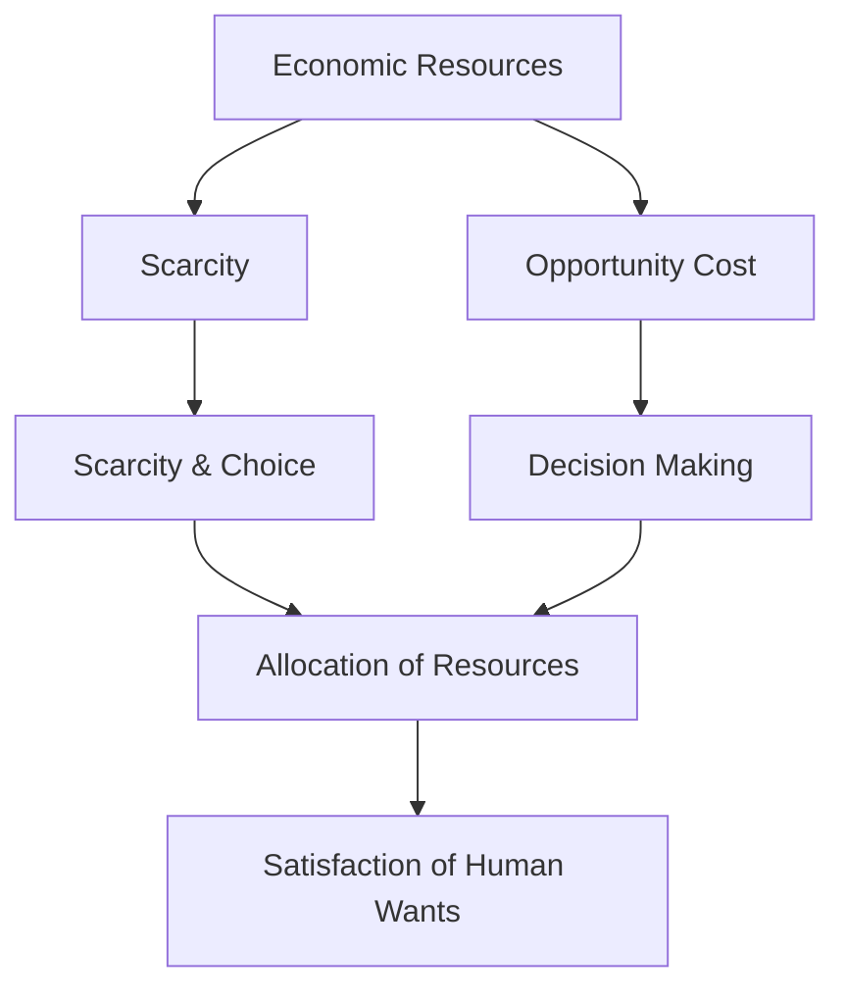

---

title: Economic_Resources
course: Economics
unit: '1'
semester: Winter 2026
mode: ECON-MICRO
type: atomic_note
hub: '[[1_Basics_Of_Economics_Hub]]'
source: '[[5-Pdf Store/note generated/Winter 2026/Economics/Chapter_1.pdf]]'
date: '2026-05-08'
prerequisites:
- '[[Definition_Of_Economics]]'
- '[[Human_Wants]]'
- '[[Scarcity_And_Choice]]'
- '[[Scarcity]]'
- '[[Opportunity_Cost]]'
source_pages:
- 2
generated: true

---


## 1. Mental Model

Imagine your household is like a small country! Just like a country, your household needs things to function. Your mom and dad are like the leaders, and they have to make smart choices to manage the household's resources. Think of your allowance, your parents' salaries, and even the garden in your backyard as the household's "economic resources". Just as a country needs resources like land, labor, and money to build roads and schools, your household needs resources like food, water, and money to buy toys and have fun. Your mom and dad have to decide how to use these resources wisely, like choosing between buying a new bike or saving for a family vacation. They're making economic decisions to make the most of what you have, just like a country's leaders do!

## 2. Micro Theory

The concept of Economic Resources is intricately linked to the fundamental principles of economics, which originated from the Greek phrase “one who manages a household”. This etymology underscores the essence of economics as the management of scarce resources to satisfy unlimited human wants. The definition of economics, as per [[Definition_Of_Economics]], revolves around the allocation of [[Economic_Resources]] to meet [[Human_Wants]], which are insatiable and diverse.

The mechanism of economic resources is rooted in [[Scarcity_And_Choice]], where the scarcity of resources necessitates choices about their allocation. This scarcity implies that [[Economic_Resources]] are limited, while wants are unlimited, leading to the fundamental economic problem of [[Scarcity]]. The allocation of these resources involves [[Opportunity_Cost]], which represents the value of the next best alternative given up when a choice is made. Understanding opportunity costs is crucial for [[Decision_Making_Units]], be they consumers or producers, as they make choices about how to allocate resources.

The study of [[Economic_Resources]] falls under Microeconomics, a branch of economics that focuses on the behavior and decision-making of individual economic units. [[Macroeconomics]], on the other hand, looks at the economy " 

The reasoning processes of [[Inductive_Reasoning]] and [[Deductive_Reasoning]] are pivotal in understanding and analyzing economic resources. Inductive reasoning helps in forming generalizations about the behavior of economic resources, while deductive reasoning aids in deriving specific conclusions from general principles.

The concept of [[Economic_Resources]] is foundational to [[Economic_Theory]], which seeks to explain how economies allocate resources. These resources are the inputs used in the production of goods and services, aimed at satisfying human wants. The efficient allocation of these resources is a key objective of economic systems, striving for [[Efficient_Allocation]], which occurs when resources are allocated in a way that no one can be made better off without making someone else worse off.

The branches of economics, including [[Branches_Of_Economics]], study how resources are allocated in different economic systems such as [[Capitalist_Economy]], and how they address issues like [[Market_Failure]] and the [[Role_Of_Government]]. The works of [[Adam_Smith]], often regarded as the father of modern capitalism, laid foundational aspects of economic theory, including the "invisible hand" mechanism that guides resources allocation in a free market.

The basic economic questions of [[What_To_Produce]], [[How_To_Produce]], and [[For_Whom_To_Produce]] revolve around the allocation of [[Economic_Resources]]. These questions highlight the trade-offs and choices that economies must make, reflecting the concept of [[Tradeoffs]] and the [[Law_Of_Increasing_Opportunity_Cost]], which states that as more of one good is produced, the opportunity cost of producing additional units increases.

The study of economic resources and their allocation leads to an understanding of [[Economic_Growth]], which can be achieved through more efficient use of resources, technological advancements, or an increase in resources. Different [[Economic_Systems]] attempt to solve the basic economic questions and allocate resources in ways that reflect their values and institutional structures.

In conclusion, [[Economic_Resources]] are the backbone of economic activity, and their efficient allocation is crucial for satisfying [[Human_Wants]] in the face of [[Scarcity]]. The technical analysis of these resources involves understanding their scarcity, the trade-offs involved in their allocation, and the mechanisms by which economies make decisions about their use, all of which are central to the study of economics as derived from the household management concept.

## 3. Limitations & Edge Cases

The concept of economic resources is limited by the fundamental problem of scarcity, where the needs and wants of individuals are unlimited, but the resources available to satisfy those needs are finite. This limitation is further complicated by the fact that resources are not only scarce but also have alternative uses, necessitating choices about how to allocate them efficiently. Moreover, the management of economic resources is often likened to managing a household, implying that resources must be utilized in a way that maximizes utility, much like a household manager must make decisions about how to allocate limited budget and resources to meet the needs of its members. Additionally, the assumption of rationality in economic decision-making can be challenged by the presence of uncertainty, imperfect information, and transaction costs, which can limit the ability of individuals and firms to make optimal choices about how to use economic resources. Overall, the limitations of economic resources highlight the need for careful consideration and decision-making in their allocation.

## 4. Market Graph



The flowchart illustrates the central role of economic resources in consumer behavior analysis, highlighting their scarcity, the necessity of choices, and the concept of opportunity costs in decision-making. The effective allocation of these resources is crucial for maximizing the satisfaction of unlimited human wants.

## 5. Walkthrough

## Step 1: Define Economic Resources and Scarcity

Economic resources are limited, while human wants are unlimited. This situation leads to scarcity, which necessitates choices about the allocation of these resources.

## Step 2: Identify the Etymology of Economics

The word "economy" originates from the Greek phrase meaning "one who manages a household," implying the management of scarce resources.

## Step 3: Understand the Fundamental Economic Problem

The fundamental economic problem is scarcity, which arises because economic resources are limited and human wants are unlimited.

## Step 4: Recognize the Role of Opportunity Cost

Opportunity cost represents the value of the next best alternative given up when a choice is made about allocating economic resources.

## Step 5: Apply to Decision-Making Units

Understanding opportunity costs is crucial for decision-making units, as it helps in making optimal choices about how to allocate scarce economic resources to satisfy unlimited human wants.

---

## Review & Practice

```interactive-quiz

[
  {
    "type": "mcq",
    "difficulty": "L1",
    "question": "What is the primary characteristic of economic resources in the context of consumer behavior analysis?",
    "options": {
      "A": "They are unlimited and can satisfy all human wants.",
      "B": "They are scarce and must be allocated to meet insatiable human wants.",
      "C": "They are only limited to financial resources and do not include time or skills.",
      "D": "They are abundant and do not require choices about their allocation."
    },
    "answer": "B",
    "explanation": "The concept of economic resources is fundamentally tied to the idea of scarcity, which implies that these resources are limited while human wants are unlimited. This scarcity necessitates choices about how to allocate resources effectively to meet diverse and insatiable wants."
  },
  {
    "type": "fill_in",
    "difficulty": "L2",
    "question": "Fill in the blank.",
    "textWithBlanks": "The Blank is a critical concept in economics that refers to the inputs used in the production of goods and services.",
    "answer": [
      "Economic Resources"
    ],
    "explanation": "The term 'Economic Resources' refers to the inputs used in the production of goods and services, aimed at satisfying human wants. It is foundational to Economic Theory, which seeks to explain how economies allocate these resources."
  },
  {
    "type": "debug",
    "difficulty": "L1",
    "question": "Find the bug in the following formula for calculating the efficient allocation of Economic Resources: Efficient_Allocation = Total Revenue / [[Opportunity_Cost]]",
    "content": "The efficient allocation of Economic Resources is a key objective of economic systems. It occurs when resources are allocated in a way that no one can be made better off without making someone else worse off. The formula for Efficient_Allocation is given by Efficient_Allocation = Total Revenue / [[Opportunity_Cost]].",
    "answer": "The bug in the formula is that it should be Efficient_Allocation = Marginal Benefit / Marginal Cost, not Total Revenue / [[Opportunity_Cost]].",
    "required_keywords": [
      "Marginal_Benefit",
      "Marginal_Cost",
      "Opportunity_Cost"
    ],
    "explanation": "The correct formula for efficient allocation of resources in economics relates to equating marginal benefit (MB) with marginal cost (MC), not total revenue (TR) with opportunity cost (OC). The efficient allocation is achieved when MB = MC, which ensures that resources are used in the most valuable way. Using total revenue and opportunity cost does not accurately represent the efficient allocation concept."
  }
]

```