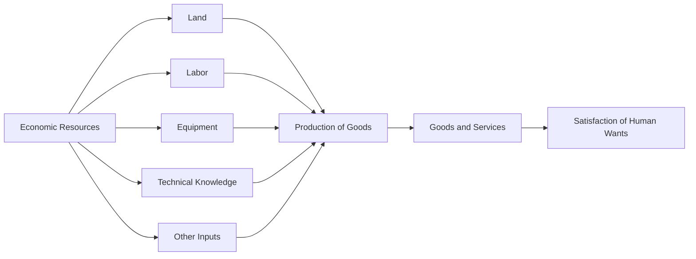

---

title: Economic_Resources
course: Economics
unit: '1'
semester: Winter 2026
mode: ECON-MICRO
type: atomic_note
hub: '[[1_Basics_Of_Economics_Hub]]'
source: '[[5-Pdf Store/note generated/Winter 2026/Economics/Chapter_1.pdf]]'
date: '2026-05-08'
prerequisites:
- '[[Adam_Smith]]'
- '[[Human_Wants]]'
source_pages:
- 9
generated: true

---


## 1. Mental Model

In the real-world scenario of a boutique hotel's renovation project, economic resources play a crucial role in decision-making. For instance, the hotel's management must allocate its limited resources, such as land (the physical building and its location), labor (the workforce of architects, engineers, and construction workers), and equipment (cranes, excavators, and other machinery), to renovate the property while maximizing its value. Two specific components of economic resources that are explicitly mapped in this scenario are: (1) **Technical Knowledge** (the expertise of the architects and engineers in designing and executing the renovation), and (2) **Labor** (the skilled workforce required to carry out the construction and renovation work). The hotel's management must carefully balance these resources to complete the project on time, within budget, and to the desired quality, ultimately affecting the hotel's profitability and competitiveness in the market.

## 2. Micro Theory

In the realm of Microeconomics, [[Economic_Resources]] refer to the fundamental inputs utilized in the production of goods and services, which are inherently scarce or limited in nature. These productive resources, also known as factors of production, comprise land, labor, equipment, technical knowledge, and other inputs that are essential for the creation of commodities. The study of economics, as initiated by [[Adam_Smith]], revolves around how individuals and societies choose to allocate these limited resources to satisfy their unlimited [[Human_Wants]].

The mechanism of Economic Resources is rooted in the concept of Scarcity, which necessitates the efficient allocation of resources to maximize their utility. This involves Resource Allocation, a critical aspect of economic analysis that seeks to optimize the distribution of resources among competing uses. Economic Analysis, both Positive Economics and Normative Economics, provides a framework for understanding the allocation of resources and the implications of different allocation mechanisms.

The efficient allocation of Economic Resources is a central concern in Microeconomics, which is one of the Branches Of Economics. It is achieved through the process of Efficient Allocation, where resources are allocated in a manner that maximizes their productivity and satisfies the needs of individuals. The study of Macroeconomics, on the other hand, examines the aggregate performance of economies, including the utilization of Economic Resources at the national level.

The technical definition of Economic Resources relies on Inductive Reasoning and Deductive Reasoning, which are essential tools in economic analysis. Economists employ these reasoning techniques to understand the behavior of economic agents, the allocation of resources, and the resulting outcomes. The Basic Economic Questions, which include what, how, and for whom to produce, are addressed through the allocation of Economic Resources in different Economic Systems.

In conclusion, Economic Resources are the fundamental inputs used in the production of goods and services, and their efficient allocation is critical to satisfying Human Wants in the face of Scarcity. The study of economics provides a framework for understanding the mechanisms of Economic Resources and their role in shaping economic outcomes.

## 3. Limitations & Edge Cases

The concept of economic resources is limited by its assumption of scarcity, which may not always hold true, such as in cases of abundant renewable resources; additionally, it often fails to account for non-market goods and services, like household work and leisure activities, which have significant economic value but are not traditionally considered economic resources; furthermore, the classification of resources can be too broad, encompassing both tangible and intangible assets, leading to difficulties in measurement and valuation; and finally, the notion of economic resources is also constrained by its neglect of institutional and social factors, such as unequal access to resources, power dynamics, and cultural context, which can significantly influence the allocation and utilization of resources.

## 4. Market Graph



This flowchart illustrates the role of economic resources in the production of goods and services, which ultimately leads to the satisfaction of human wants. The efficient allocation of these scarce resources is a fundamental problem in economics, and understanding their relationships is crucial for analyzing consumer behavior.

## 5. Walkthrough

### 5-Step Technical Walkthrough of Economic Resources

#### Step 1: Identification of Economic Resources
Identify the fundamental inputs or factors of production. According to the source text, these include:
- Land
- Labor
- Equipment
- Technical knowledge
And other similar productive resources.

#### Step 2: Recognition of Scarcity
Acknowledge that these resources are inherently scarce or limited in nature. This scarcity necessitates efficient allocation to maximize utility.

#### Step 3: Resource Allocation
Allocate these limited resources among competing uses to produce various commodities. The goal is to optimize the distribution of resources.

#### Step 4: Production of Commodities
Utilize the allocated resources (land, labor, equipment, technical knowledge) to produce goods and services. For example, using labor and equipment to produce wheat.

#### Step 5: Satisfaction of Human Wants
The ultimate purpose of allocating and utilizing these economic resources is to satisfy human wants, which are considered unlimited. The efficient production of commodities (e.g., wheat, smartphones) aims to meet these wants.

---

## Review & Practice

```interactive-quiz

[
  {
    "type": "mcq",
    "difficulty": "L1",
    "question": "What is the primary reason for the study of economics, according to the concept of Economic Resources?",
    "options": {
      "A": "To understand how to produce goods and services with unlimited resources.",
      "B": "To allocate limited resources to satisfy unlimited Human Wants.",
      "C": "To maximize profits for businesses and minimize costs for consumers.",
      "D": "To analyze the impact of economic policies on international trade."
    },
    "answer": "B",
    "explanation": "The study of economics revolves around how individuals and societies choose to allocate limited resources to satisfy their unlimited Human Wants. This concept is rooted in the scarcity of Economic Resources, which necessitates efficient allocation to maximize utility."
  },
  {
    "type": "fill_in",
    "difficulty": "L2",
    "question": "Fill in the blank.",
    "textWithBlanks": "In the realm of Microeconomics, [[Economic_Resources]] refer to the fundamental inputs utilized in the production of goods and services, which are inherently Blank or limited in nature.",
    "answer": [
      "scarce"
    ],
    "explanation": "The term that completes the sentence is 'scarce'. This is a critical concept in economics, as it underlies the fundamental problem of scarcity, which necessitates the efficient allocation of resources to maximize their utility."
  },
  {
    "type": "true_false",
    "difficulty": "L1",
    "question": "The demand curve for an inferior good is upward-sloping because the income effect dominates the substitution effect.",
    "answer": false,
    "explanation": "The demand curve for an inferior good is downward-sloping, but it has a positive slope with respect to income. When income increases, the demand for an inferior good decreases, and when income decreases, the demand for an inferior good increases. This is because the income effect and substitution effect work in the same direction for inferior goods - when the price of the good increases, consumers can afford less of it and will buy less (substitution effect), and when their income increases, they will buy less of the inferior good (income effect)."
  }
]

```