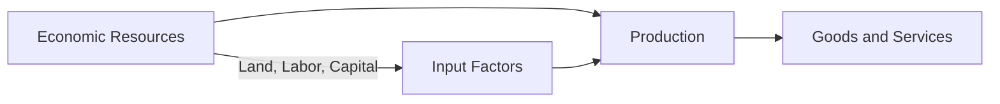

---

title: Economic_Resources
type: Atomic Note
course: Economics
semester: Winter 2026
unit: '1'
hub: "[[1_Basics_Of_Economics_Hub]]"
source: "[[Chapter_1.pdf]]"
source_pages:
- 10
mode: ECON-MACRO
read: false
generated: true
prerequisites:
- "[[Definition_Of_Economics]]"

---

# 1. Mental Model

Imagine you have a lemonade stand and you need to make lemonade for your customers. The things you need to make lemonade, like sugar, lemons, and water, are like "economic resources" - they're the basic things you need to make something valuable. Just like how you need those ingredients to make lemonade, countries need resources like land, labor, and money to make goods and services.

# 2. Economic Theory

Economic resources refer to the inputs used to produce goods and services, such as [[Labor]], [[Capital]], and [[Natural_Resources]]. These resources are essential for the production of goods and services and are a fundamental concept in [[Macroeconomics]] and [[Definition_Of_Economics]]. The allocation of these resources is crucial in achieving [[Efficient_Allocation]] and addressing [[Scarcity]] and [[Unlimited_Human_Wants]].

## 3. Economic Model



## 4. Walkthrough

* The economic resources, such as land, labor, and capital, are the inputs used to produce goods and services.
* These resources are essential for the production process, as shown in the flowchart, where they are used to create goods and services.
* For example, labor is used to mix the ingredients, capital is used to buy the equipment, and land is used to grow the lemons.
* The production process transforms these resources into goods and services that have value.

## 5. Market Failures

This concept can fail when there is a misallocation of resources, such as overusing land for a specific crop, leading to scarcity of other essential resources. Additionally, market failures can occur when there are externalities, such as pollution from production, that are not accounted for in the market price. Edge cases to watch out for include non-renewable resources, which can lead to resource depletion.

---

## 6. The Proving Grounds

```interactive-quiz

[
  {
    "id": "q1",
    "type": "true_false",
    "difficulty": "L1",
    "question": "Countries can produce goods and services without using any economic resources.",
    "answer": false,
    "explanation": "Economic resources, including labor, capital, and natural resources, are the fundamental inputs required for the production of goods and services. According to economic theory, these resources are essential and cannot be substituted or avoided in the production process. Therefore, it is not possible for countries to produce goods and services without utilizing economic resources."
  },
  {
    "id": "q2",
    "type": "synthesis",
    "difficulty": "L2",
    "question": "A small island nation with limited land area and a population of 10,000 people is seeking to develop its economy. The government has identified three potential industries: fishing, tourism, and software development. However, the nation only has 100 hectares of arable land, 500 workers with technical skills, and $1 million in capital. Using the concept of economic resources, how should the nation allocate its resources to maximize economic growth?",
    "answer": "A grading rubric: 4 points for a well-supported decision that takes into account the nation's limited resources, 3 points for a good decision but with some limitations, 2 points for a fair decision but with significant limitations, 1 point for a poor decision, and 0 points for no answer or an irrelevant answer. The answer that earns 4 points is: The nation should prioritize the software development industry, as it requires minimal land and can be done with the existing technical skills. The tourism industry can be developed secondarily, as it requires some land and labor but can generate significant revenue. The fishing industry should be the last priority, as it requires a significant amount of land and labor.",
    "explanation": "The nation has limited economic resources, including land, labor, and capital. The software development industry requires minimal land and can be done with the existing technical skills, making it the most suitable option. The tourism industry can be developed secondarily, as it requires some land and labor but can generate significant revenue. The fishing industry requires a significant amount of land and labor, making it the least suitable option. The government should allocate its resources based on the availability and suitability of each resource for each industry."
  },
  {
    "id": "q3",
    "type": "writing",
    "difficulty": "L3",
    "question": "Explain the concept of Capital as an economic resource and its role in production.",
    "answer": "Capital is an economic resource that refers to the physical and financial assets used to produce goods and services, such as machinery, equipment, and buildings. It plays a crucial role in production by enabling businesses to increase efficiency and productivity. In the context of a lemonade stand, capital could include the blender, juicer, and cups used to make and serve lemonade. Effective use of capital can help businesses reduce costs and improve output.",
    "explanation": "The underlying mechanism of capital as an economic resource lies in its ability to enhance the productivity of other resources, such as labor and natural resources. By investing in capital goods, businesses can improve their production processes, leading to increased efficiency and competitiveness. For instance, a lemonade stand owner who invests in a high-capacity blender can produce more lemonade in less time, thereby increasing their output and potentially their profits. This highlights the importance of capital in facilitating economic growth and development."
  }
]

```