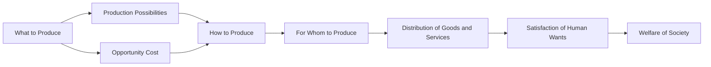

---

title: Economic_Systems
course: Economics
unit: '1'
semester: Winter 2026
mode: ECON-MICRO
type: atomic_note
hub: '[[1_Basics_Of_Economics_Hub]]'
source: '[[5-Pdf Store/note generated/Winter 2026/Economics/Chapter_1.pdf]]'
date: '2026-05-08'
prerequisites:
- '[[Resource_Allocation]]'
- '[[Scarcity]]'
- '[[Economic_Resources]]'
- '[[Human_Wants]]'
- '[[Economic_Analysis]]'
source_pages:
- 56
generated: true

---


## 1. Mental Model

In the high-stakes world of commercial airlines, the interplay between economic systems and organizational structure is exemplified by the contrasting models of Ryanair and Emirates. For instance, Ryanair, a low-cost carrier, operates under a capitalist economic system, where private ownership and profit maximization drive decision-making; explicitly, **Market Structure** (one of the components) is reflected in Ryanair's competitive pricing and efficiency-driven operations. Meanwhile, Emirates, a state-owned airline, embodies a mixed economic system, blending elements of public and private ownership; [[Resource_Allocation]] (the other component) is evident in Emirates' strategic investments in luxury amenities and route expansion, reflecting the government's goals for national development and tourism growth.

## 2. Micro Theory

An economic system is a complex framework that enables societies to address the fundamental questions of what, how, and for whom to produce, given the inherent [[Scarcity]] of [[Economic_Resources]]. It is a structured mechanism that facilitates the allocation of these limited resources to satisfy [[Human_Wants]], which are, by definition, unlimited. The economic system serves as a platform for [[Resource_Allocation]], allowing societies to organize their production and distribution processes.

The concept of an economic system is deeply rooted in [[Economic_Analysis]], which involves the use of Positive Economics to describe the existing economic phenomena and Normative Economics to prescribe how the economy should function. A society's economic system is shaped by its values, institutions, and technological advancements, influencing the way it addresses the Basic Economic Questions.

The study of economic systems falls under the purview of Macroeconomics, one of the Branches Of Economics, which examines the economy as a whole. Adam Smith, a pioneering economist, laid the groundwork for understanding economic systems by highlighting the importance of the "invisible hand" in guiding resource allocation.

The functioning of an economic system relies on Inductive Reasoning and Deductive Reasoning, as economists use empirical evidence to develop and test hypotheses about the behavior of economic agents. A well-designed economic system strives for an Efficient Allocation of resources, ensuring that the production and distribution of goods and services align with societal needs and preferences.

The performance of an economic system is often evaluated based on its ability to achieve a balance between the competing goals of efficiency, equity, and stability. The study of economic systems also involves analyzing the inter relationships between Economic Resources, Human Wants, and the mechanisms for Resource Allocation, ultimately shedding light on how societies address the fundamental questions of what, how, and for whom to produce.

In conclusion, an economic system is a multifaceted construct that provides a framework for societies to manage their resources, satisfy human wants, and address the basic economic questions, thereby facilitating a more efficient and effective allocation of resources.

## 3. Limitations & Edge Cases

The economic system, a framework guiding a society's allocation of resources, faces limitations and edge cases, particularly in its assumptions of rational behavior, perfect information, and market equilibrium. For instance, behavioral economics reveals that humans often act irrationally, contradicting the self-interest assumption. Moreover, information asymmetry and uncertainty can lead to market failures, and the assumption of perfect competition is rarely met in reality. Additionally, economic systems often struggle to account for externalities, public goods, and income inequality, leading to inefficient outcomes. Furthermore, the static nature of many economic models fails to capture the dynamic and complex interactions within economies, rendering them inadequate for addressing rapidly changing global economic landscapes.

## 4. Market Graph



This flowchart illustrates the fundamental questions of an economic system and how they are interconnected, ultimately influencing the welfare of society. The economic system provides a framework for addressing these questions, guiding the allocation of resources to meet human wants and needs.

## 5. Walkthrough

## Step 1: Define the Economic System and Its Purpose

The economic system is a framework that helps societies answer the basic questions of what, how, and for whom to produce, given the scarcity of economic resources. Its purpose is to allocate limited resources to satisfy unlimited human wants.

## Step 2: Identify the Fundamental Questions Addressed by an Economic System

The fundamental questions addressed are:

## Step 3: **What** to produce: This refers to the types and quantities of goods and services to be produced.

## Step 4: **How** to produce: This involves the methods and techniques used in the production process.

## Step 5: **For whom** to produce: This question pertains to the distribution of goods and services among the population.

## Step 6: Understand the Role of Economic Analysis

Economic analysis, which includes both [[Positive_Economics]] (describing existing economic phenomena) and [[Normative_Economics]] (prescribing how the economy should function), plays a crucial role in understanding and evaluating economic systems.

## Step 7: Recognize the Influence of Societal Factors on Economic Systems

A society's economic system is influenced by its:
- **Values**: What the society considers important.
- **Institutions**: The formal and informal rules that govern behavior.
- **Technological advancements**: The level of technology available for production.

## Step 8: Relate Economic Systems to Macroeconomics

The study of economic systems is a part of [[Macroeconomics]], which examines the economy

---

## Review & Practice

```interactive-quiz

[
  {
    "type": "mcq",
    "difficulty": "L1",
    "question": "What is the fundamental characteristic of human wants in the context of economic systems?",
    "options": {
      "A": "They are limited and can be fully satisfied.",
      "B": "They are, by definition, unlimited.",
      "C": "They are constant and do not change over time.",
      "D": "They are solely determined by income levels."
    },
    "answer": "B",
    "explanation": "The correct answer is based on the fundamental concept in economics that human wants are unlimited. This characteristic of human wants is a cornerstone of economic analysis, as it implies that societies must make choices about how to allocate limited resources to satisfy these unlimited wants."
  },
  {
    "type": "fill_in",
    "difficulty": "L2",
    "question": "Fill in the blank.",
    "textWithBlanks": "Human Wants are, by definition, Blank1.",
    "answer": [
      "unlimited"
    ],
    "explanation": "The context states that 'Human Wants are, by definition, unlimited.' This highlights a fundamental concept in economics, which is that human wants are never fully satisfied and are considered unlimited.",
    "required_keywords": [
      "Human Wants",
      "unlimited",
      "Scarcity",
      "Economic Resources"
    ]
  },
  {
    "type": "true_false",
    "difficulty": "L1",
    "question": "Human wants are, by definition, limited.",
    "answer": false,
    "explanation": "Human wants are, by definition, unlimited. This fundamental concept in economics implies that no matter how many goods and services are produced, there will always be more wants to be satisfied."
  }
]

```