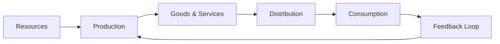

---

title: Economic_Systems
type: Atomic Note
course: Economics
semester: Winter 2026
unit: '1'
hub: "[[1_Basics_Of_Economics_Hub]]"
source: "[[Chapter_1.pdf]]"
source_pages:
- 11
mode: ECON-MACRO
read: false
generated: true
prerequisites:
- "[[Definition_Of_Economics]]"

---

# 1. Mental Model

Imagine you're part of a small town where everyone needs to decide how to share their resources, like food and toys, to make sure everyone has what they need. An economic system is like a set of rules that helps the town make those decisions, deciding who gets what and how things are made and distributed. It's a way to organize how people produce, trade, and consume goods and services.

# 2. Economic Theory

An [[Economic_Systems]] refers to the institutional framework that enables the production, distribution, and exchange of goods and services within a society. It encompasses the rules, norms, and organizations that shape the interactions between [[Decision_Making_Units]], such as households, businesses, and governments, to address the [[Basic_Economic_Questions]] of what to produce, how to produce, and for whom to produce, given the constraints of [[Scarcity]] and [[Unlimited_Human_Wants]]. [[Opportunity_Cost]] plays a crucial role in the functioning of economic systems.

# 3. Economic Model



## 4. Walkthrough

* The process starts with **Resources** (A), which can include labor, materials, and capital.
* These resources are used in **Production** (B) to create **Goods & Services** (C).
* The goods and services are then distributed (D) to various members of the society.
* The members consume (E) these goods and services, which provides feedback on the effectiveness of the production and distribution process.
* This feedback loop (F) allows for adjustments to be made in production to better meet the needs of the society.

## 5. Market Failures

This concept can fail when there are externalities, such as pollution, that are not accounted for in the production and consumption process. Additionally, information asymmetry and unequal distribution of resources can lead to market failures. Edge cases to watch out for include monopolies and oligopolies that can disrupt the distribution of goods and services.

---

## 6. The Proving Grounds

```interactive-quiz

[
  {
    "id": "q1",
    "type": "true_false",
    "difficulty": "L1",
    "question": "In a centrally planned economic system, the government has complete control over the production, distribution, and exchange of goods and services.",
    "answer": true,
    "explanation": "A centrally planned economic system is characterized by the government making most of the decisions regarding the production, distribution, and exchange of goods and services. This type of economic system is often associated with socialist or communist societies where the state aims to control the means of production and distribution to achieve social and economic goals. The government's central planning authority determines what goods and services are produced, how they are produced, and who receives them, thereby having complete control over these aspects."
  },
  {
    "id": "q2",
    "type": "synthesis",
    "difficulty": "L2",
    "question": "In a small town with 100 residents, there are 10 farmers who produce food, 5 toy makers who produce toys, and 85 non-producers. The town needs to decide how to distribute the food and toys among its residents. The farmers and toy makers can only produce a certain amount, and the non-producers have different needs and preferences. The town council proposes three economic systems: (1) a command economy where the council decides who gets what, (2) a market economy where residents trade with each other, and (3) a mixed economy where the council regulates some aspects but allows trading. Design an evaluation rubric to assess which economic system is most suitable for this town.",
    "answer": "A suitable evaluation rubric for assessing the economic systems could include the following criteria: (1) Efficiency: How well does the system allocate resources to meet the needs and preferences of all residents? (2) Equity: How fair is the distribution of food and toys among residents, considering their needs and contributions? (3) Incentives: Does the system provide incentives for farmers and toy makers to produce, and for non-producers to contribute in other ways? (4) Adaptability: How well can the system adjust to changes in production, population, or preferences? (5) Administrative feasibility: How practical and feasible is it for the town council to implement and manage the system?",
    "explanation": "The underlying mechanism for evaluating economic systems involves analyzing how they allocate resources, promote fairness, encourage production and contribution, adapt to changes, and are administratively manageable. This requires considering the trade-offs between efficiency, equity, and incentives, as well as the ability of the system to adapt to unforeseen circumstances. A mixed economy often balances the benefits of a market economy's efficiency and incentives with the equity and regulatory aspects of a command economy. The SEED value would influence which specific aspect to prioritize, such as focusing on adaptability if the town expects significant population growth."
  },
  {
    "id": "q3",
    "type": "writing",
    "difficulty": "L3",
    "question": "Explain the role of scarcity in shaping the rules of an economic system.",
    "answer": "Scarcity plays a crucial role in shaping the rules of an economic system as it necessitates the allocation of limited resources to meet unlimited wants, thereby prompting decisions on production, distribution, and consumption.",
    "explanation": "The underlying mechanism driving the influence of scarcity on economic systems lies in its fundamental impact on resource allocation. Given that resources are limited while human wants are virtually unlimited, economic systems must establish rules to prioritize and distribute these scarce resources efficiently. This involves making choices about what goods and services to produce, how to produce them, and who should receive them. Consequently, scarcity compels economic systems to develop mechanisms for rationing resources, fostering trade, and encouraging innovation to maximize the utility derived from the available resources."
  }
]

```