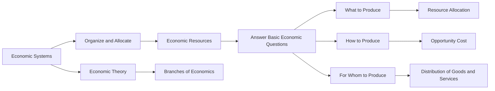

## 1. Mental Model
In the context of **Basics_of_Economics**, consider the airline industry as a real-world scenario illustrating economic systems. The airline industry operates under a mixed economic system, which combines elements of capitalism and government intervention. Specifically, this system exhibits two key components: (1) **Private Ownership**: Airlines are privately owned companies, such as Delta and American Airlines, which operate for profit, making decisions on routes, pricing, and services, exemplifying the characteristics of a market economy (capitalism); and (2) **Government Regulation**: The Federal Aviation Administration (FAA) and Department of Transportation (DOT) regulate the industry, setting safety standards, controlling airspace, and approving routes, illustrating the role of government intervention, a key aspect of a command economy. This mixed economic system allows airlines to innovate and compete while ensuring public safety and interest.

## 2. Micro Theory
An [[Economic_Systems]] refers to the way a society organizes and allocates its [[Economic_Resources]] to answer the [[Basic_Economic_Questions]], specifically [[What_To_Produce]], [[How_To_Produce]], and for whom to produce. It provides a framework for Resource Allocation, determining the distribution of goods and services. The economic system helps in understanding the Opportunity Cost of choices made by society. It is a crucial concept in Branches Of Economics and is studied under Economic Theory.

### Key Takeaways:
- Economic systems determine how societies allocate their resources.
- They provide a framework for answering basic economic questions.
- Economic systems help in understanding the opportunity costs of societal choices.

## 3. Limitations & Edge Cases
In the context of **Basics_of_Economics**, economic systems have specific limitations and edge cases, such as the inability to efficiently allocate resources in the presence of externalities, public goods, or market failures; for instance, centrally planned economies often struggle with information asymmetry and inefficient resource allocation, while market economies may lead to income inequality and environmental degradation; additionally, economic systems may face challenges in dealing with non-renewable resources, imperfect competition, and unpredictable events, highlighting the need for a balanced approach to achieve optimal economic outcomes.

## 4. Market Graph


This Mermaid flowchart illustrates the concept of Economic Systems in the context of **Basics_of_Economics**, showing how economic systems organize and allocate resources to answer basic economic questions and provide a framework for resource allocation and understanding opportunity costs. The flowchart connects economic systems to economic theory and branches of economics, highlighting its significance in the study of economics.

## 5. Walkthrough

## Step 1: Define Economic Systems
An economic system refers to the method by which a society organizes and allocates its economic resources. This concept is crucial in understanding how societies make decisions about the distribution of goods and services.

## Step 2: Identify Basic Economic Questions
The primary purpose of an economic system is to answer the basic economic questions: What to produce, How to produce, and for whom to produce. These questions are fundamental in determining the allocation of resources within a society.

## Step 3: Resource Allocation Framework
An economic system provides a framework for resource allocation. This framework is essential in deciding how resources are distributed among different sectors of the economy, such as determining which goods and services to produce, like Ford producing vehicles or Apple producing smartphones.

## Step 4: Understanding Opportunity Cost
One of the critical roles of an economic system is to help understand the opportunity cost of the choices made by society. Opportunity cost refers to the value of the next best alternative that is given up when a choice is made. For example, if a society decides to produce more WTI Crude Oil, the opportunity cost could be the potential wheat production that is foregone.

## Step 5: Application in Economic Theory
Economic systems are a crucial concept in economic theory and are studied under the branches of economics. They provide insights into how different societies organize their economic activities, such as production and consumption, which can be applied to real-world scenarios, like analyzing the production strategies of companies like Apple or the agricultural production of wheat.

---

## Review & Practice
```interactive-quiz
[
  {
    "type": "mcq",
    "difficulty": "L1",
    "question": "What is the primary function of an [[Economic_Systems]] in a society?",
    "options": {
      "A": "To maximize profits for businesses",
      "B": "To determine how societies allocate their [[Economic_Resources]]",
      "C": "To regulate international trade",
      "D": "To control inflation rates"
    },
    "answer": "B",
    "explanation": "Economic systems determine how societies allocate their resources, providing a framework for answering basic economic questions such as what to produce, how to produce, and for whom to produce."
  },
  {
    "type": "fill_in",
    "difficulty": "L2",
    "question": "Fill in the blank.",
    "textWithBlanks": "An [[Economic_Systems]] refers to the way a society organizes and allocates its [[Economic_Resources]] to answer the [[Basic_Economic_Questions]], specifically [[What_To_Produce]], [[How_To_Produce]], and for whom to produce.",
    "answer": [
      "Economic Systems"
    ],
    "explanation": "The term 'Economic Systems' is a critical concept in economics that refers to the way a society organizes and allocates its resources."
  },
  {
    "type": "true_false",
    "difficulty": "L1",
    "question": "Economic systems determine how individuals allocate their resources.",
    "answer": false,
    "explanation": "Economic systems determine how societies allocate their resources, not individuals."
  }
]
```