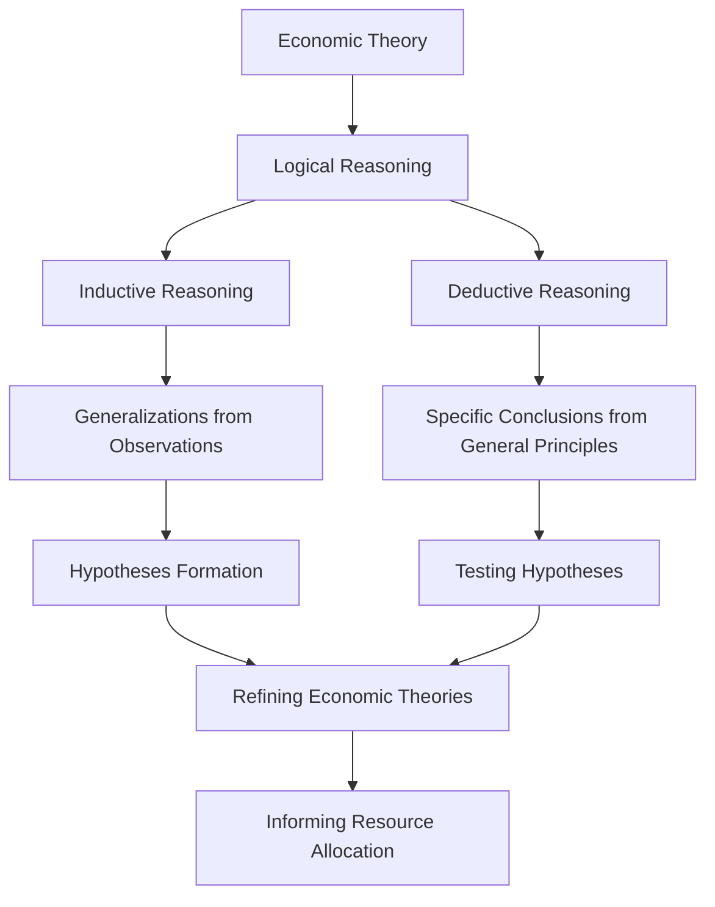

---

title: Economic_Theory
course: Economics
unit: '1'
semester: Winter 2026
mode: ECON-MICRO
type: atomic_note
hub: '[[1_Basics_Of_Economics_Hub]]'
source: '[[5-Pdf Store/note generated/Winter 2026/Economics/Chapter_1.pdf]]'
date: '2026-05-08'
prerequisites:
- '[[Economic_Analysis]]'
- '[[Economic_Resources]]'
- '[[Human_Wants]]'
- '[[Inductive_Reasoning]]'
- '[[Deductive_Reasoning]]'
source_pages:
- 21
generated: true

---


## 1. Mental Model

In a high-stakes oil rig negotiation, two major companies, Exxon and Chevron, are vying for a lucrative drilling contract. This scenario illustrates the application of Game Theory, a fundamental concept in Economic Theory. Specifically, the **Nash Equilibrium** component comes into play as both companies must strategically decide whether to bid aggressively or conservatively, anticipating the other's move, to maximize their payoff. Meanwhile, the **Prisoner's Dilemma** component is also evident, as Exxon and Chevron face a dilemma: if both companies cooperate and bid moderately, they share the contract and moderate profits; however, if one company defects and bids aggressively, it risks securing the contract but potentially sparking a costly bidding war, ultimately leading to a less optimal outcome for both parties.

## 2. Micro Theory

Economic theory serves as the foundation for [[Economic_Analysis]], employing logical reasoning to understand the intricacies of economic phenomena. At its core, economic theory provides a systematic framework for analyzing the allocation of [[Economic_Resources]], which are inherently scarce, to satisfy [[Human_Wants]]. This framework is built upon the twin pillars of logical reasoning: [[Inductive_Reasoning]] and [[Deductive_Reasoning]]. 

Inductive reasoning allows economists to formulate generalizations based on specific observations, enabling the development of hypotheses that can explain economic behaviors and relationships. Conversely, deductive reasoning facilitates the derivation of specific conclusions from general principles, providing a structured approach to testing these hypotheses. The interplay between inductive and deductive reasoning enables economists to refine and validate economic theories, which in turn inform Resource Allocation decisions.

The study of economic theory also encompasses Positive Economics, which focuses on the objective analysis of economic phenomena, describing "what is." This approach is complemented by Normative Economics, which prescribes "what ought to be," often incorporating value judgments. The dichotomy between positive and normative economics underscores the complexity of economic analysis, highlighting the need for a rigorous theoretical framework to navigate the intricacies of economic decision-making.

The fundamental principles of economic theory are designed to address the Basic Economic Questions that arise from the scarcity of resources. These questions—what to produce, how to produce, and for whom to produce—are answered through the lens of Economic Systems, which range from market-based economies to centrally planned economies. The efficiency of these systems in allocating resources is a critical concern, with Efficient Allocation being a key objective.

The works of Adam Smith, often regarded as the father of modern economics, have significantly influenced the development of economic theory. His insights into the "invisible hand" of the market and the concept of comparative advantage have shaped the field, particularly in the context of Macroeconomics, which examines aggregate economic phenomena.

Ultimately, economic theory is a branch of Branches Of Economics that underpins Economic Analysis, providing a methodological foundation for understanding the complexities of economic activity. By applying the tools of logical reasoning, economists can derive meaningful insights into the workings of economies, guiding policymakers and stakeholders in their quest to achieve an optimal allocation of resources in the face of Scarcity.

## 3. Limitations & Edge Cases

Economic theory, founded on logical reasoning through inductive and deductive methods, faces limitations in its ability to fully capture real-world complexities. Specifically, the assumptions of rationality, perfect information, and ceteris paribus often do not hold in reality, leading to inaccurate predictions and oversimplification of economic phenomena. Additionally, economic theory struggles with issues of aggregation, where individual behaviors and preferences are often aggregated to represent market trends, potentially masking important heterogeneity. Furthermore, the reliance on mathematical modeling can lead to a lack of contextual understanding and neglect of important qualitative factors, while the inductive method's reliance on historical data may be limited by the availability and accuracy of such data. Overall, these limitations highlight the need for nuanced interpretation and careful consideration of the assumptions underlying economic theory.

## 4. Market Graph



Economic theory relies on logical reasoning, comprising inductive and deductive reasoning, to analyze and understand economic phenomena. By combining these two methods, economists can develop, test, and refine theories that ultimately inform resource allocation decisions.

## 5. Walkthrough

## Step 1: Identify the Foundation of Economic Theory

Economic theory serves as the foundation for economic analysis, utilizing logical reasoning to comprehend economic phenomena.

## Step 2: Recognize the Role of Logical Reasoning

There are two methods of logical reasoning in economic theory: inductive reasoning and deductive reasoning.

## Step 3: Understand Inductive Reasoning

Inductive reasoning involves formulating generalizations based on specific observations. This method enables economists to develop hypotheses that explain economic behaviors and relationships.

## Step 4: Understand Deductive Reasoning

Deductive reasoning involves deriving specific conclusions from general principles. This structured approach allows economists to test hypotheses developed through inductive reasoning.

## Step 5: Apply Logical Reasoning to Economic Analysis

The interplay between inductive and deductive reasoning enables economists to refine and validate economic theories. These theories, in turn, inform decisions regarding the allocation of economic resources.

---

## Review & Practice

```interactive-quiz

[
  {
    "type": "mcq",
    "difficulty": "L1",
    "question": "What is the primary focus of [[Positive_Economics]] in the study of economic theory?",
    "options": {
      "A": "Prescribing 'what ought to be' in economic decision-making",
      "B": "Objective analysis of economic phenomena, describing 'what is'",
      "C": "Deriving specific conclusions from general principles using deductive reasoning",
      "D": "Formulating generalizations based on specific observations using inductive reasoning"
    },
    "answer": "B",
    "explanation": "Positive economics focuses on the objective analysis of economic phenomena, describing 'what is'. This approach is concerned with factual analysis and description, rather than prescribing 'what ought to be', which is the realm of normative economics."
  },
  {
    "type": "fill_in",
    "difficulty": "L2",
    "question": "Fill in the blank.",
    "textWithBlanks": "The study of economic theory encompasses Blank1, which focuses on the objective analysis of economic phenomena, describing \"what is\".",
    "answer": [
      "Positive Economics"
    ],
    "explanation": "The study of economic theory encompasses Positive Economics, which focuses on the objective analysis of economic phenomena, describing \"what is\". This approach is fundamental in economic theory as it provides a factual basis for understanding economic activities and phenomena without incorporating personal opinions or value judgments.",
    "required_keywords": [
      "Positive Economics",
      "Economic Theory",
      "Objective Analysis"
    ]
  },
  {
    "type": "true_false",
    "difficulty": "L1",
    "question": "The study of economic theory encompasses only Normative Economics, which focuses on prescribing 'what ought to be' in economic phenomena.",
    "answer": false,
    "explanation": "The study of economic theory encompasses both Positive Economics, which focuses on the objective analysis of economic phenomena describing 'what is', and Normative Economics, which prescribes 'what ought to be'. Therefore, the statement that it encompasses only Normative Economics is incorrect."
  }
]

```