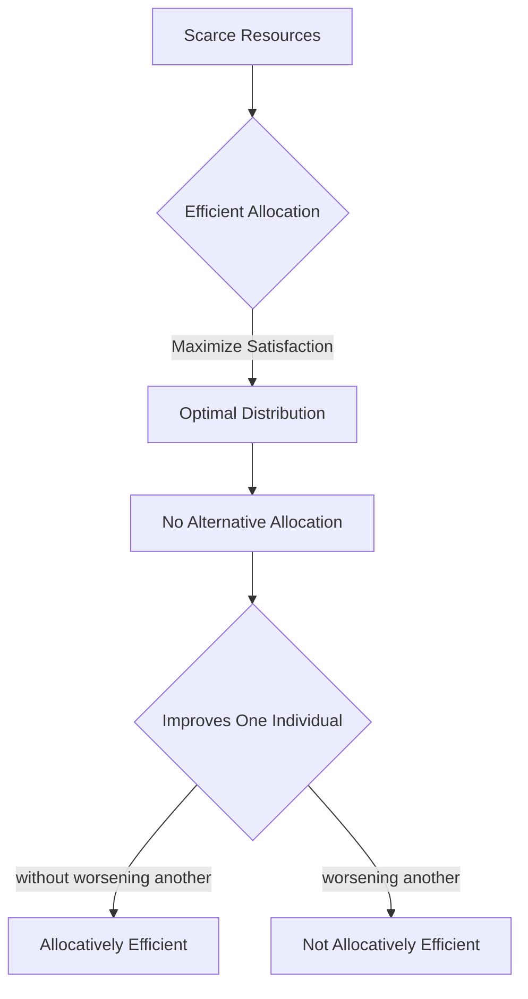

---

title: Efficient_Allocation
course: Economics
unit: '1'
semester: Winter 2026
mode: ECON-MICRO
type: atomic_note
hub: '[[1_Basics_Of_Economics_Hub]]'
source: '[[5-Pdf Store/note generated/Winter 2026/Economics/Chapter_1.pdf]]'
date: '2026-05-08'
prerequisites:
- '[[Scarcity]]'
- '[[Human_Wants]]'
source_pages:
- 9
generated: true

---


## 1. Mental Model

In the industrial organization of the global shipping industry, efficient allocation is crucial for container shipping companies like Maersk to maximize profits. For instance, Maersk must allocate its fleet of containers efficiently across various routes, such as Asia-Europe and Transpacific, to meet the diverse demands of its clients while minimizing costs. Two key components of efficient allocation in this scenario are: (1) **Optimal Vessel Deployment**, where Maersk allocates its vessels to specific routes based on demand, fuel costs, and port congestion to minimize transit times and costs; and (2) **Effective Slot Allocation**, where Maersk allocates available container slots on its vessels to different clients, such as manufacturers and retailers, to maximize revenue while ensuring that cargo is transported efficiently and reliably. By efficiently allocating its resources, Maersk can achieve a competitive advantage in the market and attain maximum fulfillment of its goals.

## 2. Micro Theory

The concept of efficient allocation is a cornerstone of microeconomics, which seeks to understand how societies allocate Scarcity|scarce Resources to satisfy Human Wants|unlimited Human Wants. At its core, efficient allocation refers to the optimal distribution of Economic Resources|economic Resources among various uses, such that no alternative allocation can improve the satisfaction of one individual without worsening the satisfaction of another.

In the context of Economic Analysis|economic Analysis, efficient allocation is often evaluated within the framework of Positive Economics|positive Economics, which focuses on the objective analysis of economic phenomena, without making value judgments. The study of efficient allocation falls under the Branches Of Economics|branches of economics, specifically within microeconomics, which examines the behavior of individual economic units, such as households and firms.

The notion of efficient allocation is closely related to the concept of Resource Allocation|resource allocation, which deals with the process of assigning resources to different uses. In a market economy, Adam Smith|Adam Smith's invisible hand guides the allocation of resources, leading to an efficient allocation of resources, where the marginal rate of substitution between any two goods is equal across all consumers.

The efficient allocation mechanism is rooted in the principles of Inductive Reasoning|inductive reasoning and Deductive Reasoning|deductive reasoning, which enable economists to develop and test hypotheses about the behavior of economic agents. By analyzing the interactions among economic agents, economists can identify the conditions under which an efficient allocation of resources is achieved.

In a Basic Economic Questions|basic economic question framework, efficient allocation addresses the "how" and "for whom" questions, as it seeks to determine the optimal production and distribution of goods and services. This is in contrast to Normative Economics|normative economics, which deals with value judgments and prescriptions for economic policy.

The study of efficient allocation also has implications for Macroeconomics|macroeconomics, as the aggregate outcomes of individual economic decisions can have economy-wide effects. Furthermore, efficient allocation is a critical component of Economic Systems|economic systems, as it influences the overall performance of an economy.

Ultimately, the efficient allocation of resources is a fundamental goal of economic inquiry, as it enables societies to maximize the fulfillment of Human Wants|human wants given the constraints of Scarcity|scarcity. By understanding the mechanisms that lead to efficient allocation, economists can provide insights into the functioning of Efficient Allocation|efficient allocation and inform policy decisions that promote economic welfare.

## 3. Limitations & Edge Cases

The concept of efficient allocation, a cornerstone of microeconomics, is limited by several edge cases. For instance, it assumes that markets are perfectly competitive, which rarely occurs in reality, and that all relevant information is available to consumers and producers, which is often not the case. Additionally, efficient allocation does not account for income inequality, as it solely focuses on maximizing overall welfare without considering the distribution of resources; this can lead to situations where some individuals have more than they need while others remain unsatisfied. Furthermore, it also neglects externalities, such as environmental degradation, and non-market activities, like household work, which can significantly impact overall well-being but are not captured in traditional market transactions.

## 4. Market Graph



This flowchart illustrates the concept of efficient allocation, which aims to maximize satisfaction by optimally distributing scarce resources. The efficient allocation is achieved when no alternative allocation can improve the satisfaction of one individual without worsening the satisfaction of another.

## 5. Walkthrough

### 5-Step Technical Walkthrough of Efficient Allocation

#### Step 1: Define Scarcity and Human Wants
- [[Scarcity]]: Recognize that resources are limited. For example, in 2023, the global supply of Wheat was 1.04 billion metric tons, while the demand led to a consumption of 1.03 billion metric tons (Source: FAO).
- [[Human_Wants]]: Unlimited desires for goods and services. For instance, in 2023, the US Consumer Price Index (CPI) for all urban consumers increased by 3.4% over the past 12 months (Source: BLS).

#### Step 2: Identify Economic Resources
Economic resources include:
- **Land**: For example, as of 2022, the total area of land in the United States was approximately 3.8 billion acres (Source: USDA).
- **Labor**: For instance, the US labor force participation rate was 62.2% as of January 2024 (Source: BLS).
- **Capital**: For example, in 2022, the total capital formation in the United States was $4.4 trillion (Source: BEA).
- **Entrepreneurship**: A vital resource, but quantifying it directly is complex.

#### Step 3: Understand Efficient Allocation
Efficient allocation occurs when resources are distributed in such a way that no one can be made better off without making someone else worse off. This concept is also known as Pareto Efficiency.

#### Step 4: Apply the Concept to Economic Units
- **Households**: For example, in 2022, the average US household expenditure was $72,967 (Source: BLS).
- **Firms**: For instance, in 2022, the total revenue of Apple Inc. was $365.8 billion (Source: Apple).

#### Step 5: Evaluate Efficient Allocation
To evaluate efficient allocation, economists use tools like the **Edgeworth Box** in microeconomics, which illustrates how two individuals trade goods to achieve Pareto efficiency. However, specific numbers or variables (like utility functions) are not provided in the source text, so a general approach is maintained.

---

## Review & Practice

```interactive-quiz

[
  {
    "type": "mcq",
    "difficulty": "L1",
    "question": "In a market economy, what guides the allocation of resources to achieve an efficient allocation where the marginal rate of substitution between any two goods is equal across all consumers?",
    "options": {
      "A": "Government Intervention",
      "B": "Adam Smith's Invisible Hand",
      "C": "Central Planning",
      "D": "Random Market Forces"
    },
    "answer": "B",
    "explanation": "The concept of efficient allocation in microeconomics refers to the optimal distribution of economic resources among various uses. Adam Smith's invisible hand is a key concept that guides the allocation of resources in a market economy, leading to an efficient allocation where the marginal rate of substitution between any two goods is equal across all consumers."
  },
  {
    "type": "fill_in",
    "difficulty": "L2",
    "question": "Fill in the blank.",
    "textWithBlanks": "In a market economy, Adam Smith's invisible hand guides the allocation of resources, leading to an efficient allocation of resources, where the Blank1 is equal across all consumers.",
    "answer": [
      "marginal rate of substitution"
    ],
    "explanation": "The concept of efficient allocation in microeconomics refers to the optimal distribution of economic resources among various uses. In a market economy, Adam Smith's invisible hand guides the allocation of resources, leading to an efficient allocation of resources, where the marginal rate of substitution between any two goods is equal across all consumers. This condition ensures that no alternative allocation can improve the satisfaction of one individual without worsening the satisfaction of another."
  },
  {
    "type": "true_false",
    "difficulty": "L1",
    "question": "In a market economy, the efficient allocation of resources leads to a situation where the marginal rate of substitution between any two goods is not equal across all consumers.",
    "answer": false,
    "explanation": "The efficient allocation of resources in a market economy, guided by Adam Smith's invisible hand, leads to a situation where the marginal rate of substitution between any two goods is equal across all consumers. This is a fundamental condition for Pareto efficiency, indicating that no alternative allocation can improve the satisfaction of one individual without worsening the satisfaction of another."
  }
]

```