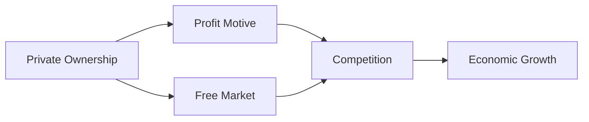

---

title: Features_Of_Capitalistic_Economy
type: Atomic Note
course: Economics
semester: Winter 2026
unit: '1'
hub: "[[1_Basics_Of_Economics_Hub]]"
source: "[[Chapter_1.pdf]]"
source_pages:
- 62
mode: ECON-MACRO
read: false
generated: true
prerequisites:
- "[[Capitalist_Economy]]"

---

# 1. Mental Model

Imagine you have a lemonade stand. In a capitalistic economy, you get to decide how much lemonade to make, how much to charge for it, and how to make it different from your neighbor's lemonade stand. This freedom to make choices and compete with others is a key feature of a capitalistic economy.

# 2. Economic Theory

The [[Features_Of_Capitalistic_Economy]] refer to the characteristics of an economic system in which private individuals and businesses own and operate the means of production, with the goal of generating profits. Key features include [[Private_Ownership]] of [[Economic_Resources]], [[Free_Market]] exchange, and [[Competition]], which allow for the [[Efficient_Allocation]] of resources. This leads to [[Economic_Growth_And_Ppf]] and [[Asymmetric_Growth_And_Ppf]].

# 3. Economic Model



## 4. Walkthrough

* Private individuals and businesses own the means of production (e.g., a lemonade stand).
* The goal is to generate profits by producing goods and services that meet consumer demand (e.g., making lemonade to sell).
* Firms compete with each other to attract customers, leading to innovation and better products (e.g., your lemonade stand competes with your neighbor's).
* This competition and pursuit of profit drive economic growth, as firms expand and new businesses emerge.

## 5. Market Failures

This concept can fail when there are externalities, such as environmental degradation, or when there is imperfect information, leading to market inefficiencies. Additionally, income inequality can arise if some individuals or groups are unable to participate in the market or accumulate wealth.

---

## 6. The Proving Grounds

```interactive-quiz

[
  {
    "id": "q1",
    "type": "true_false",
    "difficulty": "L1",
    "question": "In a capitalistic economy, the government determines the prices of goods and services.",
    "answer": false,
    "explanation": "In a capitalistic economy, private individuals and businesses own and operate the means of production, with the goal of generating profits. One of the core mechanisms of a capitalistic economy is the freedom of individuals and businesses to make choices, such as determining the prices of goods and services. This is in contrast to a centrally planned economy, where the government makes these decisions. The freedom to set prices is a key feature that allows for competition and innovation, driving economic growth. Therefore, the statement that 'In a capitalistic economy, the government determines the prices of goods and services' is false."
  },
  {
    "id": "q2",
    "type": "synthesis",
    "difficulty": "L2",
    "question": "Maria and her friend Tom both run lemonade stands in a small town. Maria decides to use a new, expensive machine to make her lemonade, while Tom sticks to his traditional method. The town's summer festival is approaching, and both expect a large crowd. However, a new health regulation requires lemonade stands to display their ingredients and methods prominently. How can Maria and Tom balance their desire for profit with the need to comply with the new regulation and differentiate their products in a crowded market?",
    "answer": "A grading rubric for evaluating Maria and Tom's strategies could include: \n- Creativity in product differentiation (20 points)\n- Compliance with the new health regulation (20 points)\n- Pricing strategy and profit maximization (20 points)\n- Marketing and customer engagement (20 points)\n- Adaptability and responsiveness to market changes (20 points)",
    "explanation": "In a capitalistic economy, private individuals like Maria and Tom own and operate their lemonade stands with the goal of generating profits. The new health regulation introduces an additional constraint that they must consider in their decision-making. By evaluating their strategies based on creativity, compliance, pricing, marketing, and adaptability, we can assess their ability to balance profit maximization with regulatory compliance and customer engagement. The use of a new machine by Maria and traditional methods by Tom presents an interesting contrast in terms of investment, risk, and potential return. The regulation requiring disclosure of ingredients and methods adds a layer of transparency and accountability, which can influence customer choices and ultimately affect profits. A well-rounded strategy that considers these factors will be crucial for success."
  },
  {
    "id": "q3",
    "type": "writing",
    "difficulty": "L3",
    "question": "Explain the concept of profit maximization in a capitalistic economy.",
    "answer": "In a capitalistic economy, profit maximization is achieved when businesses, like a lemonade stand, set prices and production levels to earn the highest possible profits, often through efficient use of resources and innovative production methods.",
    "explanation": "The underlying mechanism of profit maximization in a capitalistic economy is driven by the interaction of supply and demand. Businesses aim to produce at a level where marginal revenue equals marginal cost, allowing them to maximize their profits. This process is facilitated by private ownership of the means of production, which enables entrepreneurs to take risks and invest in their businesses, with the goal of generating profits. The freedom to make choices and compete with others, as seen in the lemonade stand example, is a key feature that enables profit maximization."
  }
]

```