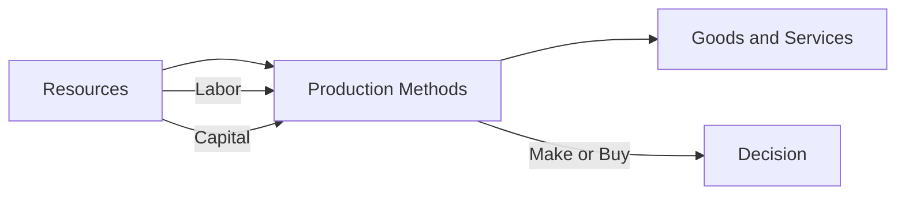

---

title: How_To_Produce
type: Atomic Note
course: Economics
semester: Winter 2026
unit: '1'
hub: "[[1_Basics_Of_Economics_Hub]]"
source: "[[Chapter_1.pdf]]"
source_pages:
- 52
- 53
mode: ECON-MACRO
read: false
generated: true
prerequisites:
- "[[Basic_Economic_Questions]]"

---

# 1. Mental Model

Imagine you're making a lemonade stand. You have to decide if you want to make the lemonade yourself or if you want to hire your friends to help. This is similar to how an economy decides how to produce things, like who should make the goods and services, and what resources to use.

# 2. Economic Theory

The concept of "How To Produce" refers to the methods and techniques used to produce goods and services. It involves the [[Opportunity_Cost]] of choosing one production method over another and the [[Efficient_Allocation]] of [[Economic_Resources]]. This decision is crucial in an economy as it affects the [[Production_Possibilities_Frontier]] and the overall [[Economic_Growth_And_Ppf]].

# 3. Economic Model



## 4. Walkthrough

* The economy starts with available **Resources** (A), such as labor and capital.
* These resources are used to determine the **Production Methods** (B), like hiring friends or investing in machines.
* The production methods then create **Goods and Services** (C), such as lemonade.
* The decision to **Make or Buy** (D) is crucial, as it affects the allocation of resources and opportunity costs.

## 5. Market Failures

This concept can fail when there are **Information Asymmetries**, where producers lack knowledge about the most efficient production methods. Additionally, **Externalities**, such as environmental costs, can lead to inefficient production decisions. Furthermore, **Market Power** can result in monopolies that restrict production and distort resource allocation.

---

## 6. The Proving Grounds

```interactive-quiz

[
  {
    "id": "q1",
    "type": "true_false",
    "difficulty": "L1",
    "question": "The decision of how to produce goods and services involves only the choice of technology to use.",
    "answer": false,
    "explanation": "The decision of how to produce goods and services is a broader concept that involves not only the choice of technology but also the allocation of economic resources and consideration of opportunity costs. It encompasses who should produce the goods and services, what resources to use, and the methods and techniques employed in production. Therefore, stating that it involves only the choice of technology to use is an oversimplification and inaccurate."
  },
  {
    "id": "q2",
    "type": "synthesis",
    "difficulty": "L2",
    "question": "The local government of a small town has decided to build a new community center. The town has a mix of skilled and unskilled labor, and there are several production methods to choose from, including using local volunteers, hiring a construction company, or a combination of both. The town's goal is to minimize costs while ensuring the center is built to code and meets the needs of the community. Using the concepts of opportunity cost, efficient allocation of resources, and production methods, determine the best approach for the town to take.",
    "answer": "A grading rubric with the following criteria: (1) Cost-effectiveness (30 points): Does the approach minimize costs while meeting the community's needs? (2) Resource allocation (25 points): Are resources (labor, materials, etc.) allocated efficiently? (3) Code compliance and quality (20 points): Does the approach ensure the center meets building codes and community standards? (4) Community engagement (15 points): Does the approach involve local volunteers or stakeholders? (5) Flexibility and adaptability (10 points): Can the approach adapt to changes in the project scope or unexpected setbacks?",
    "explanation": "The best approach for the town to take involves weighing the pros and cons of each production method. Using local volunteers can minimize costs and increase community engagement, but may require more time and effort to manage. Hiring a construction company can ensure code compliance and quality, but may be more expensive. A combination of both approaches can balance cost-effectiveness with resource allocation and community engagement. The grading rubric assesses the approach based on these factors, with a focus on cost-effectiveness, resource allocation, and code compliance."
  },
  {
    "id": "q3",
    "type": "writing",
    "difficulty": "L3",
    "question": "Explain the concept of Efficient Allocation of Economic Resources in the context of How To Produce.",
    "answer": "The Efficient Allocation of Economic Resources refers to the optimal distribution of resources such as labor, capital, and raw materials to produce goods and services. This concept is crucial in determining the most effective way to produce, as it directly impacts the productivity and profitability of a firm or economy. Efficient allocation ensures that resources are not wasted and are utilized to their full potential.",
    "explanation": "In the context of How To Produce, the Efficient Allocation of Economic Resources involves assessing the various production methods and selecting the one that maximizes output while minimizing costs. This process requires evaluating the opportunity costs of choosing one production method over another and allocating resources accordingly. For instance, a lemonade stand owner must decide whether to hire friends to help with production or to produce the lemonade themselves, taking into account the costs and benefits of each option."
  }
]

```