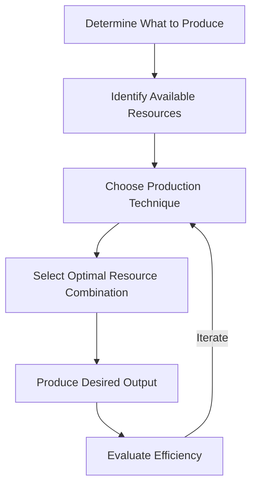

---

title: How_To_Produce
course: "Economics"
unit: '1'
semester: "Winter 2026"
mode: ECON-MICRO
type: atomic_note
hub: "[[1_Basics_Of_Economics_Hub]]"
source: "[[5-Pdf Store/note generated/Winter 2026/Economics/Chapter_1.pdf]]"
date: '2026-05-08'
prerequisites:
- "[[Basic_Economic_Questions]]"
source_pages:
- 52
generated: true

---

## 1. Mental Model

At Siemens, a leading global technology company, the "how to produce" decision is crucial in its manufacturing operations. For instance, when producing high-voltage transformers, Siemens must decide on the optimal combination of labor and capital to minimize costs and maximize efficiency. Two specific components of "how to produce" that Siemens must map are: (1) **Labor**, specifically the skill level and training of production staff, as highly skilled workers are required to operate complex machinery and ensure high-quality output; and (2) **Technology**, specifically the type and level of automation to be used, as investing in advanced robotics and machinery can significantly enhance productivity and reduce production time. By optimizing these components, Siemens can produce high-quality transformers while maintaining competitiveness in the global market.

## 2. Micro Theory

The question of "how to produce" is a fundamental inquiry in economics that arises after an economy has determined what goods and services to produce, given the constraints of [[Scarcity]] and the unlimited nature of [[Human_Wants]]. This decision is a critical component of the [[Basic_Economic_Questions]], which every Economic Systems|economic System must address. The "how to produce" question pertains to the selection of the most efficient production techniques and the optimal combination of [[Economic_Resources]], including labor, capital, and technology, to create the desired output.

From a microeconomic perspective, the "how to produce" decision involves firms making choices about the production process, guided by the principles of Positive Economics, which focuses on objective analysis and factual statements about economic phenomena. This decision is influenced by the Efficient Allocation of resources, where resources are allocated in a manner that maximizes output and minimizes waste. Adam Smith, often regarded as the father of modern economics, noted that the division of labor and the efficient allocation of resources are crucial for economic prosperity.

The mechanism for determining "how to produce" involves a combination of Inductive Reasoning and Deductive Reasoning. Firms gather data on the productivity of different inputs and use inductive reasoning to infer the most effective production methods. They then apply deductive reasoning to derive the optimal production plan, given the constraints of their resources and technology.

In making the "how to produce" decision, firms engage in Economic Analysis, evaluating the costs and benefits of alternative production techniques. This analysis is grounded in the concept of Resource Allocation, which involves directing resources towards their most valuable uses. The goal is to achieve an Efficient Allocation of resources, where the marginal rate of technical substitution between inputs equals the ratio of their prices.

The "how to produce" decision has implications for Macroeconomics, as the aggregate production decisions of firms influence the overall performance of the economy. Furthermore, this decision is subject to Normative Economics, which involves value judgments about what ought to be produced and how it should be distributed. Ultimately, the "how to produce" decision is a critical aspect of Branches Of Economics|microeconomics, which studies the behavior of individual economic units, such as firms and households, and their interactions in specific markets.

Once an economy has determined how to produce, it must consider the broader implications of its production decisions, including the impact on resource allocation, economic efficiency, and overall well-being. By understanding the technical aspects of production and the economic principles that guide firms' decisions, policymakers and economists can better address the Basic Economic Questions and promote more efficient and equitable economic outcomes.

## 3. Limitations & Edge Cases

The "How to Produce" question is subject to limitations, particularly in assuming that production methods are flexible and that resources can be easily reallocated. However, in reality, production technologies may be fixed in the short run, and firms may face constraints such as limited availability of skilled labor, specialized equipment, or specific raw materials. Additionally, the choice of production method may be influenced by institutional factors, such as labor laws, environmental regulations, and cultural norms, which can limit the range of feasible production techniques. Furthermore, the assumption of efficient production may not always hold, as firms may face informational limitations, bounded rationality, or agency problems that lead to suboptimal production decisions. These limitations highlight the need for a nuanced understanding of the production process and the constraints that firms and economies face in determining how to produce goods and services.

## 4. Market Graph



The flowchart illustrates the decision-making process for "how to produce" in labor market economics, starting from determining what to produce and iteratively evaluating and adjusting the production technique and resource combination to achieve efficient output. This process enables firms to make informed choices about production, guided by the principles of positive economics and efficient allocation of resources.

## 5. Walkthrough

### 5-Step Technical Walkthrough of "How to Produce"

#### Step 1: Define the Production Goal
The economy has already determined [[What_To_Produce]]. For this walkthrough, let's assume the economy has decided to produce 100 units of Wheat.

#### Step 2: Identify Available Economic Resources
The economy has access to - Labor
- Capital
- Technology

For simplicity, let's assume the economy has:
- 100 workers (Labor)
- $10,000 worth of machinery (Capital)

#### Step 3: Determine the Production Technique
The economy must choose the most efficient production technique. This involves selecting the optimal combination of labor, capital, and technology to produce 100 units of Wheat.

Let's assume there are two production techniques:
- Technique A: Labor-intensive (90 workers, 10 machines)
- Technique B: Capital-intensive (10 workers, 90 machines)

#### Step 4: Apply the Principle of Efficient Allocation
The economy aims to allocate resources efficiently to maximize output. Let's assume - 1 worker produces 1 unit of Wheat per hour
- 1 machine produces 5 units of Wheat per hour

Using Technique A (Labor-intensive):
- 90 workers * 1 unit/hour = 90 units/hour
- 10 machines * 5 units/hour = 50 units/hour
- Total output: 90 + 50 = 140 units/hour (can produce 100 units in less than 1 hour)

Using Technique B (Capital-intensive):
- 10 workers * 1 unit/hour = 10 units/hour
- 90 machines * 5 units/hour = 450 units/hour
- Total output: 10 + 450 = 460 units/hour (can produce 100 units in less than 1 hour)

#### Step 5: Select the Optimal Production Technique
Based on the calculations, Technique B (Capital-intensive) is more efficient, as it can produce 100 units of Wheat in less time and with potentially lower costs.

The economy decides to use Technique B: 10 workers and 90 machines to produce 100 units of Wheat.

---

## Review & Practice

```interactive-quiz

[
  {
    "type": "mcq",
    "difficulty": "L1",
    "question": "Firms determine the optimal production method by gathering data on the productivity of different inputs and using Blank1 to infer the most effective production methods, and then applying Blank2 to derive the optimal production plan.",
    "options": {
      "A": "Deductive Reasoning, Inductive Reasoning",
      "B": "Inductive Reasoning, Deductive Reasoning",
      "C": "Positive Economics, Normative Economics",
      "D": "Resource Allocation, Efficient Allocation"
    },
    "answer": "B",
    "explanation": "The correct answer involves firms using inductive reasoning to infer the most effective production methods from data on input productivity, and then applying deductive reasoning to derive the optimal production plan given their resources and technology constraints."
  },
  {
    "type": "fill_in",
    "difficulty": "L2",
    "question": "Fill in the blank.",
    "textWithBlanks": "Firms gather data on the productivity of different inputs and use [[Inductive_Reasoning]] to infer the most effective production methods.",
    "answer": [
      "Inductive_Reasoning"
    ],
    "explanation": "The question tests the specific fact that firms use inductive reasoning to infer the most effective production methods, which is a critical aspect of the 'how to produce' decision in labor market economics."
  },
  {
    "type": "true_false",
    "difficulty": "L1",
    "question": "Firms use deductive reasoning to gather data on the productivity of different inputs and infer the most effective production methods.",
    "answer": false,
    "explanation": "Firms gather data on the productivity of different inputs and use inductive reasoning to infer the most effective production methods. They then apply deductive reasoning to derive the optimal production plan, given the constraints of their resources and technology."
  }
]

```