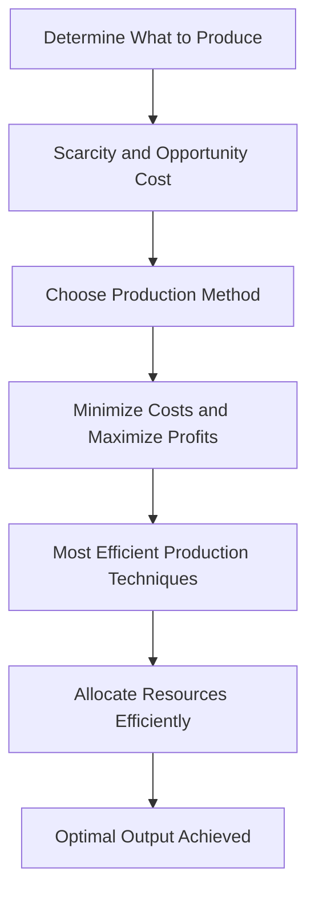

---

title: How_To_Produce
course: "Economics"
unit: '1'
semester: "Winter 2026"
mode: ECON-MICRO
type: atomic_note
hub: "[[1_Basics_Of_Economics_Hub]]"
source: "[[5-Pdf Store/note generated/Winter 2026/Economics/Chapter_1.pdf]]"
date: '2026-05-08'
prerequisites:
- "[[Basic_Economic_Questions]]"
source_pages:
- 52
generated: true

---

## 1. Mental Model

Imagine you're a Lemonade Stand owner and you've decided to make 10 cups of lemonade to sell to thirsty neighbors. Now, you need to figure out how to make it. You have two friends, Alex and Ben, who can help you. Alex is super fast at squeezing lemons, but not great at mixing. Ben is a master mixer, but slow at squeezing. You can choose to have Alex squeeze all the lemons and then Ben mix it all, or have them work together on each cup, or even have one person do everything. The "how to produce" decision is like choosing the best way for Alex and Ben to work together to make those 10 cups of lemonade efficiently, so you can sell them quickly and make more lemonade stands in the future!

## 2. Micro Theory

The economic problem of "How To Produce" arises after an economy has determined what goods and services to produce, as it necessitates the efficient allocation of scarce resources to achieve the desired output. This decision is intricately linked with the concepts of [[Scarcity_And_Choice]] and [[Opportunity_Cost]], as the method of production chosen will invariably involve tradeoffs, reflecting the fundamental economic problem of [[Scarcity]]. 

In a [[Capitalist_Economy]], which is one type of [[Economic_Systems]], the decision on how to produce is primarily made by firms. These firms aim to minimize costs and maximize profits, guiding their choices towards the most efficient production techniques given the prevailing [[Economic_Resources]] and technology. The pursuit of efficiency in production is a core objective within Microeconomics, a branch of [[Branches_Of_Economics]], which studies how [[Decision_Making_Units]], such as households and firms, make choices about how to allocate resources.

The "How To Produce" question is fundamentally about the optimal combination of inputs, such as labor and capital, to produce a certain level of output. This involves understanding the [[Production_Possibilities_Frontier]] (PPF), which illustrates the various combinations of two goods that can be produced given the available resources and technology. The PPF embodies the concept of [[Opportunity_Cost]], as moving along the frontier to produce more of one good requires giving up some of the other, reflecting the [[Law_Of_Increasing_Opportunity_Cost]].

The efficient allocation of resources to produce goods and services is a central theme in [[Economic_Theory]], which often assumes that economic agents make rational choices based on available information. [[Adam_Smith]], a foundational figure in economics, noted that firms seek to minimize costs and maximize profits, leading to an efficient allocation of resources in a market economy. This process of resource allocation is guided by market forces and the price mechanism, which play a crucial role in answering the basic economic questions of [[What_To_Produce]], [[How_To_Produce]], and [[For_Whom_To_Produce]].

The analysis of "How To Produce" also involves understanding the role of [[Economic_Resources]], which are the inputs used in the production process. These resources are limited, and their optimal allocation is crucial for achieving [[Efficient_Allocation]] and promoting [[Economic_Growth]]. The study of how resources are allocated to meet [[Human_Wants]], which are unlimited, is a fundamental aspect of economics, as defined in the [[Definition_Of_Economics]].

In making decisions about how to produce, firms engage in both [[Inductive_Reasoning]] and [[Deductive_Reasoning]], using data and logical analysis to choose the most efficient production methods. This decision-making process is influenced by the broader economic environment, including macroeconomic conditions studied in [[Macroeconomics]], and is subject to [[Market_Failure]], where the market's allocation of resources is not efficient.

The study of "How To Produce" falls under [[Positive_Economics]], which focuses on what is, rather than what should be, distinguishing it from [[Normative_Economics]]. However, the question of how to produce is often intertwined with policy debates that involve normative judgments about the role of government and the ideal allocation of resources, reflecting the [[Role_Of_Government]] in addressing market failures and ensuring an efficient and equitable economy.

Ultimately, the mechanism for determining how to produce involves firms and markets striving for [[Efficiency]] in production, guided by the principles of [[Economic_Theory]] and subject to the constraints of [[Scarcity]] and [[Tradeoffs]]. This process is a critical component of the broader study of economics, which seeks to understand how societies allocate scarce resources to meet unlimited wants, and is closely related to the study of [[Resource_Allocation]] and the various branches of economics.

## 3. Limitations & Edge Cases

The "How to Produce" question is subject to limitations, particularly in assuming that production methods are flexible and can be easily changed. However, in reality, production technologies and techniques may be rigid and not easily adaptable, especially in the short run. Additionally, the availability of resources and factor mobility can constrain the choice of production methods, and information about alternative production techniques may be imperfect. Furthermore, institutional and social factors, such as worker skills and training, existing infrastructure, and cultural norms, can also limit the range of feasible production methods, making it difficult for an economy to switch to a more efficient or optimal production technique.

## 4. Market Graph



The flowchart illustrates the decision-making process for "How to Produce" in a labor market economy, where firms choose the most efficient production techniques to minimize costs and maximize profits. By allocating resources efficiently, firms achieve optimal output, reflecting the economy's ability to address the fundamental economic problem of scarcity.

## 5. Walkthrough

### 5-Step Technical Walkthrough of "How To Produce"

#### Step 1: Define Production Goal
The economy has already determined **what** goods and services to produce. Now, it must decide **how** to produce them, focusing on the efficient allocation of scarce resources.

#### Step 2: Identify Scarce Resources
In a capitalist economy, firms face scarcity of resources. For example, if producing wheat, the firm must allocate limited resources such as **land**, **labor**, and **capital** efficiently.

#### Step 3: Determine Production Technique
Firms choose the most efficient production technique that minimizes costs and maximizes profits, given prevailing economic resources and technology. For instance, a firm producing **automobiles**, like **Ford**, might use an assembly line production method.

#### Step 4: Evaluate Opportunity Costs
Each production technique involves trade-offs, reflecting the concept of **opportunity cost**. For example, if **Ford** decides to use more **capital** (e.g., robots) and less **labor**, the opportunity cost is the potential output forgone by not using those labor resources elsewhere.

#### Step 5: Achieve Efficient Production
The goal is to achieve efficient production, a core objective in **microeconomics**. Efficient production is attained when a firm, such as **Apple**, produces goods and services at the lowest possible average cost, given the available technology and resources. This involves optimizing the combination of **economic resources** like **labor**, **capital**, and **raw materials** to produce goods and services.

---

## Review & Practice

```interactive-quiz

[
  {
    "type": "mcq",
    "difficulty": "L1",
    "question": "In the context of Environmental Economics and the economic problem of 'How To Produce', what concept illustrates the various combinations of two goods that can be produced given the available resources and technology?",
    "options": {
      "A": "Budget Constraint",
      "B": "Production Possibilities Frontier (PPF)",
      "C": "Supply Curve",
      "D": "Demand Curve"
    },
    "answer": "B",
    "explanation": "The Production Possibilities Frontier (PPF) is a graphical representation that shows the various combinations of two goods that can be produced given the available resources and technology. It embodies the concept of opportunity cost, as moving along the frontier to produce more of one good requires giving up some of the other, reflecting the Law of Increasing Opportunity Cost."
  },
  {
    "type": "fill_in",
    "difficulty": "L2",
    "question": "Fill in the blank.",
    "textWithBlanks": "The Blank is a core objective within microeconomics, which studies how decision-making units, such as households and firms, make choices about how to allocate resources.",
    "answer": [
      "efficient allocation of resources"
    ],
    "explanation": "The efficient allocation of resources is a central theme in economic theory, particularly within microeconomics. It involves determining the optimal combination of inputs, such as labor and capital, to produce a certain level of output.",
    "required_keywords": [
      "efficient allocation",
      "microeconomics",
      "resource allocation"
    ]
  },
  {
    "type": "debug",
    "difficulty": "L1",
    "question": "Find the bug in the following scenario: A firm in a capitalist economy aims to minimize costs and maximize profits by choosing the most efficient production technique given the prevailing economic resources and technology. However, in determining the optimal combination of inputs such as labor and capital to produce a certain level of output, the firm incorrectly assumes that the [[Opportunity_Cost]] of producing one more unit of output is constant, regardless of the level of production.",
    "content": "In a capitalist economy, firms decide how to produce goods and services by selecting the most cost-effective production methods. This decision is guided by the goal of minimizing costs and maximizing profits. The optimal combination of inputs like labor and capital is crucial for achieving efficient production. However, a subtle error in the decision-making process can lead to suboptimal resource allocation.",
    "answer": "The bug is that the firm assumes the [[Opportunity_Cost]] of producing one more unit of output is constant, regardless of the level of production. In reality, the opportunity cost typically increases as production levels change, especially due to the [[Law_Of_Increasing_Opportunity_Cost]], which states that as more of one good is produced, the opportunity cost of producing additional units of that good increases.",
    "required_keywords": [
      "Opportunity_Cost",
      "Law_Of_Increasing_Opportunity_Cost",
      "Efficient_Allocation"
    ],
    "explanation": "The firm's incorrect assumption about constant opportunity costs leads to a misunderstanding of the true costs associated with producing additional units of output. This can result in suboptimal production decisions and inefficient allocation of resources. The correct approach should account for the increasing opportunity cost as production levels change, reflecting the [[Law_Of_Increasing_Opportunity_Cost]]."
  }
]

```