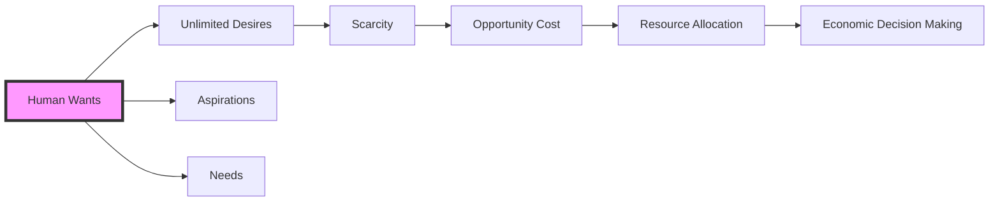

---

title: Human_Wants
course: Economics
unit: '1'
semester: Winter 2026
mode: ECON-MICRO
type: atomic_note
hub: '[[1_Basics_Of_Economics_Hub]]'
source: '[[5-Pdf Store/note generated/Winter 2026/Economics/Chapter_1.pdf]]'
date: '2026-05-08'
prerequisites:
- '[[Definition_Of_Economics]]'
- '[[Decision_Making_Units]]'
- '[[Economic_Resources]]'
- '[[Scarcity_And_Choice]]'
- '[[Opportunity_Cost]]'
source_pages:
- 12
generated: true

---


## 1. Mental Model

Imagine your house is like an economy, and you are the manager! You have lots of wants, like a new bike, a yummy ice cream, and a fun video game. Just like how a household manager has to decide how to use the limited money they have to buy things they need and want, you have to make choices too! Your parents give you a certain amount of pocket money each week, and you have to decide how to use it. Do you want to spend it on a toy, save it for a bigger goal, or use it to buy something you need, like school supplies? That's basically what happens in an economy - people make choices about how to use their resources to satisfy their wants, and that's why understanding human wants is so important in economics!

## 2. Micro Theory

The concept of human wants is a fundamental notion in economics, which originated from the Greek phrase “one who manages a household”, emphasizing the idea of managing resources to satisfy needs and desires. In the context of [[Definition_Of_Economics]], human wants refer to the various desires, aspirations, and needs of individuals that motivate them to make economic decisions. These wants are the driving force behind the actions of [[Decision_Making_Units]], which are the basic units of analysis in economics, including households, firms, and governments.

The complexity of human wants arises from their unlimited nature, which contrasts with the limited availability of [[Economic_Resources]]. This disparity gives rise to [[Scarcity_And_Choice]], as individuals and societies must make decisions about how to allocate resources efficiently to satisfy their wants. The concept of [[Opportunity_Cost]] is crucial in this context, as it represents the value of the next best alternative that is given up when a choice is made. In other words, the opportunity cost of a decision is the trade-off that must be made, reflecting the [[Tradeoffs]] inherent in economic decision-making.

The study of human wants is a critical component of Microeconomics, which focuses on the behavior of individual economic units and the interactions among them. In contrast, [[Macroeconomics]] examines the economy as a whole, focusing on aggregate variables such as economic growth, inflation, and employment. The understanding of human wants is also essential in [[Positive_Economics]], which aims to describe and analyze economic phenomena objectively, and [[Normative_Economics]], which involves making value judgments about economic policies and outcomes.

The analysis of human wants relies on various methods of reasoning, including [[Inductive_Reasoning]] and [[Deductive_Reasoning]], which enable economists to develop and test hypotheses about human behavior. By understanding human wants, economists can develop [[Economic_Theory]], which provides a framework for analyzing and predicting economic outcomes.

The satisfaction of human wants is closely tied to the concept of [[Efficient_Allocation]], which refers to the optimal distribution of resources to meet the needs and desires of individuals. This concept is central to the study of [[Resource_Allocation]], which examines how resources are allocated in different [[Economic_Systems]], such as [[Capitalist_Economy]], and how these systems address issues of [[Market_Failure]].

The works of [[Adam_Smith]], often considered the father of modern economics, laid the foundation for the study of human wants and their role in shaping economic activity. In his seminal work, Smith highlighted the importance of understanding human behavior and the Invisible Hand, which guides individuals to make decisions that promote the efficient allocation of resources.

The fundamental questions of [[Basic_Economic_Questions]], including [[What_To_Produce]], [[How_To_Produce]], and [[For_Whom_To_Produce]], are all related to the concept of human wants. These questions reflect the trade-offs that societies must make to allocate resources effectively, taking into account the [[Production_Possibilities_Frontier]] and the [[Law_Of_Increasing_Opportunity_Cost]].

Ultimately, the study of human wants is essential for understanding the complexities of economic decision-making and the allocation of resources in different economic systems. By analyzing human wants and their role in shaping economic activity, economists can provide insights into the [[Role_Of_Government]] in addressing [[Market_Failure]] and promoting [[Efficiency]] and [[Economic_Growth]].

## 3. Limitations & Edge Cases

The concept of human wants in microeconomics is limited by the fundamental fact that human needs and desires are inherently unbounded, yet the resources to satisfy them are scarce. A key limitation arises from the concept of diminishing marginal utility, where the satisfaction gained from consuming a good or service decreases with each additional unit consumed. Furthermore, human wants are also subject to the constraint of income and wealth, as individuals can only purchase goods and services within their means. Additionally, wants are often interdependent and influenced by societal and cultural factors, introducing complexities in understanding and measuring them. Lastly, the insatiability of human wants poses a challenge in defining and achieving optimal satisfaction, as individuals must continually prioritize and make trade-offs among competing desires.

## 4. Market Graph



This flowchart illustrates the concept of human wants and its relationship with scarcity, opportunity cost, and economic decision making. The artifact highlights that human wants, comprising unlimited desires, aspirations, and needs, lead to scarcity and necessitate efficient resource allocation, ultimately driving economic decision making.

## 5. Walkthrough

Here is the 5-step technical walkthrough of how 'Human Wants' operates:

**Step 1: Identification of Human Wants**
Human wants refer to the desires, aspirations, and needs of individuals that motivate them to make economic decisions. These wants are the driving force behind the actions of decision-making units, including households, firms, and governments.

**Step 2: Characterization of Human Wants**
Human wants are unlimited in nature. This means that individuals have an infinite number of desires and needs that they want to satisfy.

**Step 3: Scarcity of Economic Resources**
The availability of economic resources is limited. This scarcity of resources creates a disparity between the unlimited nature of human wants and the limited availability of resources.

**Step 4: Scarcity and Choice**
The disparity between human wants and economic resources gives rise to scarcity and choice. Individuals and societies must make decisions about how to allocate resources efficiently to satisfy their wants.

**Step 5: Opportunity Cost**
The concept of opportunity cost is crucial in this context. Opportunity cost represents the value of the next best alternative that is given up when a choice is made. It is a key consideration in decision-making, as individuals and societies must weigh the costs and benefits of different choices to allocate resources efficiently.

---

## Review & Practice

```interactive-quiz

[
  {
    "type": "mcq",
    "difficulty": "L1",
    "question": "In the context of Game Theory Application and human wants, what concept is crucial in understanding the trade-offs involved in making economic decisions to satisfy unlimited wants with limited [[Economic_Resources]]?",
    "options": {
      "A": "Marginal Utility",
      "B": "Opportunity Cost",
      "C": "Budget Constraint",
      "D": "Supply and Demand"
    },
    "answer": "B",
    "explanation": "The concept of Opportunity Cost is crucial in understanding the trade-offs involved in making economic decisions to satisfy unlimited wants with limited Economic Resources. It represents the value of the next best alternative that is given up when a choice is made."
  },
  {
    "type": "fill_in",
    "difficulty": "L2",
    "question": "Fill in the blank.",
    "textWithBlanks": "The concept of human wants is a fundamental notion in economics, which originated from the Greek phrase \u201cBlank\u201d, emphasizing the idea of managing resources to satisfy needs and desires.",
    "answer": [
      "one who manages a household"
    ],
    "explanation": "The Greek phrase \u201c one who manages a household \u201d is the origin of the concept of human wants in economics."
  },
  {
    "type": "debug",
    "difficulty": "L1",
    "question": "Find the bug in the following scenario: A consumer's demand for a good is influenced by their Wants and Needs. The consumer's Budget Constraint is $100, and the price of the good is $20. If the consumer buys 5 units of the good, their Total Utility will be maximized.",
    "content": "A consumer's demand for a good is influenced by their Wants and Needs. The consumer's Budget Constraint is $100, and the price of the good is $20. If the consumer buys 5 units of the good, their Total Utility will be maximized.",
    "answer": "The bug is that the scenario assumes that buying 5 units of the good will maximize Total Utility without considering the concept of Diminishing Marginal Utility.",
    "required_keywords": [
      "Diminishing_Marginal_Utility",
      "Total_utility",
      "Budget_Constraint",
      "Wants"
    ],
    "explanation": "The scenario overlooks the fact that as the consumer buys more units of the good, the marginal utility of each additional unit may decrease, potentially leading to a point where the total utility is not maximized at 5 units."
  }
]

```