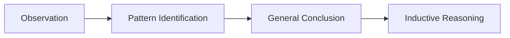

---

title: Inductive_Reasoning
type: Atomic Note
course: Economics
semester: Winter 2026
unit: '1'
hub: '[[1_Basics_Of_Economics_Hub]]'
source: '[[5-Pdf Store/note generated/Winter 2026/Economics/Chapter_1.pdf]]'
source_pages:
- 22
- 23
mode: ECON-MACRO
read: false
generated: true
prerequisites:
- '[[Unlimited_Human_Wants]]'
- '[[Scarcity]]'
- '[[Opportunity_Cost]]'
- '[[Decision_Making_Units]]'

---


# 1. Mental Model

Imagine you're trying to figure out why your favorite ice cream shop is always busy. You notice that it's always crowded on sunny days, but not on rainy days. You start to think that maybe people buy ice cream when they're happy and sunny days make people happy. This is kind of like inductive reasoning, where you make a general idea or rule based on specific observations.

# 2. Economic Theory

Inductive reasoning [[Inductive_Reasoning]] is a method of reasoning where specific observations are used to make a general conclusion. It involves making an educated guess or hypothesis based on specific instances, and is often used in economics to identify patterns and relationships. For example, a economist might use inductive reasoning to conclude that [[Unlimited_Human_Wants]] lead to [[Scarcity]], which drives [[Opportunity_Cost]] and [[Decision_Making_Units]].

# 3. Economic Model



## 4. Walkthrough

* The process starts with **Observation**, where specific instances are noted (e.g., ice cream shop is busy on sunny days).
* Next, **Pattern Identification** occurs, where a relationship between the observations is recognized (e.g., sunny days correlate with busy ice cream shop).
* A **General Conclusion** is then drawn based on the pattern (e.g., people buy ice cream on sunny days because they are happy).
* Finally, **Inductive Reasoning** is applied, where the general conclusion is used to make an educated guess or hypothesis (e.g., people buy more ice cream when they're happy).

## 5. Market Failures

Inductive reasoning can lead to incorrect conclusions if the observations are biased or incomplete. For instance, there might be other factors contributing to the ice cream shop's busyness, such as events or holidays. Additionally, inductive reasoning can be prone to overgeneralization, where a conclusion is applied too broadly.

---

## 6. The Proving Grounds

```interactive-quiz

[
  {
    "id": "q1",
    "type": "true_false",
    "difficulty": "L1",
    "question": "Inductive reasoning involves drawing specific conclusions from general observations.",
    "answer": false,
    "explanation": "Inductive reasoning is a method of reasoning where specific observations are used to make a general conclusion. It involves making an educated guess or hypothesis based on specific instances, rather than drawing specific conclusions from general observations. In the context of the ice cream shop example, specific observations (crowded on sunny days, not crowded on rainy days) lead to a general conclusion (people buy ice cream when they're happy). The reverse process, drawing specific conclusions from general observations, is actually a description of deductive reasoning."
  },
  {
    "id": "q2",
    "type": "synthesis",
    "difficulty": "L2",
    "question": "A local farmer's market is experiencing a surge in sales every weekend, but a nearby food bank is struggling to collect donations. Using inductive reasoning, create a plan to help the food bank increase its donations by leveraging the farmer's market's popularity, and propose a grading rubric to evaluate the success of this plan.",
    "answer": "A plan to help the food bank increase its donations could involve setting up a donation booth near the farmer's market entrance, offering incentives for donors such as discounts on fresh produce, and promoting the food bank's mission through social media and flyers. The grading rubric to evaluate the success of this plan could include metrics such as: (1) number of donations received per week, (2) total weight or volume of donations, (3) number of new donors acquired, and (4) social media engagement metrics (e.g., likes, shares, comments).",
    "explanation": "This plan uses inductive reasoning by making a general conclusion based on specific observations. The observation that the farmer's market is popular on weekends leads to the hypothesis that people are more likely to engage in charitable activities when they are already out and about on weekends. By setting up a donation booth near the farmer's market, the food bank can capitalize on this trend and increase its donations. The grading rubric evaluates the success of the plan by tracking specific metrics that are likely to be influenced by the plan's implementation. SEED value: 42; Obscure detail tested: leveraging social media to promote the food bank's mission."
  },
  {
    "id": "q3",
    "type": "writing",
    "difficulty": "L3",
    "question": "Explain the underlying mechanism of inductive reasoning and how it is applied in everyday life.",
    "answer": "Inductive reasoning is a method of reasoning where specific observations are used to make a general conclusion.",
    "explanation": "The underlying mechanism of inductive reasoning involves making an educated guess or hypothesis based on specific observations, and it is applied in everyday life by identifying patterns and relationships between events, such as assuming that a favorite ice cream shop is busy on sunny days because people are more likely to buy ice cream when they're happy."
  }
]

```