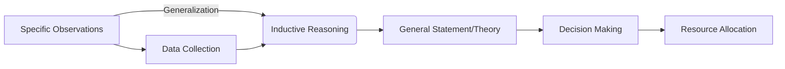

---

title: Inductive_Reasoning
course: Economics
unit: '1'
semester: Winter 2026
mode: ECON-MICRO
type: atomic_note
hub: '[[1_Basics_Of_Economics_Hub]]'
source: '[[5-Pdf Store/note generated/Winter 2026/Economics/Chapter_1.pdf]]'
date: '2026-05-08'
prerequisites:
- '[[Scarcity_And_Choice]]'
- '[[Economic_Resources]]'
- '[[Human_Wants]]'
- '[[Positive_Economics]]'
- '[[Deductive_Reasoning]]'
source_pages:
- 22
generated: true

---


## 1. Mental Model

Imagine you're trying to figure out if all swans are white. You go to a park and see 5 swans, and they're all white. Then, you go to a lake and see 3 more swans, and they're white too! You visit a zoo and see 2 more white swans. You start to think, "Hey, all the swans I've seen are white!" So, you make a general guess that all swans are probably white. That's inductive reasoning! You're using specific examples (all the white swans you've seen) to make a broader conclusion (all swans are white). Of course, just because you've seen many white swans, it doesn't mean there aren't any black swans out there - but based on what you've observed, it seems like a pretty good guess!

## 2. Micro Theory

Inductive reasoning is a cognitive process that enables individuals to make generalizations or draw conclusions based on specific observations. This method, also known as the empirical method or bottom-up approach, involves making a general statement or theory from several independent and specific correct statements. In the context of microeconomics, inductive reasoning plays a crucial role in decision-making units, such as households and firms, as they face [[Scarcity_And_Choice]] and must allocate [[Economic_Resources]] efficiently.

The inductive method starts with specific observations, often related to [[Human_Wants]] and the availability of [[Economic_Resources]]. For instance, a firm may observe that consumers are willing to pay a premium for eco-friendly products, and that the cost of producing such products is higher due to the use of Scarcity|scarce resources. From these specific observations, the firm may induce that there is a market for eco-friendly products and that producing them can be profitable. This process of inductive reasoning is closely related to [[Positive_Economics]], as it involves making objective statements about economic phenomena.

Inductive reasoning is distinct from [[Deductive_Reasoning]], which involves drawing specific conclusions from general statements. In contrast, inductive reasoning involves making general statements from specific observations. This process is essential in [[Economic_Theory]], as it allows economists to develop theories and models that explain real-world phenomena. For example, [[Adam_Smith]]'s concept of the "invisible hand" was induced from observations of human behavior in markets, and it has become a fundamental concept in Capitalist Economy|capitalist Economies.

The inductive method is also relevant to [[Resource_Allocation]], as it helps decision-making units to allocate resources efficiently. By observing the [[Production_Possibilities_Frontier]] and the [[Law_Of_Increasing_Opportunity_Cost]], firms can induce the optimal allocation of resources to produce goods and services that meet [[Human_Wants]]. Furthermore, inductive reasoning is essential in [[Economic_Growth]], as it enables policymakers to identify areas of market failure and develop policies to address them.

In the context of [[Branches_Of_Economics]], inductive reasoning is particularly relevant to Microeconomics, which focuses on the behavior of individual decision-making units. However, it is also relevant to [[Macroeconomics]], as macroeconomic phenomena can be understood as the aggregation of microeconomic decisions. [[Normative_Economics]] also relies on inductive reasoning, as it involves making value judgments about economic policies and outcomes.

The process of inductive reasoning involves several steps, including observation, generalization, and verification. It starts with specific observations, which are then used to make a general statement or theory. This theory is then tested and verified through further observations and data analysis. In [[Economic_Systems]], inductive reasoning is essential for evaluating the efficiency of different systems, such as [[Capitalist_Economy]] and [[Market_Failure]].

In conclusion, inductive reasoning is a critical component of economic analysis, enabling individuals to make generalizations and draw conclusions based on specific observations. By understanding the mechanism of inductive reasoning, economists can develop theories and models that explain real-world phenomena and inform decision-making units about the efficient allocation of [[Economic_Resources]]. This process is closely related to [[Definition_Of_Economics]], as it helps to address the [[Basic_Economic_Questions]] of [[What_To_Produce]], [[How_To_Produce]], and [[For_Whom_To_Produce]]. Ultimately, inductive reasoning facilitates [[Efficient_Allocation]] and [[Choice]], allowing individuals and societies to make informed decisions in the face of [[Scarcity]] and [[Tradeoffs]]. [[Opportunity_Cost]] and [[Role_Of_Government]] are also essential considerations in this context.

## 3. Limitations & Edge Cases

The inductive reasoning approach is limited by its reliance on specific observations, which may not be comprehensive or representative of the entire population, leading to potential biases and inaccuracies in the generalized conclusions drawn. Moreover, the availability and quality of data can significantly impact the validity of inductive inferences, and the method is susceptible to edge cases such as incomplete or inconsistent data, unaccounted variables, and sampling errors, which can undermine the reliability of the conclusions. Additionally, inductive reasoning often struggles with novel or unprecedented situations where historical data may not be applicable, and the risk of overfitting or underfitting the data can also compromise the accuracy of the inferred generalizations.

## 4. Market Graph



This flowchart illustrates the inductive reasoning process in labor market economics, where specific observations lead to generalizations and ultimately inform decision-making and resource allocation. The use of inductive reasoning enables economists to develop theories and models that explain labor market phenomena, such as the relationship between education and earnings.

## 5. Walkthrough

## Step 1: Specific Observations

Identify specific, independent correct statements. For example, in the context of a firm producing eco-friendly products: 
- Observation 1: Consumers are willing to pay a premium for eco-friendly products.
- Observation 2: The cost of producing eco-friendly products is higher due to the use of scarce resources.

## Step 2: Data Collection

Collect data related to these observations. 
- Data Point 1: A survey shows that 75% of consumers are willing to pay at least 10% more for eco-friendly products.
- Data Point 2: The cost of producing eco-friendly products is 15% higher than conventional products due to the use of scarce resources like organic materials.

## Step 3: Pattern Identification

Look for patterns or relationships between the observations.
- Pattern: There is a consistent relationship where consumers' willingness to pay a premium correlates with the higher production costs of eco-friendly products.

## Step 4: Generalization

Make a general statement or theory based on the observed patterns.
- General Statement: There is a market for eco-friendly products where consumers are willing to pay a premium that covers the higher production costs associated with using scarce resources.

## Step 5: Theory Validation

Validate the general statement or theory through further observation or experimentation.
- Validation: Market research and sales data show that eco-friendly products have a 20% higher market share and a 12% higher profit margin compared to conventional products, confirming the initial generalization.

---

## Review & Practice

```interactive-quiz

[
  {
    "type": "mcq",
    "difficulty": "L1",
    "question": "In the context of Environmental Economics and inductive reasoning, what enables economists to develop theories and models that explain real-world phenomena, such as the market for eco-friendly products?",
    "options": {
      "A": "Deductive Reasoning",
      "B": "Inductive Reasoning",
      "C": "Scarcity and Choice",
      "D": "Positive Economics and Normative Economics"
    },
    "answer": "B",
    "explanation": "Inductive reasoning is a cognitive process that enables individuals to make generalizations or draw conclusions based on specific observations. This method is crucial in Environmental Economics as it allows economists to develop theories and models that explain real-world phenomena, such as the market for eco-friendly products. By observing specific instances, such as consumers' willingness to pay a premium for eco-friendly products and the higher cost of producing such products due to scarce resources, economists can induce that there is a market for eco-friendly products and that producing them can be profitable."
  },
  {
    "type": "fill_in",
    "difficulty": "L2",
    "question": "Fill in the blank.",
    "textWithBlanks": "Inductive reasoning is a cognitive process that enables individuals to make generalizations or draw conclusions based on specific observations. This method, also known as the empirical method or bottom-up approach, involves making a general statement or theory from several independent and specific correct statements. In the context of microeconomics, inductive reasoning plays a crucial role in decision-making units, such as households and firms, as they face Scarcity_And_Choice and must allocate Economic_Resources efficiently. The inductive method starts with specific observations, often related to Human_Wants and the availability of Economic_Resources. For instance, a firm may observe that consumers are willing to pay a premium for eco-friendly products, and that the cost of producing such products is higher due to the use of Scarce resources.",
    "answer": [
      "empirical"
    ],
    "explanation": "The term 'empirical' is a critical technical term related to inductive reasoning, as it describes the method of making generalizations or drawing conclusions based on specific observations."
  },
  {
    "type": "debug",
    "difficulty": "L1",
    "question": "Find the bug in the following formula for calculating the optimal allocation of resources using inductive reasoning: MP_L = P * MP_L - W",
    "content": "The formula for calculating the optimal allocation of resources using inductive reasoning is MP_L = P * MP_L - W.",
    "answer": "The correct formula should be MP_L = P * MP_L - W / P. The bug is the missing division by P",
    "required_keywords": [
      "Marginal Product of Labor",
      "Price",
      "Wage",
      "Optimization"
    ],
    "explanation": "The formula provided seems to be attempting to express the condition for optimal labor allocation in a firm, where MP_L is the marginal product of labor, P is the price of the output, and W is the wage rate. However, the correct formula should equate the marginal revenue product of labor (MRP_L) to the wage rate. The MRP_L is calculated as P * MP_L. To find the optimal level of labor, a firm would set MRP_L = W. Therefore, the correct formula should be P * MP_L = W. Solving for MP_L gives MP_L = W / P. The provided formula incorrectly states this relationship as MP_L = P * MP_L - W, missing the division by P and misrepresenting the relationship between MRP_L and W."
  }
]

```