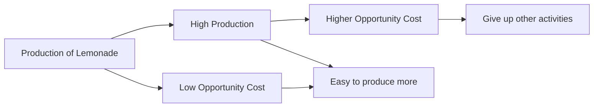

---

title: Law_Of_Increasing_Opportunity_Cost
type: Atomic Note
course: Economics
semester: Winter 2026
unit: '1'
hub: "[[1_Basics_Of_Economics_Hub]]"
source: "[[Chapter_1.pdf]]"
source_pages:
- 46
mode: ECON-MACRO
read: false
generated: true
prerequisites:
- "[[Production_Possibilities_Frontier]]"

---

# 1. Mental Model

Imagine you have a lemonade stand and you want to make more lemonade. At first, it's easy to make more cups, but as you make more and more, you start to run out of cups, sugar, and even time to make it. This means that to make even more lemonade, you'll have to give up something else, like playing with your friends, and it's getting harder to make that extra cup. That's basically what the Law of Increasing Opportunity Cost is.

# 2. Economic Theory

The [[Law_Of_Increasing_Opportunity_Cost]] states that as the production of a good or service increases, the [[Opportunity_Cost]] of producing an additional unit also increases. This occurs because [[Economic_Resources]] are being moved from the production of one good to the production of another, leading to decreasing efficiency. As a result, the [[Production_Possibilities_Frontier]] becomes steeper, illustrating the increasing [[Opportunity_Cost]] of producing more of one good.

# 3. Economic Model



## 4. Walkthrough

* The production of lemonade starts low, and it's easy to make more cups (Low Opportunity Cost).
* As production increases, it becomes harder to make more lemonade, and the opportunity cost of producing more increases.
* At high production levels, making even more lemonade requires giving up other activities, like playing with friends.
* The opportunity cost of producing more lemonade keeps increasing as production levels rise.

## 5. Market Failures

The Law of Increasing Opportunity Cost may fail in scenarios where technology or innovation significantly reduces production costs, or when there are no alternative uses for resources. Additionally, in cases where there are abundant resources, the law may not hold as the opportunity cost of production may not increase as rapidly. Edge cases include situations with perfect substitutes or perfectly elastic supply.

---

## 6. The Proving Grounds

```interactive-quiz

[
  {
    "id": "q1",
    "type": "true_false",
    "difficulty": "L1",
    "question": "The Law of Increasing Opportunity Cost states that as production increases, opportunity cost decreases.",
    "answer": false,
    "explanation": "The Law of Increasing Opportunity Cost actually states that as the production of a good or service increases, the opportunity cost of producing that good or service also increases. This is because resources are being moved from the production of one good to the production of another, and as more resources are allocated to the production of a particular good, the opportunity cost of producing an additional unit of that good increases. For example, in the lemonade stand scenario, as more lemonade is made, the opportunity cost of making an additional cup increases because it may require giving up more valuable activities, like playing with friends, or using more expensive resources."
  },
  {
    "id": "q2",
    "type": "synthesis",
    "difficulty": "L2",
    "question": "Maria has been operating a small organic farm on the outskirts of town, specializing in heirloom tomatoes. She has been selling them at the local farmer's market and to a few high-end restaurants. As demand for her tomatoes has increased, Maria has been considering expanding her production. However, her farm is situated on a sloping terrain, which makes it difficult to cultivate and manage large quantities of produce. Additionally, the town has recently introduced a zoning regulation that restricts the number of farmhands she can hire during peak season. With these constraints in mind, Maria needs to decide how to proceed with expanding her production while minimizing costs and maximizing profits. What should Maria do to optimize her production levels and what are the implications of her choices?",
    "answer": "A grading rubric to assess Maria's decision-making process could be as follows: \n- Criterion 1: Understanding of the Law of Increasing Opportunity Cost (20 points)\n  - Does the student recognize that as Maria increases her production of heirloom tomatoes, her opportunity costs will rise due to the constraints on her farm and the zoning regulations?\n- Criterion 2: Analysis of Production Constraints (20 points)\n  - Does the student identify the specific constraints (sloping terrain and zoning regulations) that affect Maria's production and consider how these constraints impact her opportunity costs?\n- Criterion 3: Evaluation of Potential Solutions (30 points)\n  - Does the student propose potential solutions for Maria to optimize her production levels, such as implementing more efficient farming techniques, exploring alternative markets, or negotiating with local authorities to adjust the zoning regulations?\n- Criterion 4: Consideration of Opportunity Costs (30 points)\n  - Does the student demonstrate an understanding of the opportunity costs associated with each potential solution, such as the cost of investing in new equipment, the potential loss of customers if she expands too quickly, or the benefits of diversifying her product line?",
    "explanation": "The Law of Increasing Opportunity Cost states that as the production of a good or service increases, the opportunity cost of producing an additional unit also increases. In Maria's case, as she expands her production of heirloom tomatoes, she will face increasing opportunity costs due to the constraints on her farm and the zoning regulations. For instance, she may need to invest in more equipment or hire additional farmhands (if allowed by the regulations), which will increase her costs. Alternatively, she may need to forgo other opportunities, such as planting different crops or selling to different markets, which will also increase her opportunity costs. A key insight is that Maria should consider these opportunity costs when making her decision, rather than just focusing on the potential benefits of expanding her production. By using a grading rubric that assesses the student's understanding of the Law of Increasing Opportunity Cost, analysis of production constraints, evaluation of potential solutions, and consideration of opportunity costs, we can evaluate the student's ability to think critically about complex economic decisions."
  },
  {
    "id": "q3",
    "type": "writing",
    "difficulty": "L3",
    "question": "Explain the concept of diminishing marginal returns in relation to the Law Of Increasing Opportunity Cost",
    "answer": "The Law of Increasing Opportunity Cost is closely related to the concept of diminishing marginal returns, where the marginal output of a production process decreases as the input increases, resulting in higher opportunity costs for producing additional units",
    "explanation": "The underlying mechanism is that as production increases, the opportunity cost of producing one more unit also increases because resources become scarcer and have to be diverted from other uses, making it more costly to produce additional units, this is reflected in the Law of Increasing Opportunity Cost which states that as the production of a good or service increases, the opportunity cost also increases"
  }
]

```