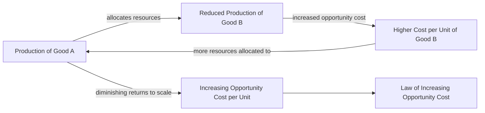

---

title: Law_Of_Increasing_Opportunity_Cost
course: "Economics"
unit: '1'
semester: "Winter 2026"
mode: ECON-MICRO
type: atomic_note
hub: "[[1_Basics_Of_Economics_Hub]]"
source: "[[5-Pdf Store/note generated/Winter 2026/Economics/Chapter_1.pdf]]"
date: '2026-05-08'
prerequisites:
- "[[Opportunity_Cost]]"
source_pages:
- 46
generated: true

---

## 1. Mental Model

In the realm of Game Theory Application, consider a real-world scenario of a Major League Baseball (MLB) team's decision to allocate its in-house budget to either signing top-tier pitchers or hitters. As the team decides to allocate more resources to signing pitchers, it faces increasing opportunity costs; for instance, if it signs 3 top pitchers, it could have instead signed 2 top hitters and 1 additional supporting player, but if it then decides to sign 4 top pitchers, it must forego signing 2 top hitters, illustrating the [[Law_Of_Increasing_Opportunity_Cost]]. Explicit components mapped here are: (1) [[Opportunity_Cost]], as the team must give up other valuable resources (hitters) to acquire more pitchers; and (2) **Trade-off**, as the team's decision to allocate more resources to one area (pitching) directly impacts its ability to invest in another area (hitting).

## 2. Micro Theory

The Law of Increasing Opportunity Cost is a fundamental concept in microeconomics that describes the relationship between the production of different goods and services, given the scarcity of [[Economic_Resources]]. As an economy produces more of one good or service, it must allocate resources away from the production of another good or service, resulting in an increase in the [[Opportunity_Cost]] per unit of the additional output. This law states that as we produce more and more of a product, the opportunity cost per unit of the additional output increases.

The mechanism underlying this law is rooted in the concept of [[Scarcity]], which implies that Economic Resources are limited and cannot be used to produce all the goods and services that people want. As a result, economies must make choices about how to allocate resources, which is a central problem in [[Basic_Economic_Questions]]. The Law of Increasing Opportunity Cost arises from the fact that resources are not perfectly adaptable to the production of different goods and services. For instance, a worker with specialized skills in producing one good may not be as productive in producing another good, leading to a decrease in efficiency and an increase in Opportunity Cost.

The concept of increasing opportunity cost is closely related to Resource Allocation, as it highlights the trade-offs involved in allocating resources to produce different goods and services. In a market economy, Adam Smith's concept of the "invisible hand" guides the allocation of resources, leading to an Efficient Allocation of resources. However, this allocation may not always be optimal from a social perspective, which is a concern in Normative Economics.

The Law of Increasing Opportunity Cost can be analyzed using Positive Economics, which focuses on the objective analysis of economic phenomena. This law can be derived using Deductive Reasoning, starting from the assumptions of scarcity and Human Wants, and using Inductive Reasoning to generalize the concept to different economic contexts. The study of this law falls under the branch of Microeconomics, which is a subset of Branches Of Economics.

In contrast to Macroeconomics, which studies the economy Furthermore, this law is relevant to understanding Economic Systems, as it illustrates the challenges of allocating resources in a world of scarcity.

Overall, the Law of Increasing Opportunity Cost provides a fundamental insight into the workings of economies, highlighting the trade-offs involved in allocating Economic Resources to produce different goods and services.

## 3. Limitations & Edge Cases

The Law of Increasing Opportunity Cost assumes a two-good economy with fixed resources and technology, but its limitations arise when these assumptions are violated. For instance, if there are unemployed resources or underutilized capacity, the opportunity cost may not increase as production of one good expands, potentially leading to constant or even decreasing opportunity costs. Additionally, technological advancements or improved resource allocation can reduce opportunity costs, contradicting the law. Furthermore, in cases where resources are highly adaptable or substitutable, the opportunity cost may not increase uniformly, and the law's applicability may be limited. Edge cases, such as a single-product economy or a scenario with perfectly substitutable resources, can also render the law inapplicable.

## 4. Market Graph



The flowchart illustrates the Law of Increasing Opportunity Cost, showing how as production of Good A increases, resources are allocated away from Good B, resulting in a higher opportunity cost per unit of Good B. This fundamental concept in microeconomics highlights the trade-offs and scarcity of economic resources that lead to increasing opportunity costs.

## 5. Walkthrough

## Step 1: Define the Initial Production Scenario

Given that an economy is producing two goods, let's denote them as Good A and Good B. Initially, the economy produces 0 units of Good A and some quantity of Good B. For simplicity, let's assume the initial production of Good B is 10 units.

## Step 2: Introduce Production of Additional Units of Good A

As the economy starts to produce more of Good A, it must allocate resources away from the production of Good B. Let's say it decides to produce 1 unit of Good A. According to the source text, this shift results in an increase in the opportunity cost per unit of the additional output of Good A.

## Step 3: Calculate the Opportunity Cost of Producing Additional Units of Good A

Assume that to produce the first unit of Good A, the economy has to give up 1 unit of Good B. The opportunity cost of producing 1 unit of Good A is 1 unit of Good B.

## Step 4: Analyze the Increase in Opportunity Cost for Subsequent Units

As the economy continues to produce more units of Good A, the opportunity cost per unit of Good A increases. For instance, to produce the second unit of Good A, it might have to give up 2 units of Good B. This means the opportunity cost per unit of Good A has increased.

## Step 5: Generalize the Law of Increasing Opportunity Cost

Generalizing from the previous steps, as the economy produces more and more of Good A, the opportunity cost per unit of the additional output of Good A increases. For example, producing the first unit of Good A costs 1 unit of Good B, the second unit costs 2 units of Good B, and so on. This increasing cost reflects the Law of Increasing Opportunity Cost, which states that as we produce more and more of a product, the opportunity cost per unit of the additional output increases.

---

## Review & Practice

```interactive-quiz

[
  {
    "type": "mcq",
    "difficulty": "L1",
    "question": "As an economy produces more of one good or service, what happens to the opportunity cost per unit of the additional output?",
    "options": {
      "A": "It decreases due to increased efficiency",
      "B": "It increases due to decreased adaptability of resources",
      "C": "It remains constant due to perfect resource allocation",
      "D": "It becomes negative due to economies of scale"
    },
    "answer": "B",
    "explanation": "The Law of Increasing Opportunity Cost states that as an economy produces more of one good or service, it must allocate resources away from the production of another good or service, resulting in an increase in the opportunity cost per unit of the additional output. This is because resources are not perfectly adaptable to the production of different goods and services."
  },
  {
    "type": "fill_in",
    "difficulty": "L2",
    "question": "Fill in the blank.",
    "textWithBlanks": "The Blank is a fundamental concept in microeconomics that describes the relationship between the production of different goods and services, given the scarcity of Economic Resources.",
    "answer": [
      "Opportunity Cost"
    ],
    "explanation": "The Law of Increasing Opportunity Cost is a fundamental concept in microeconomics that describes the relationship between the production of different goods and services, given the scarcity of Economic Resources. As an economy produces more of one good or service, it must allocate resources away from the production of another good or service, resulting in an increase in the Opportunity Cost per unit of the additional output.",
    "required_keywords": [
      "Opportunity Cost",
      "Microeconomics",
      "Economic Resources"
    ]
  },
  {
    "type": "true_false",
    "difficulty": "L1",
    "question": "The Law of Increasing Opportunity Cost states that as an economy produces more of one good or service, the opportunity cost per unit of the additional output decreases.",
    "answer": false,
    "explanation": "The Law of Increasing Opportunity Cost actually states that as an economy produces more of one good or service, it must allocate resources away from the production of another good or service, resulting in an increase in the opportunity cost per unit of the additional output. This is due to the scarcity of economic resources and their imperfect adaptability to different uses."
  }
]

```