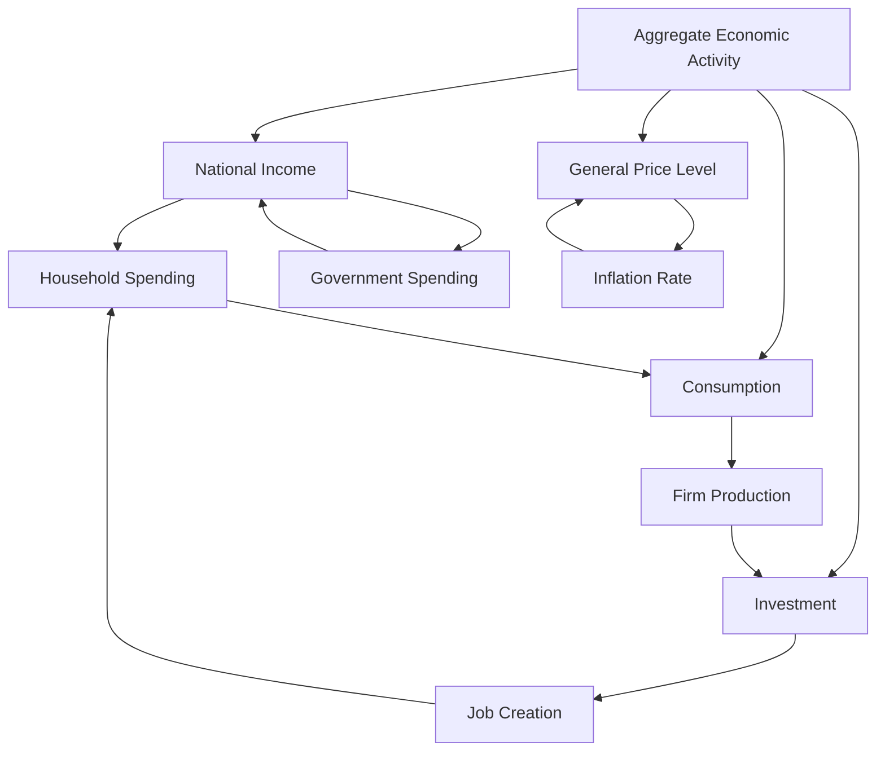

---

title: Macroeconomics
course: Economics
unit: '1'
semester: Winter 2026
mode: ECON-MICRO
type: atomic_note
hub: '[[1_Basics_Of_Economics_Hub]]'
source: '[[5-Pdf Store/note generated/Winter 2026/Economics/Chapter_1.pdf]]'
date: '2026-05-08'
prerequisites:
- '[[Economic_Growth]]'
- '[[Economic_Resources]]'
- '[[Economic_Analysis]]'
- '[[Positive_Economics]]'
- '[[Normative_Economics]]'
source_pages:
- 17
generated: true

---


## 1. Mental Model

Consider a vast, sprawling metropolitan airport, where thousands of individual travelers (decision-making units) make choices about flight schedules, routes, and layovers. From a macroeconomic perspective, the collective decisions of these travelers influence the overall demand for air travel, which in turn affects the airport's capacity utilization, airline pricing strategies, and ultimately, the broader economy. Specifically, two components of macroeconomics are at play here: (1) **Aggregate Demand**, as the total number of travelers and their travel plans shape the demand for air travel services, and (2) [[Economic_Growth]], as the airport's performance and the air travel industry's overall health contribute to the regional economy's growth, influencing factors such as employment rates, GDP, and infrastructure investments.

## 2. Micro Theory

Macroeconomics can be rigorously defined as the branch of economics that examines the aggregate behavior of economic agents within an economy, focusing on the overall performance, structure, and growth of the economy. This field of study is concerned with understanding the interactions and interdependencies among various economic aggregates, such as national income, consumption, investment, and the general price level. At its core, macroeconomics seeks to explain the dynamics of economic systems by analyzing the collective actions of households, firms, governments, and foreign entities, and how these actions influence the allocation of [[Economic_Resources]].

The study of macroeconomics relies heavily on [[Economic_Analysis]], employing both [[Positive_Economics]] and [[Normative_Economics]] to understand and evaluate the performance of an economy. Positive economics provides a foundation for analyzing the current state of the economy, while normative economics offers insights into how the economy ought to perform, guiding policymakers in their decision-making processes. The foundational ideas of [[Adam_Smith]], often regarded as the father of modern economics, laid the groundwork for understanding how individual economic units contribute to the overall performance of an economy.

Macroeconomics fundamentally explores how Human Wants and Scarcity influence economic decisions at the aggregate level. Given that resources are limited, the study of macroeconomics involves understanding how economies achieve an Efficient Allocation of resources, ensuring that the production and distribution of goods and services align with societal needs and wants. This involves addressing the Basic Economic Questions of what to produce, how to produce, and for whom to produce, on a macroeconomic scale.

The mechanisms driving macroeconomics involve complex interactions among various sectors of the economy, necessitating the use of Inductive Reasoning and Deductive Reasoning to model and predict economic phenomena. Through the lens of Macroeconomics, economists examine how different Economic Systems and policy interventions affect economic outcomes, such as growth, inflation, and employment levels.

A critical aspect of macroeconomic analysis is understanding the role of Resource Allocation in achieving economic efficiency and stability. Policymakers use macroeconomic models and theories to devise strategies for optimizing the performance of the economy, taking into account factors such as fiscal policy, monetary policy, and international trade.

In the broader context of Branches Of Economics, macroeconomics stands as a distinct field that complements Microeconomics, together providing a comprehensive understanding of economic activity. While microeconomics focuses on the behavior of individual economic units, macroeconomics offers insights into the economy-wide effects of various economic phenomena.

The study of macroeconomics ultimately aims to inform and guide policymakers in their efforts to manage the economy effectively, promoting conditions conducive to economic growth, stability, and prosperity. By understanding the aggregate behavior of economic agents and the resulting macroeconomic outcomes, economists and policymakers can work towards achieving a more efficient and equitable allocation of resources, thereby improving the overall well-being of society.

## 3. Limitations & Edge Cases

The macroeconomic approach is limited by its failure to account for individual heterogeneity, as it aggregates the behavior of all decision-making units, thereby masking important differences in preferences, endowments, and constraints that exist across households, firms, and industries. Furthermore, macroeconomics often relies on unrealistic assumptions, such as the representative agent hypothesis, which posits that a single, average agent can accurately represent the economy, neglecting issues of distribution, inequality, and diversity. Additionally, macroeconomics typically assumes that the economy is in equilibrium, which may not always be the case, particularly during times of significant economic disruption or structural change. Moreover, the use of aggregate data can lead to the ecological fallacy, where relationships observed at the aggregate level do not necessarily hold at the individual level, resulting in flawed policy conclusions. Overall, these limitations highlight the need for microeconomic analysis to complement macroeconomic insights and provide a more nuanced understanding of economic phenomena.

## 4. Market Graph



This flowchart illustrates the interdependencies among various economic aggregates in macroeconomics, including national income, consumption, investment, and the general price level. The arrows represent the causal relationships between these aggregates, demonstrating how the aggregate behavior of economic agents influences the overall performance of the economy.

## 5. Walkthrough

## Step 1: Define the Scope of Macroeconomics

Macroeconomics examines the aggregate behavior of economic agents within an economy, focusing on overall performance, structure, and growth. It looks at interactions among national income, consumption, investment, and the general price level.

## Step 2: Identify Key Economic Aggregates

The key economic aggregates in macroeconomics include national income, consumption, investment, and the general price level. These aggregates help in understanding the overall performance of the economy.

## Step 3: Analyze Aggregate Behavior

The study of macroeconomics analyzes the collective actions of households, firms, governments, and foreign entities. This analysis helps in understanding how these actions influence the allocation of economic resources.

## Step 4: Apply Economic Analysis

Macroeconomics relies on economic analysis, which includes both positive and normative economics. Positive economics analyzes the current state of the economy, while normative economics evaluates the economy based on value judgments.

## Step 5: Evaluate Economic Performance

Using the tools of positive and normative economics, macroeconomics seeks to explain the dynamics of economic systems and evaluate the performance of an economy. This evaluation helps in understanding the effects and consequences of the aggregate behavior of all decision-making units in a certain economy.

---

## Review & Practice

```interactive-quiz

[
  {
    "type": "mcq",
    "difficulty": "L1",
    "question": "The study of macroeconomics relies heavily on [[Economic_Analysis]], which employs both [[Positive_Economics]] and [[Normative_Economics]] to understand and evaluate the performance of an economy. What type of economics provides a foundation for analyzing the current state of the economy?",
    "options": {
      "A": "Normative Economics",
      "B": "Positive Economics",
      "C": "Environmental Economics",
      "D": "Microeconomics"
    },
    "answer": "B",
    "explanation": "Positive economics provides a foundation for analyzing the current state of the economy, while normative economics offers insights into how the economy ought to perform."
  },
  {
    "type": "fill_in",
    "difficulty": "L2",
    "question": "The study of macroeconomics relies heavily on _______________, employing both Positive Economics and Normative Economics to understand and evaluate the performance of an economy.",
    "textWithBlanks": "The Blank is a crucial aspect of macroeconomic analysis.",
    "answer": [
      "Economic Analysis"
    ],
    "explanation": "The study of macroeconomics relies heavily on Economic Analysis, employing both Positive Economics and Normative Economics to understand and evaluate the performance of an economy.",
    "required_keywords": [
      "Economic Analysis",
      "Positive Economics",
      "Normative Economics"
    ]
  },
  {
    "type": "true_false",
    "difficulty": "L1",
    "question": "The study of macroeconomics relies heavily on Economic Analysis, employing only Positive Economics to understand and evaluate the performance of an economy.",
    "answer": false,
    "explanation": "The study of macroeconomics relies heavily on Economic Analysis, employing both Positive Economics and Normative Economics to understand and evaluate the performance of an economy. Positive economics provides a foundation for analyzing the current state of the economy, while normative economics offers insights into how the economy ought to perform, guiding policymakers in their decision-making processes."
  }
]

```