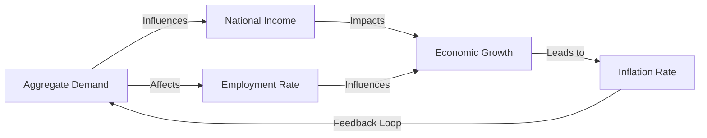

---

title: Macroeconomics
course: Economics
unit: '1'
semester: Winter 2026
mode: ECON-MICRO
type: atomic_note
hub: '[[1_Basics_Of_Economics_Hub]]'
source: '[[5-Pdf Store/note generated/Winter 2026/Economics/Chapter_1.pdf]]'
date: '2026-05-08'
prerequisites:
- '[[Definition_Of_Economics]]'
- '[[Scarcity_And_Choice]]'
- '[[Economic_Resources]]'
- '[[Human_Wants]]'
- '[[Scarcity]]'
source_pages:
- 17
generated: true

---


## 1. Mental Model

Imagine you're at a huge school with thousands of students, and each student is like a tiny factory making their own little decisions about what to buy for lunch, how to spend their allowance, and what games to play at recess. Macroeconomics is like looking at the entire school and seeing how all these individual decisions add up to affect the whole place. It's like taking a helicopter view of the schoolyard and noticing things like, "Hey, lots of kids are buying sandwiches today, so the cafeteria is busier than usual!" or "Recess is really popular, so the playground equipment is getting worn out faster!" It's not just about one student or one lunch choice, but about how all the students and their choices affect the school as a whole.

## 2. Micro Theory

The study of macroeconomics, a branch of economics, entails a comprehensive analysis of the economy as a whole, examining the aggregate behavior of all decision-making units within a specific economy. This field of study is intricately linked to the [[Definition_Of_Economics]], as it seeks to understand the economy's overall performance, encompassing various aspects such as economic growth, inflation, and employment. Macroeconomics diverges from microeconomics in its approach, as it does not isolate individual economic units, but rather, focuses on the collective actions of these units and their impact on the economy.

The [[Scarcity_And_Choice]] paradigm is fundamental to understanding macroeconomic phenomena, as economies face constraints in allocating [[Economic_Resources]] to satisfy [[Human_Wants]]. The pervasive issue of [[Scarcity]] necessitates the efficient allocation of resources, which is a primary concern in macroeconomics. This involves evaluating the [[Opportunity_Cost]] of choices made by decision-making units, as these costs influence the overall performance of the economy.

Macroeconomics relies heavily on [[Positive_Economics]], which involves objective analysis of economic phenomena, and [[Normative_Economics]], which incorporates subjective value judgments. The former provides a foundation for understanding the workings of the economy, while the latter informs policy decisions aimed at achieving desired economic outcomes. The scientific method, encompassing [[Inductive_Reasoning]] and [[Deductive_Reasoning]], underpins macroeconomic analysis, enabling economists to develop and test hypotheses about the economy.

The [[Branches_Of_Economics]] framework highlights the significance of macroeconomics in understanding the economy. Pioneers like [[Adam_Smith]] laid the groundwork for modern economic thought, which has evolved to incorporate various macroeconomic theories and models. [[Economic_Theory]] provides a lens through which to examine the economy, and [[Resource_Allocation]] is a critical aspect of macroeconomic analysis, as it pertains to the allocation of resources across different sectors of the economy.

The [[Basic_Economic_Questions]] - [[What_To_Produce]], [[How_To_Produce]], and [[For_Whom_To_Produce]] - are addressed through macroeconomic analysis, which examines the economy's production possibilities, as represented by the [[Production_Possibilities_Frontier]]. The [[Law_Of_Increasing_Opportunity_Cost]] and [[Tradeoffs]] are essential concepts in understanding the economy's growth and development.

Macroeconomics also explores the functioning of various [[Economic_Systems]], including the [[Capitalist_Economy]], and the role of government in addressing [[Market_Failure]]. The [[Role_Of_Government]] is critical in maintaining economic stability and promoting [[Efficient_Allocation]] of resources. Furthermore, macroeconomics examines the dynamics of [[Economic_Growth]], which is influenced by factors such as technological progress, institutional changes, and policy interventions.

Ultimately, macroeconomics provides a comprehensive framework for analyzing the economy, taking into account the interactions among various decision-making units and the economy's overall performance. By understanding the complexities of macroeconomic phenomena, policymakers can make informed decisions to promote economic stability, growth, and prosperity.

## 3. Limitations & Edge Cases

As a microeconomist, I analyze the limitations of macroeconomics, which include its inability to capture the intricacies of individual decision-making units, such as consumers and firms, and instead relies on aggregate variables that mask the heterogeneity of economic agents. For instance, macroeconomics' assumption of a representative agent overlooks the diverse preferences and behaviors of individual consumers, while its focus on aggregate demand and supply neglects the complexities of micro-level interactions, such as the impact of relative prices and substitution effects on consumer choices, ultimately leading to potential inaccuracies in policy predictions and outcomes.

## 4. Market Graph



This flowchart illustrates the interconnections between key macroeconomic variables, including aggregate demand, national income, employment rate, economic growth, and inflation rate. The feedback loop from inflation rate to aggregate demand highlights the dynamic nature of macroeconomic systems, where changes in one variable can have ripple effects throughout the economy.

## 5. Walkthrough

## Step 1: Define Macroeconomics and Its Focus

Macroeconomics is a branch of economics that analyzes the economy as a whole, focusing on the aggregate behavior of all decision-making units within a specific economy. It examines the overall performance of the economy, including aspects such as economic growth, inflation, and employment.

## Step 2: Identify Key Aspects of Macroeconomic Analysis

The key aspects of macroeconomic analysis include understanding the economy's growth, inflation rate, and employment levels. These aspects are influenced by the collective actions of individual economic units.

## Step 3: Understand the Role of Scarcity and Choice in Macroeconomics

The paradigm of scarcity and choice is fundamental to macroeconomics. Economies face constraints in allocating economic resources to satisfy human wants, necessitating the efficient allocation of resources.

## 4: Analyze the Concept of Opportunity Cost in Macroeconomics

The concept of opportunity cost is crucial in macroeconomics as it involves evaluating the trade-offs in allocating resources. Opportunity cost refers to the value of the next best alternative that is given up when a choice is made.

## 5: Apply Macroeconomic Principles to Real-World Data

For example, in 2023, the US Inflation Rate was 3.4%. This macroeconomic indicator reflects the aggregate behavior of decision-making units in the US economy, influencing the overall performance of the economy.

---

## Review & Practice

```interactive-quiz

[
  {
    "type": "mcq",
    "difficulty": "L1",
    "question": "What is the primary focus of macroeconomic analysis in understanding the economy?",
    "options": {
      "A": "The behavior of individual economic units and their interactions",
      "B": "The aggregate behavior of all decision-making units within a specific economy",
      "C": "The efficient allocation of resources in a capitalist economy",
      "D": "The role of government in addressing market failure"
    },
    "answer": "B",
    "explanation": "Macroeconomics focuses on the aggregate behavior of all decision-making units within a specific economy, examining the economy's overall performance, encompassing various aspects such as economic growth, inflation, and employment."
  },
  {
    "type": "fill_in",
    "difficulty": "L2",
    "question": "Fill in the blank.",
    "textWithBlanks": "The study of macroeconomics entails a comprehensive analysis of the economy as a whole, examining the aggregate behavior of all decision-making units within a specific economy, which is intricately linked to the [[Definition_Of_Economics]], as it seeks to understand the economy's overall performance, encompassing various aspects such as economic growth, Blank, and employment.",
    "answer": [
      "inflation"
    ],
    "explanation": "The sentence contains the term 'inflation', which is a critical concept in macroeconomics. Inflation refers to the rate at which prices for goods and services are rising in an economy."
  },
  {
    "type": "debug",
    "difficulty": "L1",
    "question": "Identify and correct the technical error in the following macroeconomic scenario: The central bank increases the money supply to stimulate economic growth, but this action has no effect on the inflation rate because the Velocity Of Money is constant.",
    "content": "The central bank increases the money supply to stimulate economic growth, but this action has no effect on the inflation rate because the Velocity Of Money is constant.",
    "answer": "The correct statement should be: The central bank increases the money supply to stimulate economic growth, but this action may lead to an increase in the inflation rate, as described by the Quantity Theory Of Money (MV = PT), which assumes that the velocity of money (V) is not necessarily constant but rather influenced by various factors. The error lies in assuming that the velocity of money is constant, as it can fluctuate due to changes in Monetary Policy and Fiscal Policy.",
    "required_keywords": [
      "Quantity_Theory_Of_Money",
      "Velocity_Of_Money",
      "Monetary_Policy"
    ],
    "explanation": "The error in the statement is the assumption that the velocity of money is constant. In reality, the velocity of money can change due to various factors such as changes in interest rates, inflation expectations, and financial innovations. According to the Quantity Theory of Money, an increase in the money supply (M) can lead to an increase in the price level (P), i.e., inflation, if the velocity of money (V) and the real output (T) are not constant."
  }
]

```