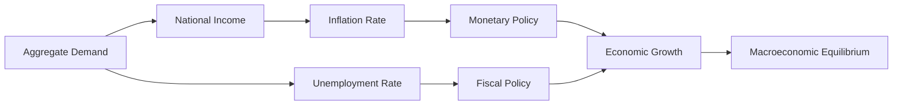

## 1. Mental Model
Imagine you're at a super busy amusement park with thousands of people riding roller coasters, playing games, and eating cotton candy. Each person is like a tiny decision-making unit, making choices about which ride to go on, what game to play, and what snack to buy. Macroeconomics is like looking at the entire amusement park from a helicopter view, seeing how all these individual choices add up to affect the whole park. It's like observing how the total number of people waiting in line, the overall amount of money being spent on snacks and souvenirs, and the general excitement level of the crowd, all interact and influence each other. Just as the amusement park's overall atmosphere and success depend on how all these individual choices play out, macroeconomics looks at how the collective actions of all decision-making units in an economy - like households, businesses, and governments - impact the economy as a whole.

## 2. Micro Theory
The study of macroeconomics is intricately linked to the [[Definition_Of_Economics|economic discipline]] as a whole, particularly in its focus on the aggregate outcomes of the interactions among individual [[Decision_Making_Units]], which include consumers, businesses, government, and foreign entities. Macroeconomics essentially zooms out from the microeconomic perspective, which examines the behaviors and interactions of these individual units, to analyze the economy as a whole.

The foundation of macroeconomic analysis lies in understanding the principles of [[Scarcity_And_Choice]] and [[Opportunity_Cost]], which underpin the [[Theory_Of_Economics]]. Given the presence of [[Unlimited_Wants]] and [[Scarce_Resources]], economies must engage in [[Resource_Allocation]] to meet the demands of their populations efficiently. This process of allocation is guided by the [[Production_Possibilities_Frontier]] (PPF) and the [[Law_Of_Increasing_Opportunity_Cost]], which illustrate the trade-offs involved in production decisions.

Macroeconomics, as one of the [[Branches_Of_Economics]], specifically seeks to understand the factors influencing [[Economic_Growth]], which can be viewed through the lens of increases in the production possibilities frontier of an economy over time. It delves into issues such as the overall level of [[Economic_Analysis|economic activity]], [[Efficient_Allocation|resource utilization]], inflation, unemployment, and international trade balances.

The discipline employs both [[Positive_Economics|positive]] and [[Normative_Economics|normative]] approaches. Positive economics provides an objective analysis of economic phenomena, describing "what is," while normative economics prescribes "what ought to be," often involving value judgments. Macroeconomic analysis relies heavily on [[Inductive_Reasoning|inductive]] and [[Deductive_Reasoning|deductive]] methods to construct and test hypotheses about aggregate economic behavior.

The core of macroeconomic inquiry revolves around answering the [[Basic_Economic_Questions]] faced by any economy: [[What_To_Produce]], [[How_To_Produce]], and [[For_Whom_To_Produce]]. These questions pertain to the composition of output, the techniques of production, and the distribution of income and wealth among the population, respectively.

In addressing these questions, macroeconomics considers the functioning of different [[Economic_Systems]], including the [[Capitalist_Economy]], and the [[Role_Of_Government_In_Market_Economy]]. The government plays a crucial role in stabilizing the economy, correcting [[Market_Failure|market failures]], and ensuring an efficient and equitable allocation of resources.

Ultimately, macroeconomics aims to provide policymakers with the tools and insights necessary to manage the economy effectively, fostering conditions conducive to sustainable economic growth, low unemployment, and stable prices. This requires a comprehensive understanding of the aggregate behavior of all decision-making units within an economy and the complex interactions among them.

## 3. Limitations & Edge Cases
The macroeconomic approach is limited by its failure to account for individual heterogeneity, as it aggregates the behavior of all decision-making units, thereby masking important distributional effects and disparities within the economy; for instance, the assumption of a representative agent can be problematic when there are significant differences in income, wealth, or preferences across different segments of the population, leading to oversimplification of complex issues; furthermore, macroeconomics often relies on unrealistic assumptions, such as the existence of a single, homogeneous good or a uniform interest rate, which can be at odds with the complexities of real-world economies characterized by diverse products, multiple interest rates, and imperfect information, ultimately rendering macroeconomic models imperfect predictors of real-world economic outcomes.

## 4. Market Graph


This flowchart illustrates the interconnections between key macroeconomic variables and policies, demonstrating how aggregate demand influences national income, inflation, and unemployment rates, which in turn are targeted by monetary and fiscal policies to achieve economic growth and stability. The overall goal is to reach macroeconomic equilibrium, where the economy's resources are utilized efficiently.

## 5. Walkthrough
Here is a 5-step technical walkthrough of how Macroeconomics operates:

**Step 1: Identify Decision-Making Units**
The decision-making units in an economy include consumers, businesses, government, and foreign entities. These individual units interact with each other to produce aggregate outcomes.

**Step 2: Analyze Aggregate Behavior**
Macroeconomics studies the aggregate behavior of all decision-making units in a certain economy. This involves examining the interactions among these units to understand the economy as a whole.

**Step 3: Understand Scarcity and Resource Allocation**
The economy faces unlimited wants and scarce resources. As a result, economies must engage in resource allocation to meet the demands of their populations efficiently. This process is guided by the principles of scarcity and choice.

**Step 4: Apply Macroeconomic Principles**
The aggregate behavior of decision-making units is influenced by the presence of scarcity and the need for resource allocation. Macroeconomics aims to understand the consequences of these interactions on the economy as a whole.

**Step 5: Examine Aggregate Outcomes**
The ultimate goal of macroeconomic analysis is to examine the aggregate outcomes of the interactions among individual decision-making units. This involves studying the effects and consequences of their aggregate behavior on the economy.

---

## Review & Practice
```interactive-quiz
[
  {
    "type": "mcq",
    "difficulty": "L1",
    "question": "If the price elasticity of demand for a good is 2, and the price increases by 10%, what will be the percentage change in the quantity demanded?",
    "options": {
      "A": "5% decrease",
      "B": "20% decrease",
      "C": "10% decrease",
      "D": "15% decrease"
    },
    "answer": "B",
    "explanation": "The price elasticity of demand is given by $E_d = \\frac{\\% \\Delta Q_d}{\\% \\Delta P}$. Given that $E_d = 2$ and $\\% \\Delta P = 10\\%$, we can rearrange the formula to solve for $\\% \\Delta Q_d = E_d \\times \\% \\Delta P = 2 \\times 10\\% = 20\\%$. Since the elasticity is greater than 1, the demand is elastic, and the quantity demanded will decrease by 20%."
  },
  {
    "type": "fill_in",
    "difficulty": "L2",
    "question": "Fill in the blank.",
    "textWithBlanks": "The [[blank]] is a macroeconomic concept that describes the overall level of economic activity in an economy, often measured by the total output of goods and services.",
    "answer": [
      "Gross Domestic Product"
    ],
    "explanation": "The Gross Domestic Product (GDP) is a macroeconomic concept that describes the overall level of economic activity in an economy, often measured by the total output of goods and services. It is calculated as the sum of consumption, investment, government spending, and net exports. GDP = C + I + G + (X - M), where C is consumption, I is investment, G is government spending, X is exports, and M is imports. This concept is crucial in understanding the performance of an economy and is widely used as an indicator of economic growth and stability."
  },
  {
    "type": "debug",
    "difficulty": "L2",
    "question": "Find the bug in the formula for calculating the GDP growth rate: $GDP_{growth} = \frac{GDP_{current} - GDP_{previous}}{GDP_{previous}} \times 100$",
    "content": "The formula provided seems mostly correct but let's assume a subtle error exists in its implementation within a specific macroeconomic model.",
    "answer": "The formula itself is correct, but a potential bug could arise if the GDP values are not adjusted for inflation. The correct formula should use real GDP values: $GDP_{growth} = \frac{RGDP_{current} - RGDP_{previous}}{RGDP_{previous}} \times 100$, where RGDP denotes real GDP.",
    "required_keywords": [
      "fix_syntax"
    ],
    "explanation": "The provided formula calculates the GDP growth rate, which is a crucial macroeconomic indicator. However, if the GDP values used are nominal and not adjusted for inflation, the calculated growth rate would be misleading. The correct approach involves using real GDP (RGDP) values, which are nominal GDP values adjusted for changes in price levels. This ensures that the growth rate reflects actual changes in the quantity of goods and services produced, rather than changes in prices. The LaTeX representation of the corrected formula is: $GDP_{growth} = \\frac{RGDP\\_{current} - RGDP\\_{previous}}{RGDP\\_{previous}} \\times 100$."
  },
  {
    "type": "trace",
    "difficulty": "L2",
    "question": "What is the exact output of the impact of a cost increase, such as higher wages, on the supply curve, equilibrium price, and total revenue in the context of consumer behavior analysis?",
    "content": "To analyze the impact of a cost increase, such as higher wages, on the supply curve, equilibrium price, and total revenue, we need to understand the fundamental principles of microeconomics and how they aggregate to macroeconomic phenomena. The supply curve typically slopes upward, indicating that as the price of a good increases, producers are willing to supply more of it. An increase in costs, such as higher wages, would increase the production costs for suppliers. This increase in costs would cause the supply curve to shift to the left (or decrease), because at any given price, producers are now willing to supply less of the good due to the higher costs of production. Formally, this can be represented as a change in the supply function: $Q_s = f(P, C)$, where $Q_s$ is the quantity supplied, $P$ is the price of the good, and $C$ represents the costs of production. An increase in $C$ (e.g., higher wages) leads to a decrease in $Q_s$ at any given $P$.",
    "answer": "The supply curve shifts to the left. The equilibrium price increases, and the equilibrium quantity decreases. The impact on total revenue depends on the elasticity of demand.",
    "explanation": "Mathematically, we can express the initial supply and demand equilibrium as $Q_s = Q_d$, where $Q_s$ is the quantity supplied and $Q_d$ is the quantity demanded. An increase in production costs shifts the supply curve to the left, leading to a new equilibrium: $Q_{s'} = Q_d'$. Assuming a simple linear supply function $Q_s = a + bP$ and demand function $Q_d = c - dP$, where $a$, $b$, $c$, and $d$ are constants, an increase in costs ($C$) would change the supply function to $Q_{s'} = a' + bP$, with $a' < a$. The new equilibrium price ($P'$) and quantity ($Q'$) can be found by solving $Q_{s'} = Q_d'$. The total revenue ($TR$) is given by $TR = P \\times Q$. The change in total revenue due to the cost increase depends on the elasticities of supply and demand. If demand is elastic, the decrease in quantity might outweigh the increase in price, potentially decreasing total revenue. Conversely, if demand is inelastic, total revenue might increase due to the higher price despite the lower quantity sold."
  }
]
```