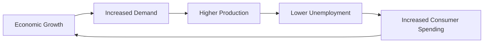

---

title: Macroeconomics
type: Atomic Note
course: Economics
semester: Winter 2026
unit: '1'
hub: "[[1_Basics_Of_Economics_Hub]]"
source: "[[Chapter_1.pdf]]"
source_pages:
- 17
mode: ECON-MACRO
read: false
generated: true
prerequisites:
- "[[Definition_Of_Economics]]"

---

---

title: Macroeconomics
description: Understanding Macroeconomics

---

# 1. Mental Model

Imagine you're at a school bake sale. You have a limited number of cupcakes to sell, and lots of people want to buy them. Macroeconomics is like looking at the entire school's bake sale and lemonade stand, and trying to understand how all the different sales and purchases affect the whole school's economy. It's about understanding how everything adds up and affects the community.

# 2. Economic Theory

[[Macroeconomics]] is a branch of economics that studies the overall performance of an economy, focusing on [[Aggregate_Behavior]], [[Economic_Resources]], and the interactions among [[Decision_Making_Units]]. It examines the economy as a whole, looking at issues such as economic growth, inflation, and unemployment. By analyzing the economy from a macroeconomic perspective, economists can better understand the complex interactions within an economy and make more informed decisions.

Quiz Questions:
1. What is the main focus of [[Macroeconomics]]?
2. What does [[Aggregate_Behavior]] refer to in economics?
3. Why is understanding [[Economic_Resources]] important in macroeconomics?

# 3. Economic Model



## 4. Walkthrough

* The model starts with **Economic Growth**, which leads to an increase in **Demand** for goods and services.
* As demand increases, businesses respond by increasing **Production** to meet the demand.
* Higher production levels lead to **Lower Unemployment** rates as more people are hired to work in the businesses.
* With more people employed, there's an increase in **Consumer Spending**, which in turn fuels further economic growth.

## 5. Market Failures

This concept can fail when external factors like government policies or global events disrupt the cycle. Common pitfalls include ignoring the impact of inflation or assuming that economic growth will always lead to lower unemployment. Edge cases to watch out for include scenarios where technological advancements lead to job displacement, or where economic growth is fueled by unsustainable debt.

---

## 6. The Proving Grounds

```interactive-quiz

[
  {
    "id": "q1",
    "type": "true_false",
    "difficulty": "L1",
    "question": "The core mechanism of macroeconomics involves analyzing individual consumer behavior.",
    "answer": false,
    "explanation": "Macroeconomics focuses on the overall performance of an economy, studying aggregate variables such as GDP, inflation, and unemployment. It looks at the economy as a whole, rather than analyzing individual consumer behavior, which is a key aspect of microeconomics. Therefore, the statement is false."
  },
  {
    "id": "q2",
    "type": "synthesis",
    "difficulty": "L2",
    "question": "The government of a small island nation is considering implementing a policy to boost its economy, which has been experiencing a slowdown due to a decline in tourism. The policy involves a combination of reducing interest rates to encourage borrowing and spending, increasing government spending on infrastructure projects, and implementing tax cuts to increase disposable income. However, there are concerns that the policy may lead to inflation and a trade deficit. Using the concepts of macroeconomics, evaluate the potential effectiveness of this policy and its potential risks.",
    "answer": "A grading rubric: \n- Evaluate the current state of the economy (10 points): \n  - Identification of the economic slowdown and its causes (5 points)\n  - Understanding of the role of tourism in the economy (3 points)\n  - Recognition of the potential for policy intervention (2 points)\n- Analysis of the policy components (30 points):\n  - Reduction of interest rates (10 points):\n    - Expected impact on borrowing and spending (5 points)\n    - Potential effect on consumption and investment (3 points)\n    - Risk of inflation (2 points)\n  - Increase in government spending on infrastructure (10 points):\n    - Multiplier effect on the economy (5 points)\n    - Potential for job creation and increased demand (3 points)\n    - Risk of increased government debt (2 points)\n  - Implementation of tax cuts (10 points):\n    - Expected impact on disposable income and consumption (5 points)\n    - Potential effect on government revenue and debt (3 points)\n    - Risk of increased income inequality (2 points)\n- Consideration of potential risks (30 points):\n  - Inflation (10 points):\n    - Causes and effects of inflation (5 points)\n    - Potential for wage-price spiral (3 points)\n    - Impact on savings and purchasing power (2 points)\n  - Trade deficit (10 points):\n    - Causes and effects of a trade deficit (5 points)\n    - Potential impact on exchange rates and exports (3 points)\n    - Risk of reduced foreign investment (2 points)\n- Conclusion and recommendations (30 points):\n  - Summary of policy effectiveness and risks (15 points)\n  - Recommendations for adjustments or alternative policies (10 points)\n  - Consideration of long-term implications and sustainability (5 points)",
    "explanation": "The policy involves a combination of monetary policy (reducing interest rates), fiscal policy (increasing government spending), and supply-side policy (implementing tax cuts). The reduction of interest rates aims to encourage borrowing and spending, which can boost consumption and investment. However, it also risks increasing inflation, particularly if the economy is already close to full capacity. The increase in government spending on infrastructure projects can create jobs and stimulate economic growth through the multiplier effect, but it also risks increasing government debt and the potential for inefficient allocation of resources. The implementation of tax cuts can increase disposable income and consumption, but it also risks increasing income inequality and reducing government revenue. The policy's potential effectiveness depends on the current state of the economy, the responsiveness of consumers and businesses to policy changes, and the ability of the government to manage potential risks. A comprehensive evaluation of the policy requires consideration of the potential impact on inflation, trade deficit, and long-term sustainability."
  },
  {
    "id": "q3",
    "type": "writing",
    "difficulty": "L3",
    "question": "Explain the concept of macroeconomic equilibrium and how it is achieved.",
    "answer": "Macroeconomic equilibrium occurs when the aggregate demand for goods and services equals the aggregate supply of goods and services in an economy. This equilibrium is achieved when the total amount that consumers, businesses, government, and foreigners are willing to spend on goods and services equals the total amount that producers are willing to supply. The intersection of the aggregate demand and aggregate supply curves determines the equilibrium level of real GDP and the price level. At this point, there is no tendency for the economy to move away from this equilibrium, as the quantity of goods and services demanded equals the quantity supplied.",
    "explanation": "The underlying mechanism of macroeconomic equilibrium involves the interaction between aggregate demand and aggregate supply. Aggregate demand is influenced by factors such as consumption, investment, government spending, and net exports. Aggregate supply, on the other hand, is influenced by factors such as production costs, technology, and expectations. The equilibrium is achieved through price adjustments, where changes in the price level influence the quantity of goods and services demanded and supplied, ultimately leading to a stable equilibrium."
  }
]

```