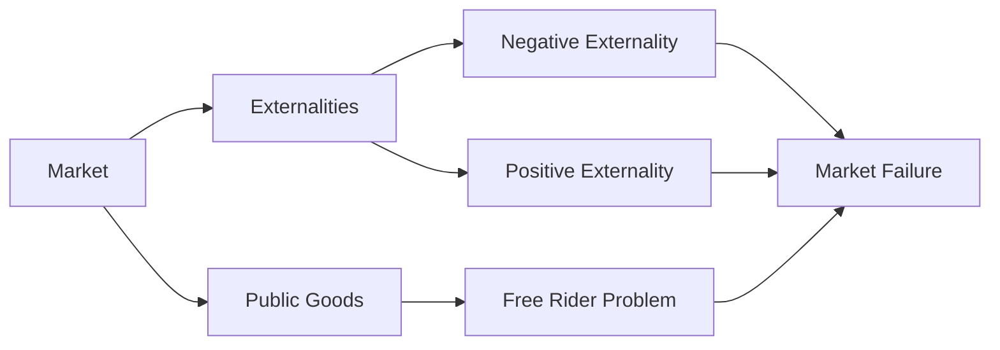

---

title: Market_Failure
type: Atomic Note
course: Economics
semester: Winter 2026
unit: '1'
hub: "[[1_Basics_Of_Economics_Hub]]"
source: "[[Chapter_1.pdf]]"
source_pages:
- 61
mode: ECON-MACRO
read: false
generated: true
prerequisites:
- "[[Role_Of_Government_In_Market_Economy]]"

---

# 1. Mental Model

Imagine you're at a big park where people play and have picnics. Sometimes, a park might have a big loudspeaker playing music that bothers people who are trying to relax. In this case, the music is like a "market failure" because the person playing the music didn't pay for disturbing others, and there's no easy way for everyone to agree to stop the music. 

# 2. Economic Theory

[[Market_Failure]] occurs when the [[Efficient_Allocation]] of goods and services is not achieved through the [[Capitalist_Economy]], often due to externalities or public goods. This happens when the [[Role_Of_Government_In_Market_Economy]] needs to intervene, as the market cannot correct issues like [[Asymmetric_Growth_And_Ppf]] or [[Market_Failure]] on its own. The [[Basic_Economic_Questions]] of what, how, and for whom to produce are not met efficiently.

# 3. Economic Model



## 4. Walkthrough

* The market (A) can lead to externalities (B), which are effects on third parties not involved in the market transaction.
* Externalities can be either negative (D), such as pollution, or positive (E), such as a homeowner's garden benefiting neighbors.
* Public goods (C) can lead to the free rider problem (F), where individuals benefit without contributing to the good's provision.
* These issues can result in market failure (G), where the market does not allocate resources efficiently.

## 5. Market Failures

Market failures often occur when externalities or public goods are not properly accounted for, leading to inefficient resource allocation. Common pitfalls include ignoring negative externalities, such as environmental degradation, or failing to provide public goods, like national defense. Edge cases to watch out for include situations where government intervention may also lead to inefficiencies.

---

## 6. The Proving Grounds

```interactive-quiz

[
  {
    "id": "q1",
    "type": "true_false",
    "difficulty": "L1",
    "question": "The existence of market failure implies that government intervention is always necessary to achieve efficient allocation of goods and services.",
    "answer": false,
    "explanation": "Market failure occurs when the efficient allocation of goods and services is not achieved through the capitalist economy, often due to externalities or public goods. However, the existence of market failure does not necessarily imply that government intervention is always necessary. While government intervention can sometimes correct market failures, it is not the only possible solution. Other mechanisms, such as private bargaining, negotiation, or changes in consumer behavior, can also potentially address market failures. The need for government intervention depends on the specific circumstances of each market failure."
  },
  {
    "id": "q2",
    "type": "synthesis",
    "difficulty": "L2",
    "question": "The city of Greenfield has a beautiful lake that is a popular spot for recreation. However, a new factory, Lakeview Industries, has recently opened on the lake's shore, and its operations are causing significant water pollution. The pollution is affecting not only the lake's ecosystem but also the local fishing industry and tourism. The factory's owners argue that they cannot afford to implement costly pollution-reducing measures, while the local community claims that the factory's actions are a clear example of market failure. Develop a grading rubric to assess the factory's environmental impact and its compliance with environmental regulations.",
    "answer": "A grading rubric to assess Lakeview Industries' environmental impact and compliance could include the following criteria: \n1. Level of pollution: Measured in terms of the amount of pollutants released into the lake, with higher levels resulting in lower grades.\n2. Compliance with environmental regulations: Adherence to existing laws and regulations, such as obtaining necessary permits and meeting emission standards.\n3. Implementation of pollution-reducing measures: Adoption of cost-effective technologies or practices to minimize environmental harm.\n4. Impact on local ecosystem and industries: Assessment of the factory's effects on the lake's biodiversity, fishing industry, and tourism.\n5. Community engagement and transparency: Factory's communication with local stakeholders and willingness to address concerns.\nThe grades could be: A (90-100%): Minimal environmental impact, full compliance with regulations, and proactive measures to reduce pollution; B (80-89%): Moderate impact, mostly compliant with regulations, and some efforts to mitigate effects; C (70-79%): Significant impact, partial compliance, and limited efforts to address issues; D (60-69%): Major environmental harm, non-compliance with regulations, and lack of engagement with stakeholders; F (Below 60%): Severe environmental damage, significant non-compliance, and no efforts to address concerns.",
    "explanation": "This grading rubric assesses Lakeview Industries' environmental impact and compliance with regulations by considering multiple factors. The rubric evaluates not only the level of pollution but also the factory's adherence to environmental laws, implementation of pollution-reducing measures, and engagement with the local community. By using this rubric, regulators and stakeholders can comprehensively evaluate the factory's performance and encourage improvements. The rubric's criteria are weighted to reflect the relative importance of each factor, with compliance and pollution levels being the most critical. The grades provide a clear and transparent way to communicate the factory's environmental performance, enabling informed decision-making and promoting accountability."
  },
  {
    "id": "q3",
    "type": "writing",
    "difficulty": "L3",
    "question": "Explain the concept of market failure due to externalities, specifically how it relates to public goods and the challenges in achieving efficient allocation in a capitalist economy.",
    "answer": "Market failure occurs when the efficient allocation of goods and services is not achieved through the capitalist economy, often due to externalities or public goods. This happens when the production or consumption of a good or service affects third parties, either positively or negatively, and these effects are not reflected in market prices. For instance, in the case of a park with a loudspeaker playing music, the music can be considered a negative externality that affects people trying to relax. The person playing the music does not bear the full cost of disturbing others, leading to an inefficient allocation of resources.",
    "explanation": "The underlying mechanism of market failure due to externalities involves the divergence between private and social costs or benefits. When a firm or individual produces a good or service, they consider their private costs and benefits. However, if their actions affect others, either positively (e.g., a beekeeper's bees pollinate nearby farms) or negatively (e.g., a factory's pollution), these external effects are not accounted for in the market transaction. This leads to a misallocation of resources, as the market equilibrium does not reflect the true social costs or benefits. In the case of public goods, like national defense or public parks, the challenges in achieving efficient allocation arise because these goods are non-rivalrous and non-excludable, making it difficult to charge consumers directly and leading to free-rider problems."
  }
]

```