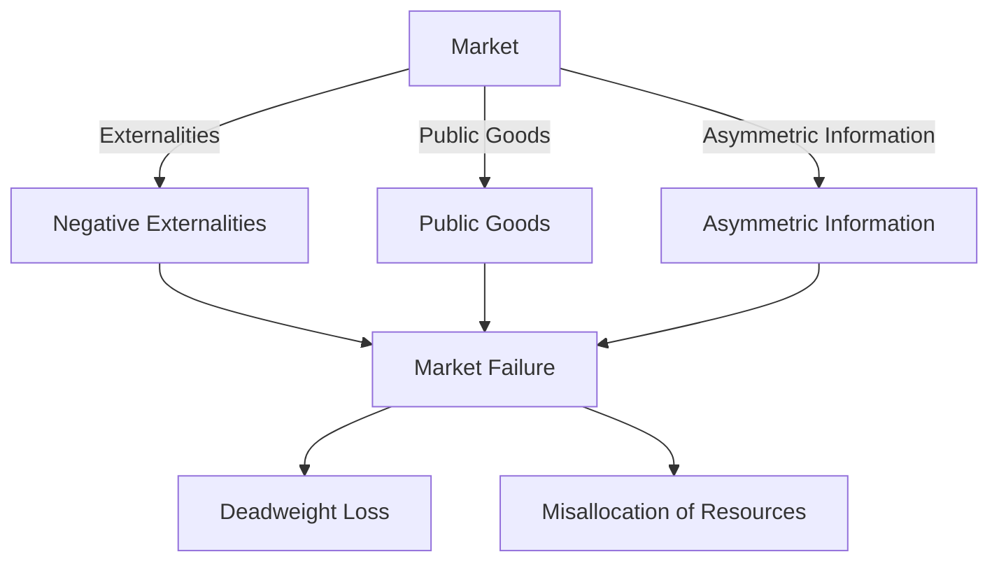

---

title: Market_Failure
course: "Economics"
unit: '1'
semester: "Winter 2026"
mode: ECON-MICRO
type: atomic_note
hub: "[[1_Basics_Of_Economics_Hub]]"
source: "[[5-Pdf Store/note generated/Winter 2026/Economics/Chapter_1.pdf]]"
date: '2026-05-08'
prerequisites:
- "[[Capitalist_Economy]]"
source_pages:
- 61
generated: true

---

## 1. Mental Model

In the context of Game Theory Application, consider the real-world scenario of "Tragedy of the Commons" in the North Sea fisheries. Here, multiple fishing companies operate, each acting in their own self-interest to maximize catches and profits. However, the market fails when the collective overfishing leads to depletion of fish stocks, causing a negative externality that affects all fishermen. Two specific components of market failure explicitly mapped in this scenario are: (1) **Externalities**, as the overfishing activities of one company impose costs on others, and (2) **Non-excludability**, as the fish stocks are a shared resource, making it difficult to exclude individual companies from accessing and depleting them, illustrating a classic market failure scenario.

## 2. Micro Theory

In the context of microeconomics, market failure is a situation that arises when the price mechanism, which is the primary allocative mechanism in a [[Capitalist_Economy]], fails to efficiently allocate [[Economic_Resources]]. This occurs when the market's invisible hand, as described by [[Adam_Smith]], does not lead to an optimal allocation of resources, resulting in a misallocation of resources that could have been better utilized to satisfy [[Human_Wants]].

The price mechanism is considered to be a efficient allocator of resources when it leads to an [[Efficient_Allocation]], where the marginal rate of substitution of one good for another is equal to the marginal rate of transformation. However, in certain situations, the price mechanism may not work efficiently, leading to market failure. This can happen when there are externalities, public goods, or asymmetric information, which can disrupt the proper functioning of the market.

From a Positive Economics perspective, market failure is a situation that can be objectively identified and analyzed using Economic Analysis, which relies on Deductive Reasoning and Inductive Reasoning to understand the behavior of economic agents and the outcomes of different market scenarios. In contrast, Normative Economics would focus on value judgments about what the market should achieve, rather than what it actually achieves.

The study of market failure is a crucial aspect of Microeconomics, which is one of the Branches Of Economics. It helps policymakers and economists understand when and how government intervention or other external actions may be necessary to correct market failures and improve Resource Allocation. 

The fundamental problem of Scarcity and the Basic Economic Questions of what, how, and for whom to produce, are central to understanding market failure. In a market economy, the answers to these questions are typically determined by the interactions of individual economic agents in markets. However, when market failures occur, the economy may not be able to provide an optimal allocation of resources, and alternative Economic Systems or policy interventions may be considered.

The analysis of market failure also relies on Macroeconomics to some extent, as understanding the aggregate implications of market failures can inform policy decisions. Ultimately, market failure highlights the limitations of the price mechanism in achieving an efficient allocation of resources and underscores the need for a nuanced understanding of the strengths and weaknesses of different economic systems.

## 3. Limitations & Edge Cases

The concept of market failure is limited in that it assumes a deviation from the ideal conditions of perfect competition, and its analysis often relies on unrealistic assumptions, such as the existence of perfect information and the ability to identify and correct failures; edge cases, including the presence of public goods, externalities, and information asymmetry, can render markets inefficient, but the boundaries of market failure become ambiguous when considering real-world complexities, such as transaction costs, bounded rationality, and the Coase theorem, which suggests that private bargaining can sometimes correct externalities, thus challenging the notion of market failure and highlighting the need for a nuanced understanding of the limitations of government intervention.

## 4. Market Graph



This flowchart illustrates the different types of market failures that can occur when the price mechanism does not work efficiently, including externalities, public goods, and asymmetric information, which can lead to deadweight loss and misallocation of resources. The presence of market failures indicates that the market is not allocating resources efficiently, resulting in a suboptimal outcome.

## 5. Walkthrough

## Step 1: Define Efficient Allocation

An efficient allocation occurs where the marginal rate of substitution (MRS) of one good for another equals the marginal rate of transformation (MRT). This is the condition under which the price mechanism is considered to efficiently allocate resources.

## Step 2: Identify Conditions for Market Failure

Market failure occurs when the price mechanism does not lead to an efficient allocation of resources. This happens under specific conditions: 

## Step 3: Externalities

## Step 4: Public goods

## Step 5: Asymmetric information

## Step 6: Understand Externalities

Externalities refer to the costs or benefits that affect third parties who did not choose to incur these costs or benefits. For example, pollution from a factory (negative externality) or the benefits to society from a company providing free training (positive externality).

## Step 7: Analyze Impact on Resource Allocation

When externalities, public goods, or asymmetric information are present, the market does not allocate resources efficiently. For instance, in the case of negative externalities like pollution, the firm does not account for the external costs it imposes on society, leading to overproduction from a social perspective.

## Step 8: Conclusion on Market Failure

Market failure results in a misallocation of resources. This means that resources could have been better utilized to satisfy human wants if the market had allocated them more efficiently. The presence of externalities, public goods, or asymmetric information disrupts the proper functioning of the market, leading to market failure.

---

## Review & Practice

```interactive-quiz

[
  {
    "type": "mcq",
    "difficulty": "L1",
    "question": "What is the primary condition for the price mechanism to lead to an efficient allocation of resources in a market?",
    "options": {
      "A": "The marginal rate of substitution is greater than the marginal rate of transformation.",
      "B": "The marginal rate of substitution of one good for another is equal to the marginal rate of transformation.",
      "C": "The marginal rate of transformation is greater than the marginal rate of substitution.",
      "D": "The marginal rate of substitution and marginal rate of transformation are unrelated."
    },
    "answer": "B",
    "explanation": "The price mechanism leads to an efficient allocation of resources when the marginal rate of substitution of one good for another is equal to the marginal rate of transformation. This condition ensures that resources are allocated optimally to satisfy human wants."
  },
  {
    "type": "fill_in",
    "difficulty": "L2",
    "question": "Fill in the blank.",
    "textWithBlanks": "In the context of microeconomics, market failure is a situation that arises when the price mechanism, which is the primary allocative mechanism in a [[Capitalist_Economy]], fails to efficiently allocate [[Economic_Resources]]. This occurs when the market's invisible hand, as described by [[Adam_Smith]], does not lead to an optimal allocation of resources, resulting in a misallocation of resources that could have been better utilized to satisfy [[Human_Wants]]. The price mechanism is considered to be a efficient allocator of resources when it leads to an [[Efficient_Allocation]], where the marginal rate of substitution of one good for another is equal to the marginal rate of transformation. However, in certain situations, the price mechanism may not work efficiently, leading to market failure. This can happen when there are Externalities, public goods, or asymmetric information, which can disrupt the proper functioning of the market.",
    "answer": [
      "externalities"
    ],
    "explanation": "The sentence directly from the Context that contains the single most important technical term for 'Market Failure' is: 'This can happen when there are Externalities, public goods, or asymmetric information, which can disrupt the proper functioning of the market.' The term Externalities is replaced with Blank.",
    "required_keywords": [
      "market failure",
      "externalities",
      "public goods",
      "asymmetric information"
    ]
  },
  {
    "type": "true_false",
    "difficulty": "L1",
    "question": "In the context of Environmental Economics, market failure occurs when the marginal rate of substitution of one good for another is not equal to the marginal rate of transformation.",
    "answer": true,
    "explanation": "Market failure arises when the price mechanism fails to efficiently allocate resources, which happens when the marginal rate of substitution (MRS) of one good for another is not equal to the marginal rate of transformation (MRT). The MRS represents the rate at which a consumer is willing to trade one good for another, while the MRT represents the rate at which one good can be transformed into another in production. In a perfectly competitive market, MRS = MRT, leading to an efficient allocation of resources. However, in cases of market failure, such as externalities or public goods, this equality does not hold, resulting in an inefficient allocation of resources."
  }
]

```