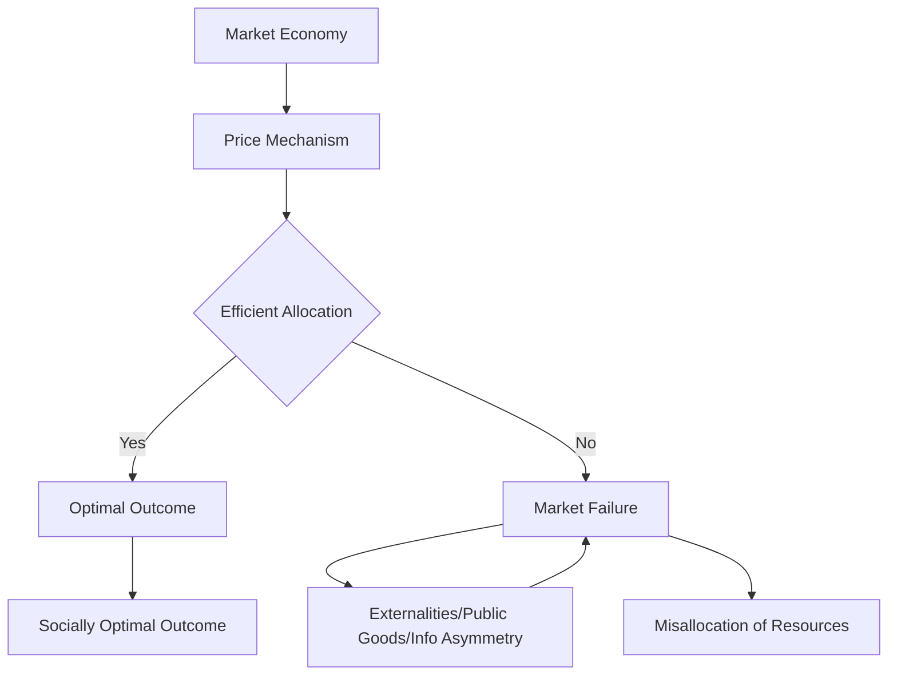

---

title: Market_Failure
course: "Economics"
unit: '1'
semester: "Winter 2026"
mode: ECON-MICRO
type: atomic_note
hub: "[[1_Basics_Of_Economics_Hub]]"
source: "[[5-Pdf Store/note generated/Winter 2026/Economics/Chapter_1.pdf]]"
date: '2026-05-08'
prerequisites:
- "[[Capitalist_Economy]]"
source_pages:
- 61
generated: true

---

## 1. Mental Model

Imagine you're at a school bake sale. Usually, when someone wants to buy a cookie, they pay the price the baker set, and everyone gets what they want. But, what if someone's little dog gets loose and runs into the bake sale, knocking over a tray of yummy cupcakes? Everyone's upset, and the cupcakes get ruined. The baker didn't get paid for the cupcakes, and the buyers didn't get their treats. This is like market failure - the "invisible hand" of the price mechanism didn't work properly because something outside of it (the loose dog) interfered. Just like how the bake sale didn't work efficiently with the dog causing trouble, market failure happens when something outside the market, like pollution or unequal information, messes up the normal buying and selling process, so people don't get what they want or producers don't get paid fairly.

## 2. Micro Theory

In the context of Microeconomics, [[Market_Failure]] occurs when the price mechanism, which is the primary allocative mechanism in a [[Capitalist_Economy]], fails to achieve an [[Efficient_Allocation]] of [[Economic_Resources]]. This happens when the market's invisible hand, as described by [[Adam_Smith]], does not lead to a socially optimal outcome, resulting in a misallocation of resources.

The price mechanism is supposed to guide [[Decision_Making_Units]], such as consumers and firms, in their choices about how to allocate resources, given the constraints of [[Scarcity]] and [[Opportunity_Cost]]. However, when the price mechanism does not work efficiently, it leads to [[Market_Failure]]. This can occur due to various reasons, including the presence of Externalities, Public Goods, and Information Asymmetry.

In a market economy, the price mechanism is expected to provide signals to consumers and producers about the relative scarcity of goods and services, influencing their [[Choice]] and [[Tradeoffs]]. However, when these signals are distorted or absent, the market fails to achieve an efficient allocation of resources. This is often the case when there are Externalities, which are costs or benefits that are not reflected in the market price of a good or service.

The study of [[Market_Failure]] falls under the branch of Microeconomics, which is concerned with the analysis of individual economic units, such as households and firms, and their interactions in specific markets. Microeconomics relies heavily on [[Positive_Economics]], which focuses on the objective analysis of economic phenomena, and [[Normative_Economics]], which involves subjective judgments about what ought to be.

The concept of [[Market_Failure]] is closely related to [[Efficient_Allocation]], which refers to the optimal allocation of resources given the constraints of [[Scarcity]] and [[Opportunity_Cost]]. When markets fail, the allocation of resources is not efficient, leading to a loss of Economic Efficiency. This can have significant implications for [[Economic_Growth]] and [[Resource_Allocation]].

The analysis of [[Market_Failure]] also involves [[Inductive_Reasoning]] and [[Deductive_Reasoning]], as economists use empirical evidence and theoretical models to understand the causes and consequences of market failures. By studying [[Market_Failure]], economists can provide insights into the [[Role_Of_Government]] in addressing these failures and promoting [[Efficient_Allocation]].

In conclusion, [[Market_Failure]] occurs when the price mechanism fails to achieve an efficient allocation of resources, leading to a misallocation of [[Economic_Resources]]. This concept is central to Microeconomics and has significant implications for [[Economic_Theory]], [[Resource_Allocation]], and [[Decision_Making_Units]]. Understanding [[Market_Failure]] is crucial for designing policies that promote [[Efficiency]] and [[Economic_Growth]].

## 3. Limitations & Edge Cases

The concept of market failure is limited in that it assumes a deviation from the ideal conditions of perfect competition, and its analysis often relies on unrealistic assumptions, such as the existence of perfect information and the ability to internalize externalities; edge cases, like the presence of public goods or natural monopolies, can render markets inefficient, but the boundaries of market failure become ambiguous when considering real-world complexities, such as transaction costs, bounded rationality, and the difficulties of accurately measuring and internalizing externalities, ultimately leading to challenges in defining and addressing market failures in a practical and policy-relevant manner.

## 4. Market Graph



This flowchart illustrates the concept of market failure, where the price mechanism fails to achieve an efficient allocation of resources, leading to a misallocation of resources. The presence of externalities, public goods, and information asymmetry can cause market failure, resulting in a socially suboptimal outcome.

## 5. Walkthrough

## Step 1: Identify the Conditions for Market Failure

Market failure occurs when the price mechanism fails to achieve an efficient allocation of economic resources. This happens when the market does not lead to a socially optimal outcome.

## Step 2: Understand the Role of the Price Mechanism

The price mechanism guides decision-making units (consumers and firms) in allocating resources, given the constraints of scarcity and opportunity cost.

## 3: Recognize the Causes of Market Failure

Market failure can occur due to various reasons, including externalities, public goods, and information asymmetry.

## 4: Analyze the Impact of Market Failure

When the price mechanism does not work efficiently, it leads to a misallocation of resources, resulting in market failure.

## 5: Determine the Consequence of Market Failure

The consequence of market failure is that the market does not achieve a socially optimal outcome, leading to inefficient allocation of resources.

---

## Review & Practice

```interactive-quiz

[
  {
    "type": "mcq",
    "difficulty": "L1",
    "question": "What is the primary reason for [[Market_Failure]] in the context of Microeconomics?",
    "options": {
      "A": "The presence of Monopolies",
      "B": "The presence of Externalities",
      "C": "The absence of Government Intervention",
      "D": "The lack of Consumer Information"
    },
    "answer": "B",
    "explanation": "Market failure occurs when the price mechanism fails to achieve an efficient allocation of resources. One of the primary reasons for market failure is the presence of Externalities, which are costs or benefits that are not reflected in the market price of a good or service. This leads to a misallocation of resources, as the market's invisible hand does not account for these external costs or benefits."
  },
  {
    "type": "fill_in",
    "difficulty": "L2",
    "question": "Fill in the blank.",
    "textWithBlanks": "The Blank occurs when the price mechanism fails to achieve an efficient allocation of resources, leading to a misallocation of economic resources.",
    "answer": [
      "Market Failure"
    ],
    "explanation": "The term 'Market Failure' is a critical concept in Environmental Economics and Microeconomics, referring to situations where the market's allocative mechanism fails to achieve an efficient allocation of resources."
  },
  {
    "type": "debug",
    "difficulty": "L1",
    "question": "Find the bug in the following formula for calculating the socially optimal quantity of a good with a negative externality: Q* = Marginal Private Benefit - Marginal External Cost",
    "content": "The formula provided is supposed to determine the socially optimal quantity of a good in the presence of a negative externality. However, it seems to be missing a critical component. The correct formula should account for both the marginal private benefit (MPB) and the marginal social benefit (MSB), as well as the marginal external cost (MEC).",
    "answer": "The correct formula should be Q* = Marginal Social Benefit - Marginal External Cost or more accurately Q* = Marginal Private Benefit + Marginal External Benefit - Marginal External Cost if considering both external costs and benefits. However, typically for negative externalities, it is represented as MSB = MPB - MEC. So, the bug is in using Marginal Private Benefit - Marginal External Cost directly without considering Marginal Social Benefit.",
    "required_keywords": [
      "Marginal Social Benefit",
      "Marginal External Cost",
      "Efficient Allocation"
    ],
    "explanation": "The bug in the provided formula is that it does not accurately represent the conditions for a socially optimal quantity in the presence of a negative externality. The correct approach involves considering the marginal social benefit (MSB) which already accounts for the marginal external cost (MEC), leading to a more accurate representation of social optimality."
  }
]

```