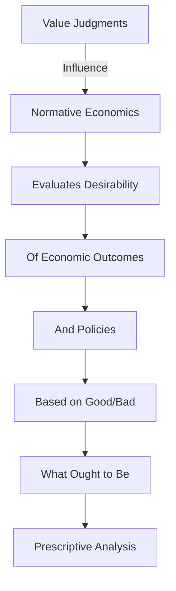

---

title: Normative_Economics
course: Economics
unit: '1'
semester: Winter 2026
mode: ECON-MICRO
type: atomic_note
hub: '[[1_Basics_Of_Economics_Hub]]'
source: '[[5-Pdf Store/note generated/Winter 2026/Economics/Chapter_1.pdf]]'
date: '2026-05-08'
prerequisites:
- '[[Resource_Allocation]]'
- '[[Economic_Analysis]]'
- '[[Human_Wants]]'
- '[[Inductive_Reasoning]]'
- '[[Deductive_Reasoning]]'
source_pages:
- 18
generated: true

---


## 1. Mental Model

Consider a scenario where a popular music streaming service, Spotify, is contemplating a price hike for its premium subscription in response to rising licensing fees for music royalties. From a normative economics perspective, Spotify's decision-makers must evaluate whether the proposed price increase is desirable. For instance, they might weigh the potential loss of subscribers against the revenue gains from the price hike, and consider the fairness of passing on costs to consumers. Two specific components of normative economics at play here are: (1) **Value judgments about fairness**, as Spotify must decide whether it is fair to raise prices and potentially inconvenience loyal subscribers; and (2) **Desirability of alternative outcomes**, as the company must assess whether the benefits of increased revenue outweigh the potential drawbacks, such as decreased subscriber satisfaction and loyalty.

## 2. Micro Theory

Normative economics is a branch of economics that provides a framework for evaluating the desirability of various economic outcomes, policies, and institutions, based on value judgments about what is good or bad, desirable or undesirable. This field of study is concerned with prescribing what ought to be, in contrast to positive economics, which focuses on describing what is. The core of normative economics lies in its use of value judgments to assess the optimality of [[Resource_Allocation]] and to guide [[Economic_Analysis]] towards achieving more desirable outcomes.

The process of normative economic analysis involves making subjective evaluations about how the economy should function, taking into account societal goals, ethical considerations, and [[Human_Wants]]. These evaluations are inherently based on [[Inductive_Reasoning]] and [[Deductive_Reasoning]], as economists gather data and use logical reasoning to derive conclusions about what economic policies or outcomes are preferable. 

Normative economics draws heavily on the understanding of Scarcity and the Basic Economic Questions that every Economic Systems must address. It considers how resources, which are classified under Economic Resources, should be allocated to meet Human Wants efficiently. The concept of Efficient Allocation is central to normative economics, as it aims to find the most desirable way to distribute resources, often invoking principles that can be traced back to the works of Adam Smith, who laid foundational ideas about the efficiency of markets.

The distinction between normative and Positive Economics is crucial. While positive economics deals with 'what is' and can be verified or falsified through empirical evidence, normative economics deals with 'what ought to be', which involves subjective judgments. This subjective nature means that normative economics is often seen as more controversial and less amenable to scientific verification than positive economics.

Normative economics has significant implications for Macroeconomics, as it influences policy decisions aimed at achieving broader economic goals such as full employment, price stability, and economic growth. Policymakers use normative economics to evaluate the desirability of different macroeconomic policies, based on their value judgments about what constitutes a good or bad economic outcome.

The mechanism of normative economics involves several steps, starting with the identification of goals or desired outcomes. These goals are derived from broader societal values and Inductive Reasoning about what is considered good or bad. Next, economists use Deductive Reasoning and models to evaluate how different policies or institutional arrangements can achieve these goals, given the constraints of Scarcity and available Economic Resources. 

Ultimately, normative economics provides a framework for making informed decisions about Resource Allocation and for designing Economic Systems that align with societal values and goals. Its integration with other branches of economics, notably Branches Of Economics, underscores its importance in guiding economic policy and in fostering a more desirable economic future. Through its emphasis on what ought to be, normative economics offers a critical perspective on how economies can be improved, making it a vital part of ongoing Economic Analysis.

## 3. Limitations & Edge Cases

Normative economics is limited by its reliance on subjective value judgments, which can vary significantly across individuals, making it challenging to achieve consensus on what "should be". Moreover, normative economic analysis is prone to biases and is often influenced by personal opinions, cultural norms, and ideological perspectives, which can lead to conflicting prescriptions for economic policy. Additionally, the subjective nature of normative economics makes it difficult to test or verify its conclusions empirically, rendering them more akin to opinions or advocacy rather than scientific fact. Furthermore, the impossibility of interpersonal comparisons of utility poses a significant challenge to normative economics, as it is hard to aggregate individual preferences and values into a social welfare function that accurately reflects the interests of all members of society.

## 4. Market Graph



This flowchart illustrates the core concept of normative economics, which involves making value judgments to evaluate the desirability of economic outcomes and policies, ultimately guiding prescriptive analysis on what ought to be. By incorporating value judgments, normative economics provides a framework for determining what should be, in contrast to positive economics, which describes what is.

## 5. Walkthrough

### 5-Step Technical Walkthrough of Normative Economics

#### Step 1: Define the Economic Outcome or Policy
Identify the specific economic outcome or policy to be evaluated. For example, consider the 2023 US Inflation Rate of 3.4% as the outcome.

#### Step 2: Establish Value Judgments
Make value judgments about what is considered good or bad regarding the economic outcome. For instance, a 3.4% inflation rate might be deemed undesirable if it exceeds the target inflation rate of 2% set by the Federal Reserve.

#### Step 3: Evaluate Desirability
Evaluate the desirability of the economic outcome (3.4% inflation rate) based on the established value judgments. This involves determining whether the current inflation rate aligns with societal goals, such as stable prices and low unemployment.

#### Step 4: Prescribe an Optimal Outcome
Prescribe an optimal outcome based on the evaluation. For example, if the current inflation rate of 3.4% is deemed too high, the optimal outcome might be to reduce it to the target rate of 2%.

#### Step 5: Guide Economic Analysis
Guide economic analysis towards achieving the prescribed optimal outcome. This might involve recommending monetary policy adjustments, such as increasing interest rates, to reduce inflationary pressures and move towards the target inflation rate of 2%.

---

## Review & Practice

```interactive-quiz

[
  {
    "type": "mcq",
    "difficulty": "L1",
    "question": "What is the primary focus of normative economics in evaluating economic outcomes and policies?",
    "options": {
      "A": "Describing the current state of the economy using empirical evidence",
      "B": "Prescribing what ought to be based on value judgments about desirability",
      "C": "Analyzing the impact of policies on the environment",
      "D": "Determining the optimal level of production for a firm"
    },
    "answer": "B",
    "explanation": "Normative economics is concerned with evaluating the desirability of various economic outcomes, policies, and institutions based on value judgments about what is good or bad, desirable or undesirable. It focuses on prescribing what ought to be, in contrast to positive economics, which describes what is."
  },
  {
    "type": "fill_in",
    "difficulty": "L2",
    "question": "Fill in the blank.",
    "textWithBlanks": "The Blank is central to normative economics, as it aims to find the most desirable way to distribute resources.",
    "answer": [
      "Efficient Allocation"
    ],
    "explanation": "The concept of Efficient Allocation is crucial in normative economics as it seeks to determine the most desirable distribution of resources, often invoking principles that can be traced back to foundational ideas about market efficiency."
  },
  {
    "type": "true_false",
    "difficulty": "L1",
    "question": "In normative economics, the evaluation of the desirability of economic outcomes is based on objective, empirically-verifiable data.",
    "answer": false,
    "explanation": "Normative economics evaluates the desirability of economic outcomes based on value judgments, which are subjective and not empirically verifiable. This is in contrast to positive economics, which focuses on objective, empirically-verifiable data to describe economic phenomena."
  }
]

```