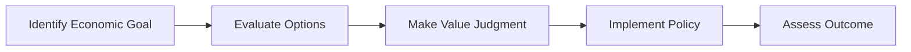

---

title: Normative_Economics
type: Atomic Note
course: Economics
semester: Winter 2026
unit: '1'
hub: '[[1_Basics_Of_Economics_Hub]]'
source: '[[5-Pdf Store/note generated/Winter 2026/Economics/Chapter_1.pdf]]'
source_pages:
- 18
mode: ECON-MACRO
read: false
generated: true
prerequisites:
- '[[Opportunity_Cost]]'
- '[[Scarcity]]'
- '[[Definition_Of_Economics]]'
- '[[Economic_Systems]]'
- '[[Efficient_Allocation]]'

---


---

title: Normative Economics
description: Understanding Normative Economics

---

# 1. Mental Model

Imagine you have a big box of chocolates, and you need to decide how to share them among your friends. Normative economics is like thinking about what you **should** do to make sure everyone gets a fair share. It's about making value judgments on what is good or bad, right or wrong, in economic policies. For example, should the government help people who are struggling financially? [[Opportunity_Cost]] and [[Scarcity]] play a big role in these decisions.

# 2. Economic Theory

Normative economics involves making subjective judgments about what economic policies **should be**. It answers questions like "What should be the tax rate?" or "How much should the government intervene in the economy?" [[Definition_Of_Economics]] includes both positive and normative economics, but normative economics focuses on the value judgments. This approach is essential for policymakers to decide on [[Economic_Systems]] and [[Efficient_Allocation]] of resources.

## Quiz Questions:

1. What type of economics deals with value judgments on what economic policies should be?
a) Positive Economics
b) Normative Economics
c) Macroeconomics

Answer: b) Normative Economics

2. Which of the following questions is an example of normative economics?
a) What is the current unemployment rate?
b) Should the government increase the minimum wage?
c) How does a change in interest rates affect investment?

Answer: b) Should the government increase the minimum wage?

3. What is a key challenge in applying normative economics?
a) It relies solely on objective data.
b) It involves making universally accepted value judgments.
c) Different people have different opinions on what is right or wrong.

Answer: c) Different people have different opinions on what is right or wrong.

# 3. Economic Model



## 4. Walkthrough

* Identify an economic goal, such as reducing poverty or increasing economic growth.
* Evaluate different policy options to achieve the goal, considering factors like cost, effectiveness, and fairness.
* Make a value judgment on which option is the most desirable, based on personal or societal values.
* Implement the chosen policy and assess its outcome to determine its effectiveness.

## 5. Market Failures

Normative economics can be prone to biases and subjective judgments, leading to inefficient or ineffective policies. Additionally, policymakers may face challenges in accurately assessing outcomes and making adjustments, and there may be disagreements on what constitutes a "good" or "fair" outcome.

---

## 6. The Proving Grounds

```interactive-quiz

[
  {
    "id": "q1",
    "type": "true_false",
    "difficulty": "L1",
    "question": "In normative economics, decisions are made solely based on objective data and facts.",
    "answer": false,
    "explanation": "Normative economics involves making value judgments about what economic policies are good or bad, right or wrong. It does not solely rely on objective data and facts, but rather incorporates subjective opinions and ethical considerations. This is in contrast to positive economics, which focuses on objective data and facts to describe economic phenomena. Therefore, the statement that decisions in normative economics are made solely based on objective data and facts is false."
  },
  {
    "id": "q2",
    "type": "synthesis",
    "difficulty": "L2",
    "question": "The government is considering implementing a policy to redistribute income from the wealthy to the poor through a new tax bracket. However, this policy may lead to a decrease in economic growth as wealthy individuals may choose to invest their money elsewhere. Using normative economics, evaluate the trade-offs of this policy and propose a solution that balances fairness and economic efficiency.",
    "answer": "A grading rubric for this question would assess the student's ability to weigh the moral implications of income redistribution against the potential economic consequences. The rubric would consider the student's identification of the key stakeholders, analysis of the policy's impact on economic growth and fairness, and proposal of a solution that takes into account opportunity costs and scarcity.",
    "explanation": "This question requires the application of normative economics to a complex policy issue. The student must consider the moral implications of income redistribution, such as promoting fairness and reducing poverty, against the potential economic consequences, such as decreased economic growth. The student must also take into account the concepts of opportunity cost and scarcity, as the policy may lead to trade-offs between different economic goals. A well-reasoned solution would demonstrate an understanding of the underlying mechanisms of normative economics and the ability to balance competing values and interests."
  },
  {
    "id": "q3",
    "type": "writing",
    "difficulty": "L3",
    "question": "Explain the role of opportunity cost in making normative economic judgments about resource allocation.",
    "answer": "Opportunity cost plays a crucial role in normative economic judgments as it represents the value of the next best alternative that is given up when a choice is made. In the context of resource allocation, opportunity cost helps policymakers evaluate the trade-offs involved in distributing resources, ensuring that the most beneficial outcomes are prioritized. For instance, when deciding how to allocate a limited budget, policymakers must consider the opportunity cost of funding one program over another, ultimately making a value judgment about which program yields the greatest benefit.",
    "explanation": "The underlying mechanism of opportunity cost in normative economics involves weighing the benefits and drawbacks of alternative choices. By considering the opportunity cost of a decision, policymakers can make more informed judgments about how to allocate resources in a way that aligns with their values and goals. This process enables them to prioritize certain economic outcomes over others, making a normative judgment about what is good or bad, right or wrong."
  }
]

```