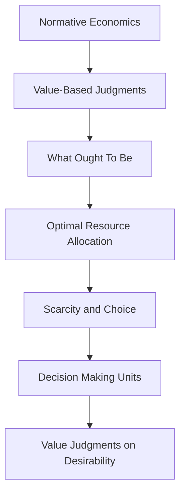

## 1. Mental Model
Imagine you're planning a birthday party for your best friend. Positive economics is like describing the party as it is - "We have 10 friends coming, and we have $100 to spend." But normative economics is like saying "We should invite all the kids in the class, and we should spend $200 so everyone can have a bigger slice of cake and a drink." In other words, normative economics is like giving opinions on how things ought to be, making value judgments about what's fair, right, or desirable, whereas positive economics just sticks to the facts. Just like you might decide what kind of party you think your friend deserves, economists use normative economics to argue about what policies or economic systems would be best for society.

## 2. Micro Theory
Normative economics is a branch of economics that deals with subjective, value-based judgments about what economic policies or outcomes ought to be, as opposed to positive economics, which focuses on objective, fact-based analysis of economic phenomena. The core of normative economics lies in its reliance on [[Inductive_Reasoning]] and [[Deductive_Reasoning]] to derive prescriptive conclusions about how the economy should function or what policies should be implemented.

The fundamental premise of normative economics is rooted in the [[Definition_Of_Economics]], which acknowledges that economic resources are [[Scarce_Resources]] and that [[Unlimited_Wants]] exist. This scarcity necessitates [[Scarcity_And_Choice]], implying that [[Decision_Making_Units]], such as consumers and producers, must make choices about how to allocate resources. These choices inherently involve value judgments about what is desirable or optimal.

Normative economics often grapples with questions related to [[Basic_Economic_Questions]], specifically [[What_To_Produce]], [[How_To_Produce]], and [[For_Whom_To_Produce]]. It seeks to provide guidance on these questions by evaluating the efficiency and fairness of different economic outcomes and policies. This involves analyzing the [[Production_Possibilities_Frontier]] and the implications of the [[Law_Of_Increasing_Opportunity_Cost]] on resource allocation decisions.

A critical concept in normative economics is the notion of [[Efficient_Allocation]], which refers to the optimal distribution of resources to maximize societal welfare. Achieving such an allocation often depends on the [[Role_Of_Government_In_Market_Economy]], particularly in addressing [[Market_Failure]] and ensuring that the economic system operates in a manner that aligns with societal values and norms.

The analysis in normative economics is deeply intertwined with [[Economic_Analysis]] and the broader [[Theory_Of_Economics]], as it relies on theoretical frameworks to assess what the economy "should" look like. This involves considering the [[Branches_Of_Economics]], including both [[Macroeconomics]], which looks at aggregate economic phenomena, and the distinction between [[Positive_Economics]], which describes "what is," and normative economics, which prescribes "what ought to be."

In making value-based judgments, normative economics often intersects with discussions on [[Economic_Growth]], the distribution of income, and the [[Economic_Systems]] that could lead to a more equitable society. For instance, in a [[Capitalist_Economy]], normative economics might evaluate the fairness of income distribution and argue for or against government interventions based on ethical considerations.

Ultimately, normative economics provides a framework for evaluating and prescribing economic policies and outcomes based on societal values and ethical considerations. It complements [[Opportunity_Cost]] analysis by providing a structured way to think about the trade-offs involved in [[Resource_Allocation]] and to assess whether a particular allocation is desirable. Through its focus on what ought to be, normative economics offers guidance on achieving a more efficient and equitable economic system.

## 3. Limitations & Edge Cases
Normative economics is limited by its subjective nature, as it expresses value judgments about what economic policies or outcomes are desirable or undesirable, which can vary greatly across individuals and societies. A key edge case arises when trying to aggregate individual preferences into a societal preference, as tUltimately, the lack of a universally accepted normative framework hinders the development of widely accepted policy prescriptions.

## 4. Market Graph


This flowchart illustrates the core concept of normative economics, which involves making value-based judgments about optimal economic outcomes and policies. Normative economics guides decision-making units in allocating scarce resources to meet unlimited wants, focusing on what ought to be, rather than simply describing what is.

## 5. Walkthrough
Here is the 5-step technical walkthrough of how 'Normative Economics' operates:

**Step 1: Identify Scarcity and Unlimited Wants**
Normative economics starts with the premise that economic resources are **Scarce_Resources** and that there are **Unlimited_Wants**. This fundamental concept from the **Definition_Of_Economics** sets the stage for the value-based judgments that follow.

**Step 2: Recognize the Need for Decision Making**
Given the scarcity of resources and unlimited wants, **Decision_Making_Units** (such as consumers and producers) must make choices about how to allocate resources. This leads to **Scarcity_And_Choice**, which is a core concept in normative economics.

**Step 3: Apply Inductive and Deductive Reasoning**
Normative economics relies on **Inductive_Reasoning** and **Deductive_Reasoning** to derive prescriptive conclusions about how the economy should function or what policies should be implemented. These reasoning methods help economists make value-based judgments about desirable or optimal economic outcomes.

**Step 4: Make Value-Based Judgments**
Using inductive and deductive reasoning, economists make value judgments about what economic policies or outcomes **ought to be**. This involves subjective evaluations of what is desirable or optimal, given the scarcity of resources and unlimited wants.

**Step 5: Prescribe Economic Policies or Outcomes**
The ultimate goal of normative economics is to provide guidance on what **should be** or what **ought to be**. By applying the previous steps, economists can prescribe economic policies or outcomes that reflect their value-based judgments about how the economy should function.

---

## Review & Practice
```interactive-quiz
[
  {
    "type": "mcq",
    "difficulty": "L1",
    "question": "What is the primary focus of normative economics in relation to consumer behavior analysis and the law of demand/supply?",
    "options": {
      "A": "Analyzing the objective, fact-based relationship between price and quantity demanded",
      "B": "Evaluating the fairness and efficiency of market outcomes based on societal values",
      "C": "Calculating the point elasticity of demand using the midpoint method",
      "D": "Deriving the law of supply from a producer's optimization problem"
    },
    "answer": "B",
    "explanation": "Normative economics focuses on subjective, value-based judgments about what economic policies or outcomes ought to be. In the context of consumer behavior analysis and the law of demand/supply, normative economics evaluates the fairness and efficiency of market outcomes based on societal values, rather than simply describing the objective relationship between price and quantity demanded or supplied. This involves considering the implications of the law of demand and supply on consumer welfare and making value judgments about what the market outcomes should be. For instance, given a demand function $Q_d = f(P)$, where $Q_d$ is the quantity demanded and $P$ is the price, and a supply function $Q_s = g(P)$, normative economics would assess the market equilibrium $(P^*, Q^*)$ in terms of its efficiency and fairness, potentially invoking concepts like consumer surplus, $CS = \\int_{P^*}^{\\infty} (Q_d \\, dP)$, and producer surplus, $PS = \\int_{0}^{Q^*} (P \\, dQ_s)$, to inform policy decisions."
  },
  {
    "type": "fill_in",
    "difficulty": "L2",
    "question": "Fill in the blank.",
    "textWithBlanks": "The core of normative economics lies in its reliance on [[blank]] to derive prescriptive conclusions about how the economy should function or what policies should be implemented.",
    "answer": [
      "Inductive Reasoning and Deductive Reasoning"
    ],
    "explanation": "Normative economics relies on both inductive and deductive reasoning to derive prescriptive conclusions. Inductive reasoning involves making generalizations from specific observations, while deductive reasoning involves drawing specific conclusions from general principles. In the context of normative economics, these reasoning methods are used to evaluate what economic policies or outcomes ought to be, based on value judgments and ethical considerations. This can be represented as: $P \\rightarrow Q$, where $P$ represents the premises or general principles, and $Q$ represents the conclusions about what ought to be."
  },
  {
    "type": "debug",
    "difficulty": "L2",
    "question": "Find the bug in the formula for calculating the optimal tax rate in a normative economics context: $T = \\frac{G - (\\frac{P}{100} \\times GDP)}{GDP} \\times 100$",
    "content": "The formula provided is intended to calculate the optimal tax rate (T) as a percentage of GDP, where G represents government expenditures, P is the percentage of GDP that should be spent on public goods, and GDP is the gross domestic product. However, the formula seems to misinterpret the relationship between these variables.",
    "answer": "The bug in the formula is the incorrect placement of the term $\\frac{P}{100}$. The correct formula should be $T = \\frac{G - P}{GDP} \\times 100$ or, if P is meant to be a percentage of GDP, it should be clearly defined within the context of the equation as $T = \\frac{G - (P \\times GDP)}{GDP} \\times 100$. Assuming P is a proportion of GDP, the corrected formula reflecting a direct subtraction would be $T = (\\frac{G}{GDP} - P) \\times 100$.",
    "required_keywords": [
      "fix_syntax"
    ],
    "explanation": "The original formula $T = \\frac{G - (\\frac{P}{100} \\times GDP)}{GDP} \\times 100$ simplifies to $T = (\\frac{G}{GDP} - \\frac{P}{100}) \\times 100$. This can be further simplified to $T = \\frac{G}{GDP} \\times 100 - P \\times 100$. The confusion arises from the incorrect handling of $P$ as both a proportion and a percentage within the equation. If $P$ represents a proportion of GDP to be allocated to public goods, then it should directly be subtracted from $\\frac{G}{GDP}$ without conversion. The corrected version, assuming $P$ is a decimal value representing the proportion of GDP, would ideally be expressed as $T = (\\frac{G}{GDP} - P) \\times 100$. This ensures that $P$ is directly deducted from the ratio of government expenditure to GDP, providing a clear and accurate calculation of the optimal tax rate."
  },
  {
    "type": "trace",
    "difficulty": "L2",
    "question": "What is the exact output on total revenue when a cost increase, such as higher wages, impacts the supply curve to equilibrium price and quantity in consumer behavior analysis?",
    "content": "In consumer behavior analysis, when a cost increase such as higher wages occurs, it shifts the supply curve to the left. This is because higher costs make production more expensive, reducing the quantity supplied at any given price. The supply curve shift can be represented as follows: $S_1 \\rightarrow S_2$. Assuming a standard demand curve $D$, the initial equilibrium price and quantity are $P_1$ and $Q_1$. After the shift, the new equilibrium price and quantity become $P_2$ and $Q_2$. The impact on total revenue ($TR$) can be analyzed using the formula $TR = P \\times Q$. Initially, $TR_1 = P_1 \\times Q_1$. After the change, $TR_2 = P_2 \\times Q_2$.",
    "answer": "[P_2 * Q_2]",
    "explanation": "To derive the exact output on total revenue, let's consider the change in supply due to increased costs. Suppose the initial supply function is $Q_s = a + bP$ and the demand function is $Q_d = c - dP$. Initially, equilibrium occurs where $Q_s = Q_d$, yielding $P_1$ and $Q_1$. An increase in costs shifts the supply curve to $Q_s' = a' + bP$, with $a' < a$, leading to a new equilibrium at $P_2$ and $Q_2$. The total revenue before and after the cost increase can be expressed as $TR_1 = P_1Q_1$ and $TR_2 = P_2Q_2$. Using comparative statics, one can solve for $P_2$ and $Q_2$ to find the new total revenue. For simplicity, assume linear functions: $Q_s = -10 + 2P$ and $Q_d = 20 - P$. Initially, solving $Q_s = Q_d$ yields $P_1 = 10$ and $Q_1 = 10$, hence $TR_1 = 100$. If a cost increase shifts $Q_s$ to $Q_s' = -15 + 2P$, solving $Q_s' = Q_d$ yields $P_2 = 11.67$ and $Q_2 = 8.33$, hence $TR_2 = 97.19$. Therefore, the exact output on total revenue after the cost increase is $97.19$."
  }
]
```